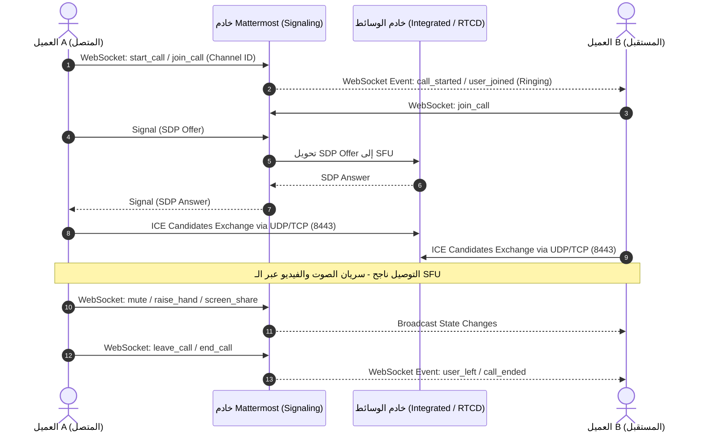

# تقرير التحليل الشامل لمكالمات Mattermost والبنية التحتية المطلوبة
## Mattermost Calls Architecture & Infrastructure Analysis

---

## 1. الملخص التنفيذي (Executive Summary)

يقدم نظام المكالمات في Mattermost (`com.mattermost.calls`) حلاً متكاملاً للاتصالات الصوتية والمرئية ومشاركة الشاشة في الوقت الفعلي (Real-Time Communication). تم تصميم النظام ليعمل بالكامل داخل البنية التحتية للمؤسسة (Self-Hosted / Air-Gapped) دون إرسال البيانات أو الصوت/الفيديو عبر خوادم خارجية طرف ثالث (إلا عند استخدام خادم STUN العام لاكتشاف العنوان فقط).

يهدف هذا التقرير إلى تقديم تحليل معماري وشامل 360 درجة لمشروع Mattermost (من واقع المستندات والكود المصدري في `/home/osmsoftwareengineering/mattermost`) وتحديد البنية التحتية المطلوبة، آلية عمل المكالمات، الفرق بين المكالمات الصوتية الرقمية والمكالمات الهاتفية (PSTN/SIP)، ثم إسقاط ذلك بالكامل على مشروعنا المطور بلغة فلاتر (`flutter_mattermost`).

---

## 2. كيفية عمل المكالمات المعمارية ودورة حياتها (Call Architecture & Lifecycle)

### 2.1 التقنيات الأساسية (Core Technology)
تعتمد المكالمات في Mattermost بشكل رئيسي على بروتوكول **WebRTC (Web Real-Time Communication)**، وتستخدم نموذج **SFU (Selective Forwarding Unit)** في إدارة الوسائط:
- **P2P vs SFU**: في المكالمات الجماعية، لا يتعامل كل عميل مع العملاء الآخرين بشكل مباشر (Peer-to-Peer PeerConnection لكل مشترك)، بل يتصل كل عميل بخادم الوسائط (SFU)، والذي يقدم خدمة توجيه دفقات الصوت والفيديو والمحتوى (Media Routing) بكفاءة عالية.
- **تشفير وسائط الاتصال**: يتم تشفير الصوت والفيديو أثناء النقل بشكل إجباري باستخدام **DTLS (Datagram Transport Layer Security)** و **SRTP (Secure Real-time Transport Protocol)**.

### 2.2 تبادل الإشارات (Signaling Layer)
إشارة المكالمة (Signaling) هي مرحلة الاتصال الأولية لتنسيق وبدء المكالمة وتبادل معلومات الاتصال الشبكي (SDP & ICE Candidates).
- تتم كافة الإشارات عبر نفق **WebSocket** الخاص بخادم Mattermost الرئيسي (`wss://<your-mattermost-domain>/api/v4/websocket`).
- الأحداث المستخدمة (Signaling Events):
  - `custom_com.mattermost.calls_call_started`: تنبيه بدء مكالمة في قناة أو محادثة مباشرة.
  - `custom_com.mattermost.calls_user_joined`: انضمام مستخدم للمكالمة.
  - `custom_com.mattermost.calls_user_left`: مغادرة مستخدم للمكالمة.
  - `custom_com.mattermost.calls_user_muted` / `unmuted`: تغيير حالة الميكروفون.
  - `custom_com.mattermost.calls_signal`: تبادل رسائل SDP (`offer` / `answer`) و `ice_candidate`.

### 2.3 مسار وسائط الصوت والفيديو (Media Flow)
1. **البروتوكول المفضل**: يُنقل الصوت والفيديو عبر **UDP** (منفذ `8443`) لتقليل زمن التأخير (Latency) إلى أدنى حد.
2. **الخيار الاحتياطي (TCP Fallback)**: في حال وجود جدران حماية تحظر UDP، يتم تحويل الترافيك تلقائياً إلى **TCP** عبر المنفذ `8443`.

### 2.4 دورة حياة المكالمة الكاملة (Step-by-step Call Lifecycle)



---

## 3. المكالمات الصوتية/الفيديو الرقمية مقابل المكالمات الهاتفية (PSTN / SIP Integration)

من الجوانب المهمة التي يجب استيعابها في هذا التحليل هو التمييز بين نوعين من الاتصالات:

### 3.1 المكالمات الرقمية المضمنة (Native WebRTC Calls)
- **ما يقدمه Mattermost افتراضياً**: مكالمات تطبيق-إلى-تطبيق (App-to-App / Browser-to-Browser) عبر بروتوكولات IP.
- **المزايا**: تشفير كامل في النقل، عدم وجود تكاليف دقائق اتصالات، دعم الفيديو ومشاركة الشاشة والتفاعلات الحية.
- **القيود**: تعمل فقط بين المستخدمين المسجلين والداخلين على المنصة عبر التطبيق أو المتصفح.

### 3.2 المكالمات الهاتفية الحقيقية (PSTN / Phone Calls / Dial-In & Dial-Out)
إذا كان المطلوب هو إمكانية الاتصال برقم هاتف جوال/أرضي تقليدي (+966-5xxxxxxx) أو السماح للمستخدمين بالاتصال هاتفياً بالانضمام للمكالمة (Dial-In):
- **كيف نصل إليها؟**: Mattermost Calls لا يحتوي افتراضياً على بوابة هاتفية (PSTN Gateway)، ولكنه يتطلب إضافة مكونات شبكية إضافية:
  1. **SIP Trunking Provider**: مزود خدمة اتصالات (مثل Twilio, Bandwidth, Telnyx, أو شركات الاتصالات المحلية STC/Zain/Mobily).
  2. **SIP Gateway / IP-PBX Server**: خادم مثل **Asterisk** أو **FreeSWITCH** أو **Kamailio**.
  3. **محول البروتوكول (WebRTC to SIP Gateway)**:
     - تحويل إشارات WebRTC/SDP إلى SIP INVITE/ACK/BYE.
     - تحويل الترميز الصوتي (Codec Transcoding): تحويل الصوت من **Opus** (المستخدم في WebRTC) إلى **G.711 PCMU/PCMA** أو **G.722** (المستخدم في شبكات الهاتف).
  4. **Media Bridge Bot**: بوت ينضم للمكالمة داخل القناة في Mattermost كـ Peer ويقوم بنقل الصوت المتبادل بين SIP Gateway و Mattermost SFU.

---

## 4. البنية التحتية المطلوبة وأنماط التشغيل (Infrastructure Deployment Architectures)

توفر Mattermost خيارين معماريين رئيسيين للبنية التحتية الخاصة بالمكالمات:

### 4.1 النمط 1: Integrated Calls (النمط المدمج)
في هذا النمط، تعمل محركات الإشارة والوسائط (SFU) داخل ملحق Mattermost الأصلي (`com.mattermost.calls`) محملة على نفس خادم Mattermost الرئيسي.
- **متى يُستخدم؟**:
  - البيئات الصغيرة (أقل من 50 مستخدم نشط في الوقت نفسه).
  - البيئات التجريبية والاختبارية (Development / Staging).
  - الراغبون بأبسط بنية تحتية ممكنة (سيرفر واحد فقط).
- **المكونات**:
  - خادم Mattermost Server واحد (HTTPS + WebSocket + Calls Plugin).

```
[ Mattermost Clients ] ---> (HTTPS / WS : 443) ---> [ Mattermost Server ]
[ Mattermost Clients ] ---> (UDP / TCP : 8443) ---> [ Built-in Calls SFU Engine ]
```

---

### 4.2 النمط 2: Dedicated RTCD Server (Real-Time Communication Daemon) - نمط الإنتاج الكبير
في البيئات الإنتاجية والمؤسسية، يوصى بشرط إبعاد معالجة الوسائط الصاخبة عن خادم الرسائل الرئيسي. يُستخدم خادم مستقل بلغة Go يسمى **RTCD**.
- **متى يُستخدم؟**:
  - المؤسسات التي تضم أكثر من 50 مستخدماً للمكالمات.
  - النشر على مجموعات **Kubernetes** (حيث يُعد RTCD إجبارياً).
  - الحاجة للأداء العالي وزمن التأخير المنخفض وضمان عدم تأثر محادثات الدردشة عند وجود مكالمة ضخمة.
- **المكونات**:
  - **Mattermost Server**: يتولى الإشارات (Signaling) وحالة القنوات فقط.
  - **RTCD Server**: خادم خفيف ومخصص لمعالجة وسائط الصوت والفيديو وتوجيهها مباشرة مع العملاء.
  - **التوسع الأفقي (Horizontal Scaling)**: يمكن تشغيل عدة خوادم RTCD خلف DNS Load Balancer مع ربط تلقائي بناءً على أقل الخوادم استهلاكاً للمعالج (Lowest CPU).

```
[ Mattermost Clients ] ---> (HTTPS / WS : 443) ---> [ Mattermost Server ]
                                                           |
                                                   (Internal API : 8045)
                                                           v
[ Mattermost Clients ] ---> (UDP / TCP : 8443) ---> [ Dedicated RTCD Server ]
```

---

### 4.3 الخوادم المساعدة للشبكة (STUN & TURN Servers)

1. **خادم STUN (Session Traversal Utilities for NAT)**:
   - **الوظيفة**: اكتشاف العنوان العام (Public IP) والمنفذ الظاهر للخادم والعملاء لمساعدة أجهزة الشبكة في إنشاء الاتصال.
   - **الافتراضي**: توفر Mattermost خادماً عاماً (`stun.global.calls.mattermost.com:3478 UDP`)، ولكن في البيئات المغلقة (Air-gapped) يتم تحديد العنوان يدوياً عبر إعداد `ICE Host Override`.

2. **خادم TURN (Traversal Using Relays around NAT)**:
   - **الوظيفة**: خادم ترحيل الترافيك (Relay Server). يُستخدم فقط كخيار أخير إذا كان العملاء يقفون خلف جدران حماية صارمة تمنع الاتصال المباشر عبر UDP أو TCP بمُعالج الوسائط.
   - **البرنامج الموصى به**: **coturn**.
   - **المنافذ**: `3478 UDP/TCP` و `5349 TCP (TLS)` ونطاق منافذ الترحيل `49152-65535 UDP`.

---

### 4.4 خادم التسجيل والتفريغ النصي (`calls-offloader`)
إذا كانت المؤسسة بحاجة إلى ميزات تسجيل المكالمات، التفريغ النصي (Transcriptions)، والتسميات التوضيحية المباشرة (Live Captions):
- يُنشأ خادم مستقل باسم `calls-offloader`.
- **المكونات والوظائف**:
  - يتصل بالـ RTCD / SFU كمشارك في المكالمة (Virtual Call Participant) ويقوم بتسجيل الصوت والشاشة.
  - محرك تحويل الصوت إلى نص (Speech-to-Text Engine) يعتمد على نماذج Whisper.
  - يقوم بإنشاء وتصدير ملفات فيديو بصيغة MP4 وملفات نصية TXT ونشرها تلقائياً داخل ثريد المحادثة.

---

## 5. مصفوفة المنافذ والجدران النارية (Network Port Matrix)

| الخدمة (Service) | المنفذ (Port) | البروتوكول | الاتجاه | المصدر (Source) | الهدف (Destination) | الغرض والأهمية |
|---|---|---|---|---|---|---|
| **Mattermost API & Signaling** | 443 | TCP | Inbound | العملاء (Clients) | Mattermost Server | طلبات HTTPS واتصال WebSocket للإشارات. |
| **Media Traffic (UDP)** | 8443 | UDP | Inbound | العملاء & calls-offloader | RTCD / Mattermost Server | نقل وسائط الصوت والفيديو الأساسي السريع. |
| **Media Traffic (TCP)** | 8443 | TCP | Inbound | العملاء & calls-offloader | RTCD / Mattermost Server | قناة احتياطية لنقل الوسائط عند حظر UDP. |
| **RTCD Internal API** | 8045 | TCP | Inbound | Mattermost Server | RTCD Server | الاتصال الداخلي لإدارة جلسات المكالمات. |
| **Calls Offloader API** | 4545 | TCP | Inbound | Mattermost Server | calls-offloader | إرسال واستقبال وظائف التسجيل والترجمة. |
| **STUN Discovery** | 3478 | UDP | Outbound | RTCD / Mattermost | STUN Server | اكتشاف العنوان العام للميديا سيرفر. |
| **TURN Service** | 3478 / 5349 | UDP / TCP | Inbound | العملاء | TURN Server (`coturn`) | ترحيل بيانات WebRTC للشبكات المغلقة. |
| **TURN Relay Port Range** | 49152-65535 | UDP | Inbound | العملاء | TURN Server | نطاق منافذ ترحيل الوسائط الفعلي في coturn. |

---

## 6. تحليل وتقييم مشروعنا فلاتر (`flutter_mattermost`)

عند مراجعة الكود المصدري لمشروعنا `flutter_mattermost` وتحديداً الملف [calls_manager.dart](file:///home/osmsoftwareengineering/StudioProjects/flutter_mattermost/lib/core/calls/calls_manager.dart) والملف [websocket_client.dart](file:///home/osmsoftwareengineering/StudioProjects/flutter_mattermost/lib/core/network/websocket_client.dart)، تم التوصل للنتائج التالية:

### 6.1 الميزات المحققة حالياً (Existing Features)
1. **إعداد البنية التحتية الأساسية لـ WebRTC**:
   - استخدام مكتبة `flutter_webrtc`.
   - إمكانية تهيئة `RTCPeerConnection` و `MediaStream`.
2. **الربط الأساسي مع إشارات WebSocket**:
   - الاستماع لـ `CallStartedEvent` و `WebRTCSignalingEvent`.
   - دعم إرسال إشارات `join_call` و `leave_call` و `webrtc_answer` و `ice_candidate`.
3. **التحكم الأساسي بالوسائط المحلية**:
   - كتم الميكروفون وتفعيله (`toggleMute`).
   - تشغيل وإيقاف الكاميرا (`toggleVideo`).
   - دعم مبدئي لمشاركة الشاشة (`toggleScreenShare`).

---

### 6.2 الفجوات والنواقص الحساسة في تطبيق فلاتر (Critical Gaps in Flutter Client)

لتشغيل المكالمات بمستوى احترافي ينافس التطبيق الرسمي وتطبيقات المراسلة الكبرى، يتوجب معالجة الفجوات التالية:

#### 1. إدارة إعدادات الشبكة و خوادم TURN/STUN الديناميكية:
- **المشكلة الحالية**: الكود يحتوي على `stun:stun.l.google.com:19302` بشكل ثابت (Hardcoded).
- **المطلوب**: الاستعلام الديناميكي عن جلب إعدادات ICE الخاصة بالمنشأة من خادم Mattermost عبر REST API (`GET /plugins/com.mattermost.calls/config`) وتطبيق تكوينات TURN المصرحة بالمستخدم وكلمة المرور.

#### 2. نظام رنين وتنبيهات المكالمات الواردة (Ringing & Incoming Call Push Notifications):
- **المشكلة الحالية**: التطبيق يستمع لـ WebSocket فقط أثناء فتح التطبيق (`_incomingCallsController`).
- **المطلوب**: دمج مكتبة `flutter_callkit_incoming` لاستقبال إشعار المكالمة وإطلاق شاشة رنين الهاتف الأصلية (Native Call Screen) على Android (عبر ConnectionService) و iOS (عبر CallKit) حتى لو كان التطبيق مغلقاً أو الشاشة مطفأة.

#### 3. إدارة جلسات الصوت ومخارج الصوت (Audio Session & Device Management):
- **المشكلة الحالية**: لا توجد إدارة لمسار الصوت بين السماعة الخارجية (Speaker Phone)، السماعة الداخلية (Earpiece)، وسماعات البلوتوث (Bluetooth Headset).
- **المطلوب**: إدراج حزمة `audio_session` لضمان تحويل الصوت تلقائياً وحل المشاكل الشائعة في انخفاض الميكروفون أو انقطاع صوت البلوتوث.

#### 4. إدارة تعدد المشاركين في SFU (Multi-Participant Streams & Remote Renderers):
- **المشكلة الحالية**: الكود الحالي يعتمد على `_remoteRenderer` سينجلتون واحد فقط (مناسب لمكالمة 1:1 فقط).
- **المطلوب**: إنشاء خريطة مشاركين `Map<String, ParticipantCallState>` تمكن من إدارة صوت وفيديو ومشاركة شاشة لجميع المشاركين المتواجدين في القناة.

#### 5. واجهات المستخدم الكاملة للمكالمات (Full Calls UI Suite):
- **المشكلة الحالية**: تقتصر الواجهة على المكونات الأولية.
- **المطلوب**:
  - **Active Call Banner**: شريط علوي في أرجاء التطبيق يوضح وجود مكالمة نشطة مع وقت المكالمة وزر العودة.
  - **Floating Overlay Widget**: شباك عائم صغير قابل للتنقل أثناء تصفح القنوات الأخرى.
  - **Grid View Viewports**: شبكة عرض المشاركين مع تمييز المتحدث الحالي (Active Speaker Highlight).
  - **Host Controls Modal**: قائمة للمشرفين لكتم المشاركين، طرد مشارك، إنهاء المكالمة للجميع، أو نقل صلاحية المشرف.
  - **In-Call Chat & Emoji Reactions**: التفاعل بالإيموجي السريعة وإظهار ثريد المحادثة المرفق بالمكالمة.

---

## 7. خارطة الطريق لتنفيذ وتجهيز البنية التحتية والمكالمات في تطبيقنا (Implementation Roadmap)

### المرحلة الأولى: تجهيز البنية التحتية والشبكة (Backend & Infrastructure Setup)
1. **تأكيد إعداد خادم RTCD**:
   - تثبيت وتهيئة خادم `rtcd` على بيئة Linux أو Kubernetes.
   - ربط المنفذ `8443 UDP/TCP` مباشرة وتأكيد فتح الجدران النارية.
2. **تجهيز خادم coturn**:
   - إعداد خادم TURN ودعم المصادقة الديناميكية (Static Auth Secret).
3. **تفعيل البلاجن في System Console**:
   - ضبط `PluginSettings.Plugins.com.mattermost.calls.rtcdserviceurl`.

### المرحلة الثانية: تطوير طبقة الشبكة والإشارات في فلاتر (Flutter Signaling & WebRTC Engine)
1. **تحديث `CallsManager`**:
   - جلب إعدادات ICE سيرفر ديناميكياً من API المنصة.
   - دعم التبديل الديناميكي بين الصوت والفيديو ومشاركة الشاشة.
   - معالجة إعادة التوصيل الشبكي (ICE Restart / Renegotiation) عند انتقال الجوال بين Wi-Fi و 4G/5G.
2. **إدارة مخارج الصوت**:
   - إدراج `audio_session` وتوفير قائمة اختيار مخرج الصوت (Speaker / Headset / Bluetooth).

### المرحلة الثالثة: دمج التنبيهات والرنين (Native CallKit & Push Notifications)
1. **دمج `flutter_callkit_incoming`**:
   - ربط استقبال إشعارات Push بالـ CallKit لإظهار شاشة اتصال بنظام Android/iOS.
2. **معالجة الإجابة والرفض**:
   - فتح التطبيق والانضمام التلقائي للمكالمة عند رفع السماعة من شاشة النظام.

### المرحلة الرابعة: تطوير واجهات المستخدم (UI & UX Experience)
1. بناء `CallGlobalBannerWidget` وإضافته فوق أرجاء التطبيق.
2. بناء `CallScreen` كاملة تحتوي على:
   - شبكة عرض المشاركين (Participant Grid view).
   - شريط التحكم السفلي (Mute, Video, Screen Share, Audio Device, Leave).
   - قائمة خيارات المشرف (Host Controls).
   - حائط تفاعلات الإيموجي والثريد الجانبي.

---

## 8. الخاتمة والتوصيات (Conclusion & Recommendations)

1. **للمؤسسات الكبيرة والنتاج الحقيقي**: نوصي بشدة بعدم الاعتماد على النمط المدمج (Integrated Mode) في الإنتاج، والاعتماد الفوري على **RTCD Server** مخصص مع **coturn** لضمان استقرار جودة الصوت والفيديو وعدم الإضرار بأداء خادم Mattermost الرئيسي.
2. **بالنسبة للمكالمات الهاتفية (PSTN/Phone Numbers)**: إذا كانت المنظمة بحاجة لإجراء اتصالات بأرقام هواتف تقليدية، يجب إضافة بوابة **SIP Gateway (Asterisk / FreeSWITCH)** مع ربط **SIP Trunk** وتأمين محول كوديك من Opus إلى G.711.
3. **تطبيق فلاتر**: يمتلك تطبيقنا بنية تحتية مبسطة ممتازة، وإكتمال التطوير يتطلب استكمال الفجوات المذكورة في الجزء (6.2) لا سيما CallKit والرنين وإدارة المخارج الصوتية والواجهات العائمة.
