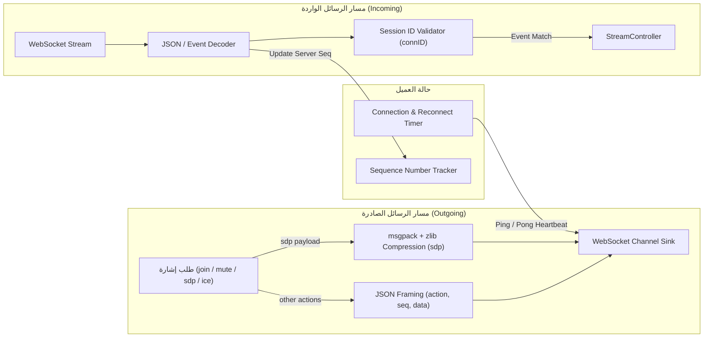
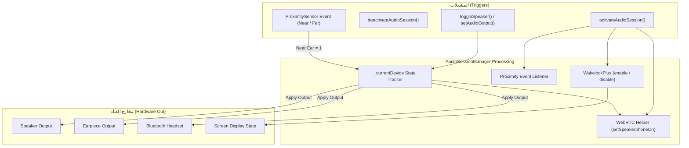
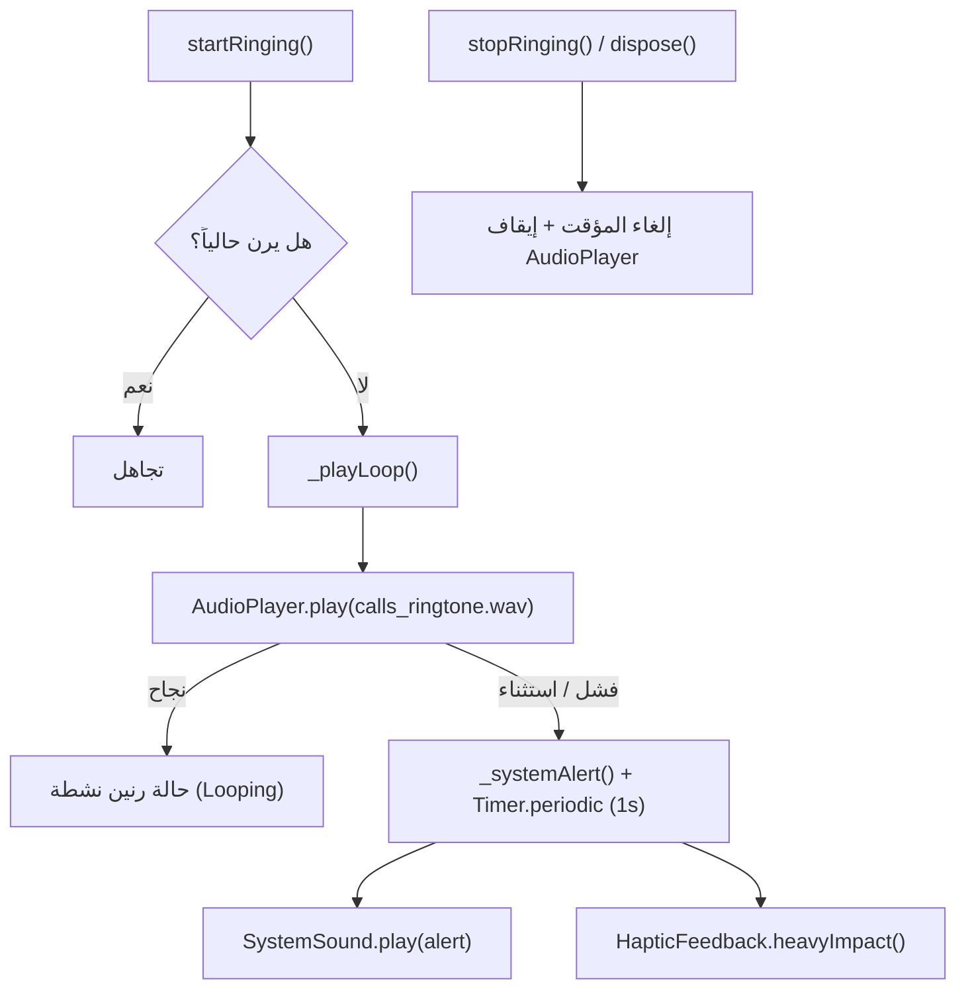
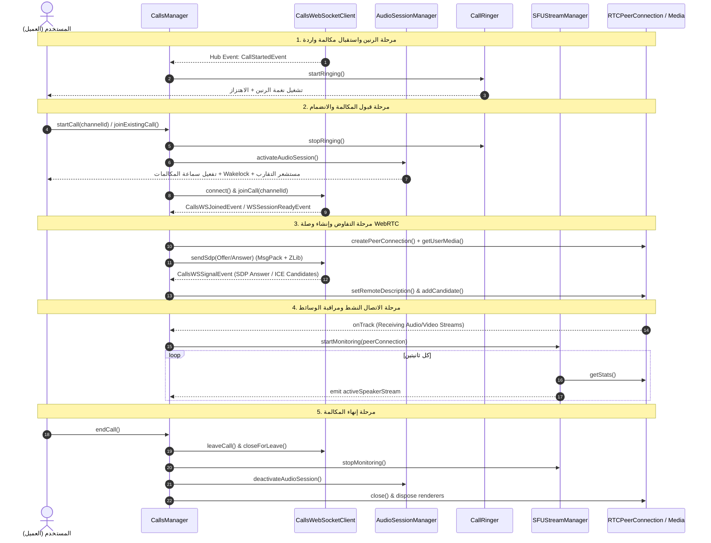

# توثيق وتحليل كلاسات إدارة المكالمات (`lib/core/calls`) ومخططات تدفق البيانات (DataFlow)

## 1. الملخص التنفيذي والنظرة العامة

يحتوي المجلد `lib/core/calls` في مشروع `flutter_mattermost` على البنية التحتية البرمجية الأساسية لإدارة المكالمات الصوتية والمرئية ومشاركة الشاشة عبر تقنية **WebRTC** ونموذج **SFU (Selective Forwarding Unit)**.

تم تصميم الكود باتباع معمارية غير متزامنة ومبنية على الأحداث (Event-Driven Architecture)، حيث تتكامل الكلاسات الخمسة معاً لتأمين دورة حياة المكالمة الكاملة (بدء الاتصال، معالجة الإشارات، إشعار الرنين، ضبط الصوت والشبكة، ومراقبة المتحدث النشط).

---

## 2. جدول الكلاسات والمكونات الأساسية في المجلد

| الملف (File) | اسم الكلاس / العنصر | النمط والتعيين | الوظيفة الرئيسية (Role & Purpose) |
|---|---|---|---|
| [calls_manager.dart](file:///home/osmsoftwareengineering/StudioProjects/flutter_mattermost/lib/core/calls/calls_manager.dart) | `CallsManager` | `@lazySingleton` | **المدير المركزي للمكالمات**: يدير آلة الحالات (State Machine)، ويتحكم ببروتوكول WebRTC، والرندرة، والربط بين الـ WebSockets والـ REST API والوسائط. |
| [calls_manager.dart](file:///home/osmsoftwareengineering/StudioProjects/flutter_mattermost/lib/core/calls/calls_manager.dart) | `CallParticipantState` | Data Class | **حالة المشارك**: تمثل حالة كل مستخدم داخل المكالمة (الصوت، الفيديو، كتم الميكروفون، رفع اليد، مشاركة الشاشة، الـ Renderer). |
| [calls_manager.dart](file:///home/osmsoftwareengineering/StudioProjects/flutter_mattermost/lib/core/calls/calls_manager.dart) | `CallReactionEvent` / `CallHostControlEvent` | Event DTOs | **كائنات الأحداث**: تمثيل تفاعلات التعبير (Emoji Reactions) وأوامر تحكم المضيف (Host Control). |
| [calls_manager.dart](file:///home/osmsoftwareengineering/StudioProjects/flutter_mattermost/lib/core/calls/calls_manager.dart) | `CallState` | Enum | **حالات آلة المكالمات**: (`idle`, `ringing`, `joining`, `connected`, `reconnecting`, `ended`). |
| [calls_websocket_client.dart](file:///home/osmsoftwareengineering/StudioProjects/flutter_mattermost/lib/core/calls/calls_websocket_client.dart) | `CallsWebSocketClient` | `@lazySingleton` | **عميل الـ WebSocket المخصص للمكالمات (`?calls=true`)**: يتولى تبادل إشارات WebRTC وتشفير رزم SDP بواسطة msgpack+zlib وإعادة الاتصال الذكي. |
| [calls_websocket_client.dart](file:///home/osmsoftwareengineering/StudioProjects/flutter_mattermost/lib/core/calls/calls_websocket_client.dart) | `CallsWebSocketEvent` | Sealed Class | **أحداث WebSocket**: الأحداث المستقبلة من الخادم (`SessionReady`, `Joined`, `Signal`, `Error`, `CallState`). |
| [audio_session_manager.dart](file:///home/osmsoftwareengineering/StudioProjects/flutter_mattermost/lib/core/calls/audio_session_manager.dart) | `AudioSessionManager` | `@lazySingleton` | **مدير جلسات الصوت**: التحكم في مخرج الصوت (السماعة الخارجية، سماعة الأذن، البلوتوث)، وإدارة مستشعر التقارب (Proximity Sensor)، والشاشة النشطة (Wakelock). |
| [audio_session_manager.dart](file:///home/osmsoftwareengineering/StudioProjects/flutter_mattermost/lib/core/calls/audio_session_manager.dart) | `AudioOutputDevice` | Enum | **مخارج الصوت**: (`speaker`, `earpiece`, `bluetooth`). |
| [sfu_stream_manager.dart](file:///home/osmsoftwareengineering/StudioProjects/flutter_mattermost/lib/core/calls/sfu_stream_manager.dart) | `SFUStreamManager` | `@lazySingleton` | **مراقب المتحدث النشط**: يحلل إحصائيات WebRTC (RTC Stats) لمستويات الصوت الصادرة من الـ SFU لتحديد وتقديم المتحدث الحالي (`Active Speaker`). |
| [call_ringer.dart](file:///home/osmsoftwareengineering/StudioProjects/flutter_mattermost/lib/core/calls/call_ringer.dart) | `CallRinger` | Normal Class | **رنّان المكالمات الواردة**: تشغيل نغمة الرنين المتكررة عند تلقي مكالمة واردة، مع خيار احتياطي لتنبهات النظام والاهتزاز عند عدم دعم الصوت. |

---

## 3. الشرح التفصيلي ومخطط التدفق (DataFlow) لكل كلاس

---

### 3.1 كلاس `CallsManager` (المدير المركزي للمكالمات)

#### الوظيفة وآلية العمل:
* هو القلب النابض لنظام الاتصال؛ يربط جميع الأجزاء الأخرى ببعضها.
* يراقب قناتين من الـ WebSockets:
  1. **الـ Hub الرئيسي (`WebSocketClientManager`)**: يستقبل أحداث بدء المكالمة (`call_start`)، مغادرتها، التفاعلات، التحكم، وتحديث الحالات.
  2. **قناة المكالمات المخصصة (`CallsWebSocketClient`)**: يتبادل من خلالها إشارات الـ WebRTC الحساسة (`offer`, `answer`, `ice`).
* يدير كائنات `RTCPeerConnection` و `MediaStream` المباشرة عبر مكتبة `flutter_webrtc`.
* ينشئ ويصين مسيرات الرندرة (`RTCVideoRenderer`) لكل المشاركين في المكالمة (`_localRenderer` و `_remoteRenderers`).
* يجلب إعدادات STUN/TURN من الخادم عبر `CallsRestRepository` لإنشاء اتصال ICE ناجح.

#### مخطط تدفق البيانات (DataFlow) لـ `CallsManager`:

```mermaid
flowchart TD
    subgraph ExternalSources ["المصادر الخارجية والأحداث"]
        HUB["Main WebSocket Hub (WebSocketClientManager)"]
        CWS["Dedicated Calls WebSocket (CallsWebSocketClient)"]
        REST["REST API (CallsRestRepository)"]
    end

    subgraph CallsManagerCore ["كلاس CallsManager"]
        direction TB
        EVT_PROC["مُعالج الأحداث (Event Processors)"]
        STATE_MACH["آلة حالات المكالمة (CallState Machine)"]
        RTC_ENGINE["WebRTC PeerConnection Engine"]
        PART_MAP["قاموس المشاركين (_participants)"]
        REND_MGR["مدير العرض (_remoteRenderers / _localRenderer)"]
    end

    subgraph Managers ["المحركات المساعدة"]
        AUDIO["AudioSessionManager"]
        SFU["SFUStreamManager"]
        RINGER["CallRinger"]
    end

    subgraph UI_Consumers ["طبقة الواجهة والـ BLoC"]
        CALL_BLOC["Call BLoC / UI Components"]
    end

    HUB -->|call_start / user_joined / call_end| EVT_PROC
    CWS -->|WSSessionReady / WSSignal (sdp, ice)| EVT_PROC
    REST -->|Fetch ICE Configs / Host Commands| RTC_ENGINE

    EVT_PROC --> STATE_MACH
    STATE_MACH -->|Trigger Ringing| RINGER
    STATE_MACH -->|Activate Session| AUDIO

    EVT_PROC -->|Negotiate Offer / Answer / ICE| RTC_ENGINE
    RTC_ENGINE -->|onTrack (Stream Attached)| REND_MGR
    RTC_ENGINE -->|Start Monitoring Stats| SFU

    REND_MGR --> PART_MAP
    EVT_PROC --> PART_MAP

    PART_MAP -->|participantsStream| CALL_BLOC
    STATE_MACH -->|callStateStream| CALL_BLOC
```

---

### 3.2 كلاس `CallsWebSocketClient` (عميل الـ WebSocket المخصص `?calls=true`)

#### الوظيفة وآلية العمل:
* فتح قناة اتصال WebSocket منفصلة ذات معلمات خاصة (`?calls=true&connection_id=...&sequence_number=...`).
* تنفيذ بروتوكول المصادقة عبر التحدي (`authentication_challenge`).
* تتبع تسلسل الرسائل عبر `seq` وترقيمها برمجياً.
* **الضغط والترميز الثنائي (Binary Protocol)**: يقدم دوال مثل `buildSdpFrame` لترجمة حزم الـ SDP وإرسالها مشفرة بـ `msgpack` ومضغوطة بـ `zlib` لتوافق متطلبات خادم Mattermost Calls.
* إدارة إعادة الاتصال التلقائي (Exponential Backoff) والحفاظ على معرّفات الجلسة الأصيلة `originalConnID` و `prevConnID`.

#### مخطط تدفق البيانات (DataFlow) لـ `CallsWebSocketClient`:



---

### 3.3 كلاس `AudioSessionManager` (مدير جلسات الصوت ومخارج الاتصال)

#### الوظيفة وآلية العمل:
* التنسيق المباشر مع طبقة النظام (Native OS) لتهيئة وضع المكالمات الصوتية (`voice-chat`).
* التحكم في مسار الصوت بين السماعة الخارجية المكبرة (`speaker`)، السماعة الداخلية للأذن (`earpiece`)، وسماعات البلوتوث (`bluetooth`).
* استخدام حزمة `WakelockPlus` لضمان عدم إطفاء الشاشة أو دخول التطبيق في وضع الخمول أثناء الاتصال النشط.
* الاستماع لمستشعر التقارب (`ProximitySensor`): عند إبعاد الهواتف المحمولة أو تقريبها من الأذن، يحول الصوت تلقائياً إلى السماعة الداخلية لتجنب اللمس العشوائي للشاشة.

#### مخطط تدفق البيانات (DataFlow) لـ `AudioSessionManager`:



---

### 3.4 كلاس `SFUStreamManager` (مراقب مستوى الصوت والمتحدث النشط)

#### الوظيفة وآلية العمل:
* تنفيذ مؤقت دوري (`Timer.periodic` كل ثانيتين) للاستعلام عن إحصائيات WebRTC من الـ `RTCPeerConnection`.
* قراءة تقارير `inbound-rtp` الخاصة بالقنوات الصوتية وخاصية `audioLevel`.
* حساب أعلى مستوى صوت بين جميع القنوات ومقارنته بحد العتبة (`maxLevel = 0.01`).
* تحديد المتحدث النشط الحالي (`_activeSpeakerSessionId`) وضخ هويته عبر `activeSpeakerStream` لتتيح للواجهة تمييز وإبراز صورة المتحدث الحالي.

#### مخطط تدفق البيانات (DataFlow) لـ `SFUStreamManager`:

```mermaid
flowchart TD
    PC["RTCPeerConnection"] -->|getStats() كل ثانيتين| TIMER["Periodic Timer (2s)"]
    TIMER -->|StatsReport List| PROC["_processStats()"]
    
    subgraph StatsAnalysis ["تحليل الإحصائيات"]
        PROC -->|Filter: inbound-rtp & kind=audio| EXTRACT["استخراج audioLevel & sessionId"]
        EXTRACT --> MAP["قاموس مستويات الصوت (_audioLevels)"]
        MAP --> DETECT["دالة اكتشاف أعلى صوت (_detectActiveSpeaker)"]
    end

    DETECT -->|If Loudest > 0.01 & Changed| STREAM["activeSpeakerStream (StreamController)"]
    STREAM -->|تحديث الواجهة| UI["UI Active Speaker Highlight"]
```

---

### 3.5 كلاس `CallRinger` (رنّان المكالمات الواردة)

#### الوظيفة وآلية العمل:
* الاستجابة لحالة المكالمة الواردة (`ringing`).
* تشغيل ملف الصوت `sounds/calls_ringtone.wav` في حلقة تكرارية (`ReleaseMode.loop`) عبر مشغل الصوت `AudioPlayer`.
* **الخيار الاحتياطي (Fallback Mechanics)**: إذا تعذّر تشغيل ملف الصوت (مثل بيئات Linux التي تفتقر لمكتبات GStreamer)، يتحول الكلاس تلقائياً لتشغيل نغمة تنبيه النظام (`SystemSound.play`) ونبضات اهتزاز هاتفية متكررة (`HapticFeedback.heavyImpact`) عبر `Timer.periodic`.

#### مخطط تدفق البيانات (DataFlow) لـ `CallRinger`:



---

## 4. المخطط الشامل لتفاعل جميع كلاسات المكالمات معاً (Unified Lifecycle DataFlow)

يوضح المخطط الزمني والتفاعلي التالي كيفية عمل هذه الكلاسات الخمسة معاً خلال دورة حياة مكالمة كاملة:


