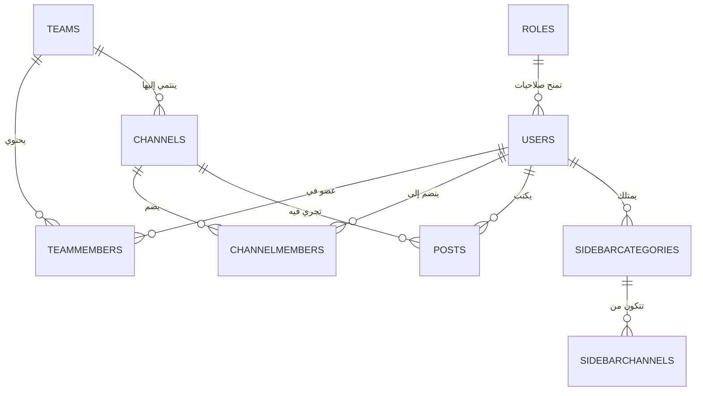

# تحليل قاعدة البيانات ونظام الصلاحيات والتصنيفات في Mattermost Server

**النظام المستهدف:** `mattermost/server` (المحرك الخلفي لـ Mattermost)  
**المسار المفصل:** `/home/osmsoftwareengineering/mattermost/server`

---

## 1. الحاجة لجدول التصنيفات الجانبية للقنوات (Channel Categories / Sidebar Categories)

### 1.1 الدوافع المعمارية والوظيفية (Architectural & Functional Rationale)
في الإصدارات الأولى من Mattermost، كانت القنوات تُعرض للمستخدم ضمن قائمة جانبية ثابتة تحتوي فقط على مجموعات تلقائية: (القنوات العامة والخاصة، والرسائل المباشرة DMs)، مع إمكانية إضافة "نجمة" للمفضلات Favorites. وكان يتم تخزين القنوات المفضلة وترتيب القنوات في جدول التفضيلات العام `Preferences` بصيغة Key-Value (مثلاً: `category: "favorite"`).

ومع توسع فرق العمل وكثرة القنوات لدى المستخدمين، ظهرت حاجة ماسة لنظام تصنيف مخصص وتفاعلي للبار الجانبي (Custom Sidebar Categories)، مما أدى لإنشاء جداول `sidebarcategories` و `sidebarchannels`.

### 1.2 الأهداف الرئيسية لنظام التصنيفات (Sidebar Categories)
1. **تخصيص كامل للقائمة الجانبية لكل مستخدم (Per-User & Per-Team Personalization):**
   كل مستخدم على مستوى كل فريق (`UserId`, `TeamId`) يستطيع إنشاء تصنيفات خاصة به (مثل: "مشاريع جارية"، "فريق التصميم"، "بلاغات عاجلة") وتجميع القنوات والرسائل المباشرة داخلها.
2. **فصل تفضيلات الواجهة عن بنية القنوات العامة:**
   القنوات هي كائنات مشتركة بين جميع أعضاء الفريق، بينما تنظيم القنوات وترتيبها وكتمها وتغليفها (Collapse) هي حالة خاصة بكل مستخدم بشكل مستقل تماماً.
3. **تحسين الأداء والاستعلامات (Performance & Data Normalization):**
   بدلاً من البحث في جدول `Preferences` المترامي الأطراف واستخراج نصوص التفضيلات وتحديثها بشكل فردي، توفر جداول التصنيفات استعلامات سريعة ومُفهرسة تسمح بإعادة الترتيب دفعة واحدة (Bulk Reordering).
4. **دعم التصنيفات الإدارية والمُدارة (Managed Categories):**
   تسمح لمسؤولي النظام أو السياسات المتقدمة (LDAP / Enterprise Groups / Plugins) بتمرير تصنيفات مُدارة تلقائياً وتوزيع القنوات عليها.

### 1.3 الهيكل الداخلي للجداول المتعلقة بالتصنيفات
يتكون نظام تصنيف القنوات من جدولين رئيسيين:

#### أ. جدول `sidebarcategories`
يُخزن تعريف التصنيف والخصائص العامة له:
```sql
CREATE TABLE sidebarcategories (
    id VARCHAR(128) PRIMARY KEY, -- معرف التصنيف (إما UUID أو معرف تلقائي مثل channels_userId_teamId)
    userid VARCHAR(26),          -- معرف المستخدم صاحب التصنيف
    teamid VARCHAR(26),          -- معرف الفريق
    sortorder BIGINT,            -- ترتيب التصنيف بالنسبة للتصنيفات الأخرى
    sorting VARCHAR(64),         -- طريقة ترتيب القنوات داخل التصنيف (manual, recent, alpha, default)
    type VARCHAR(64),            -- نوع التصنيف (channels, direct_messages, favorites, custom, managed)
    displayname VARCHAR(64),     -- الاسم المعروض للتصنيف
    muted BOOLEAN,               -- هل التصنيف مكتوم (Mute All Notification)
    collapsed BOOLEAN            -- هل التصنيف مطوي في الواجهة الجانبية
);
```

#### ب. جدول `sidebarchannels`
يُخزن ربط القنوات بالتصنيفات وترتيب القناة داخل التصنيف:
```sql
CREATE TABLE sidebarchannels (
    channelid VARCHAR(26),       -- معرف القناة
    userid VARCHAR(26),          -- معرف المستخدم
    categoryid VARCHAR(128),     -- معرف التصنيف التابع لجدول sidebarcategories
    sortorder BIGINT,            -- ترتيب القناة داخل التصنيف
    PRIMARY KEY (channelid, userid, categoryid)
);
```

### 1.4 أنواع التصنيفات المتاحة (SidebarCategoryType)
- `channels`: التصنيف الافتراضي للقنوات العامة والخاصة.
- `direct_messages`: التصنيف الافتراضي للرسائل المباشرة والمجموعات الثنائية/المتعددة.
- `favorites`: التصنيف الافتراضي للقنوات والمحادثات المجهزة بنجمة (المفضلة).
- `custom`: التصنيفات المنشأة يدوياً بواسطة المستخدم.
- `managed`: التصنيفات المدارة آلياً عبر سياسات المجموعات أو الإضافات (Plugins).

### 1.5 طريقة الترتيب الحسابية (Sort Distance)
يتم استخدام ثابت `MinimalSidebarSortDistance = 10` لإعطاء مسافات بين قيم `SortOrder` لتسهيل إقحام القنوات والتصنيفات وإعادة ترتيبها بدون الحاجة لتحديث جميع السجلات في كل عملية سحب وإفلات (Drag & Drop).

---

## 2. تحلیل Schema لقاعدة بيانات Mattermost Server بالتفصيل

تعتمد قاعدة بيانات Mattermost على استخدام معرّفات فريدة من نوعها بطول 26 حرفاً نصياً (Base32 UUIDs مكررة عبر `model.NewId()`). تدعم قاعدة البيانات كلاً من **PostgreSQL** و **MySQL** وتعتمد على محرك هجرات (Migrations) تسلسلي دقيق.

فيما يلي تحليل تفصيلي لجميع المكونات والجداول الرئيسية مقسمة حسب الوظائف:



### 2.1 وحدات المستخدمين والجلسات والتوثيق (Users & Authentication)
- **`users`**: الجدول الأهم في النظام، يحتوي بيانات المستخدم الحسابية (البريد الإلكتروني، اسم المستخدم، كلمة المرور المشفرة Hash، الحالات AuthData، الأدوار `roles` كـ String، إعدادات الإشعارات NotifyProps، وتاريخ الإنشاء والتعديل والتدمير Soft Delete).
- **`userterms_of_service`**: يتتبع موافقة المستخدمين على شروط الخدمة المخصصة وتاريخ الموافقة.
- **`sessions`**: يُخزن جلسات تسجيل الدخول النشطة، والتوكن الخاص بالجلسة Token، وتاريخ الانتهاء ExpiresAt، وأدوار الجلسة `roles` والمعدات المستهدفة (Device/Props).
- **`tokens`**: يُخزن التوكنات المؤقتة مثل توكنات إعادة تفعيل كلمة المرور أو تفعيل البريد الإلكتروني.
- **`user_access_tokens`**: التوكنات الشخصية (Personal Access Tokens - PAT) للمطورين والبوتات وتتضمن الوصف والصلاحيات والانتهاء.
- **`oauthapps` & `oauthauthdata`**: لتطبيقات OAuth2 المسجلة وبيانات التفويض الخاصة بالربط مع تطبيقات خارجية.
- **`outgoing_oauth_connections`**: اتصالات OAuth الصادرة للربط مع خدمات خارجية معتمدة.

### 2.2 وحدات الفرق وأعضائها (Teams & Team Membership)
- **`teams`**: بيانات فريق العمل (الاسم الفريد Name، الاسم المعروض DisplayName، نوع الفريق open/invite، النطاق Domain، وشعار الفريق).
- **`teammembers`**: جدول الربط بين المستخدمين والفرق، ويحتوي على أدوار المستخدم في الفريق `roles` (مثل `team_user` أو `team_admin`) وحالة الحظر أو الخروج.

### 2.3 وحدات القنوات والعضوية (Channels & Channel Membership)
- **`channels`**: يحتوي القنوات (العامة `O` - Open، الخاصة `P` - Private، المباشرة `D` - Direct، المجموعات المباشرة `G` - Group).
- **`publicchannels`**: جدول فهارس مخصص للقنوات العامة لسهولة البحث والاستكشاف السريع دون فحص الصلاحيات المعقدة.
- **`channelmembers`**: عضوية المستخدم في القنوات وتفاصيلها (تاريخ آخر قراءة `lastviewedat`، عداد الرسائل غير المقروءة `msgcount` و `mentioncount`، وأدوار المستخدم بالقناة `roles`).
- **`sharedchannels` & `sharedchannelremotes` & `sharedchannelusers` & `sharedchannelattachments`**: دعم القنوات المشتركة بين خوادم Mattermost المختلفة (Federated / Shared Channels).
- **`channelbookmarks`**: الإشارات المرجعية والروابط المثبتة داخل كل قناة.
- **`channel_join_requests`**: طلبات الانضمام للقنوات المغلقة أو الخاصة.
- **`channel_guards`**: آليات الحماية والقيود على القنوات الخاصة بالإضافات Plugins.

### 2.4 وحدات الرسائل والمنشورات (Posts & Messaging)
- **`posts`**: يحتوي الرسائل والمحادثات. يتضمن `userid`, `channelid`, `rootid` (للردود في الخيوط Threads)، `message` (نص الرسالة)، `fileids` (المرفقات)، `props` (JSON الخصائص المتقدمة)، `hashtags` و `type`.
- **`threads`**: تتبع خيوط المحادثات المتقدمة (Collapsed Reply Threads - CRT) وتخزين عدد الردود وآخر مشاركين وآخر رد.
- **`postacknowledgements`**: الإقرارات باستلام واستيعاب الرسائل المهمة (Post Acknowledgements).
- **`postpriority`**: تحديد أولوية الرسائل (Urgent / Important / Standard) وتفاصيل التنبيه المباشر.
- **`drafts`**: المسودات غير المرسلة للمستخدمين عبر القنوات أو الخيوط.
- **`reactions`**: التفاعلات والرموز التعبيرية (Emoji Reactions) على الرسائل.
- **`fileinfo`**: بيانات المرفقات والملفات الصورية والمستندات (الحجم، المسار، المصغرة Thumbnail، الأبعاد).
- **`scheduled_posts`**: المنشورات والمحادثات المجدولة للإرسال في وقت لاحق.

### 2.5 وحدات التفضيلات والقائمة الجانبية (Preferences & Sidebar)
- **`preferences`**: التفضيلات العامة للمستخدم (المظهر Theme، الإشعارات، الخواص المخفية) بصيغة `(userid, category, name, value)`.
- **`sidebarcategories`**: تصنيفات البار الجانبي للقنوات (كما شرحنا تفصيلاً في القسم الأول).
- **`sidebarchannels`**: التكشيف والتسلسل للقنوات داخل كل تصنيف جانبية.

### 2.6 وحدات الأدوار والصلاحيات والتحكم الإداري (Roles, Schemes & Access Control)
- **`roles`**: أدوار النظام والفرق والقنوات (`id`, `name`, `permissions` بنص يحتوي على المعرفات مقسمة بمسافات، `scheme_managed`).
- **`schemes`**: مخططات الصلاحيات المخصصة (Permission Schemes) التي تتيح ربط أدوار مخصصة بفرق أو قنوات معينة.
- **`access_control_policies` & `attributes` & `attribute_views`**: نظام سياسات التحكم بالوصول المتقدم (ABAC - Attribute Based Access Control) لحظر أو السماح بالوصول المتقدم.
- **`property_fields` & `property_values`**: الحقول والخصائص المخصصة للكيانات في النظام.

### 2.7 وحدات المجموعات ودليل المستخدمين (Groups & Enterprise Systems)
- **`usergroups`**: المجموعات المخصصة ومجموعات AD/LDAP.
- **`groupmembers`**: أعضاء المجموعات.
- **`groupteams` & `groupchannels`**: ربط المجموعات بالفرق والقنوات لإدارة العضوية الآلية (Group-Synced Channels/Teams).

### 2.8 وحدات البوتات والتكاملات (Bots & Integrations)
- **`bots`**: حسابات البوتات التفاعلية وخصائصها ومسؤوليها.
- **`incomingwebhooks` & `outgoingwebhooks`**: الـ Webhooks الواردة والصادرة لربط الأنظمة.
- **`commands` & `command_webhooks`**: أوامر السلاش Slash Commands المسجلة والنصوص البرمجية التابعة لها.
- **`plugin_key_value_store`**: مخزن البيانات المحلي بالإضافات (Plugins KV Store).

### 2.9 وحدات الامتثال والأرشفة والنظام (Compliance, Data Retention & System)
- **`audits`**: سجلات التدقيق والمراجعة لكافة العمليات الإدارية وأحداث تسجيل الدخول.
- **`compliance`**: وظائف تقارير الامتثال التنظيمي والاحتفاظ بالبيانات.
- **`retentionpolicies` & `retentionpoliciesteams` & `retentionpolicieschannels`**: سياسات مسح وحفظ البيانات الآلية.
- **`jobs`**: الوظائف الخلفية للجدولة (Background Jobs) مثل الفهرسة والنسخ الاحتياطي وتنظيف الملفات.
- **`systems`**: متغيرات حالة النظام وقاعدة البيانات العامة (مثل رقم الإصدار الحالي للـ Schema).
- **`licenses`**: تتبع تراخيص النظام Enterprise/Professional.

---

## 3. نظام الصلاحيات والأدوار (Permissions & Roles Architecture)

### 3.1 العمليات التي تتطلب صلاحيات وأدوار (Operations Requiring Permissions/Roles)
تُنفذ كل عملية في Mattermost بعد التحقق من امتلاك المستخدم للصلاحية المناسبة عبر دالة `SessionHasPermissionTo` أو `HasPermissionTo`. تتوزع العمليات على مستويات مختلفة:

| المستوى (Scope)         | أمثلة العمليات التي تتطلب صلاحية    | الصلاحيات المطلوبة (Permissions)                                  |
| :---------------------- | :---------------------------------- | :---------------------------------------------------------------- |
| **النظام (System)**     | إدارة إعدادات الخادم والـ Console   | `manage_system`, `read_jobs`, `revoke_user_token`                 |
|                         | إدارة الترخيص والاشتراك             | `read_license_information`, `manage_license_information`          |
|                         | إنشاء أو تعديل المستخدمين           | `edit_other_users`, `promote_guest`, `demote_to_guest`            |
|                         | إنشاء فرق عمل جديدة                 | `create_team`                                                     |
| **الفريق (Team)**       | تعديل إعدادات الفريق ورابطه         | `manage_team`, `manage_team_roles`                                |
|                         | إضافة أو إزالة أعضاء من الفريق      | `add_user_to_team`, `remove_user_from_team`                       |
|                         | إنشاء قنوات عامة/خلاصة داخل الفريق  | `create_public_channel`, `create_private_channel`                 |
| **القناة (Channel)**    | نشر الرسائل والردود                 | `create_post`, `create_post_public`                               |
|                         | تعديل أو حذف الرسائل                | `edit_post`, `delete_post`, `delete_others_posts`                 |
|                         | إدارة اعضاء القناة ودعوتهم          | `manage_public_channel_members`, `manage_private_channel_members` |
|                         | حذف القناة أو تحويلها من عامة لخاصة | `delete_public_channel`, `convert_public_channel_to_private`      |
| **المجموعات والإضافات** | إدارة المجموعات المخصصة البوتات     | `manage_bots`, `manage_custom_group_members`                      |

---

### 3.2 إمكانية إضافة أكثر من دور للمستخدم (Multi-Role Support)

#### **الجواب المباشر: نعم، قطعاً! (Yes, Absolutely)**

في نظام Mattermost، يُمكن إسناد **أكثر من Role واحد** لنفس المستخدم في نفس الوقت على مستوى النظام، وعلى مستوى الفريق، وعلى مستوى القناة.

### 3.3 الآلية البرمجية لتخزين وتقييم الأدوار المتعددة (Implementation Details)

#### أ. طريقة التخزين في قاعدة البيانات (Database Storage):
يُخزن حقل الأدوار `roles` في جداول `users`, `teammembers`, `channelmembers`, `sessions`, `roles` بنص محدد بمسافات (Space-Separated String).

مثال لقيم حقل `roles` في جدول `users`:
```
"system_user system_admin system_manager"
```
ومثال في جدول `teammembers`:
```
"team_user team_admin"
```
ومثال في جدول `channelmembers`:
```
"channel_user channel_admin"
```

#### ب. الآلية البرمجية في كود Go (`server/public/model/user.go`):
تستخدم النواة الدالة `strings.Fields` أو `strings.Split` لتفكيك النص المترابط إلى مصفوفة من الأدوار عند تقييم الفحص:

```go
// استخراج قائمة الأدوار من حقل النص
func (u *User) GetRoles() []string {
    return strings.Fields(u.Roles)
}

// فحص وجود دور معين ضمن مجموعة أدوار المستخدم
func IsInRole(userRoles string, inRole string) bool {
    roles := strings.Split(userRoles, " ")
    for _, r := range roles {
        if r == inRole {
            return true
        }
    }
    return false
}
```

#### ج. تجميع الصلاحيات (Union of Permissions):
عندما يقوم النظام بفحص صلاحية معينة (مثل `SessionHasPermissionTo`):
1. يستخرج النظام جميع الأدوار (Roles) المسندة للمستخدم في الجلسة أو الكيان.
2. يجلب مجموعة الصلاحيات (Permissions) الممنوحة لـ **كل دور من هذه الأدوار**.
3. يقوم بعمل **اتحاد (Union)** لجميع الصلاحيات؛ فإذا كانت الصلاحية المطلوبة متوفرة في **أي دور** من الأدوار المسندة للمستخدم، تكتمل العملية بنجاح.

#### د. الهرمية والتكامل بين المستويات (Hierarchical Integration):
يحصل المستخدم على الصلاحية الفعالة عبر دمج الأدوار في 4 مستويات متكاملة:
1. **System Roles:** تمتد لكافة خوادم النظام (مثل `system_user` + `system_admin` + `system_user_manager`).
2. **Team Roles:** خاصة بفريق معين (مثل كون المستخدم `team_admin` في الفريق أ، بينما هو `team_user` فقط في الفريق ب).
3. **Channel Roles:** خاصة بقناة معينة (مثل كون المستخدم `channel_admin` في قناة "المشاريع" و `channel_user` في بقية القنوات).
4. **Group Roles:** الصلاحيات المشتقة من المجموعات المنتمي إليها عبر LDAP أو المجموعات المخصصة.

---

## 4. الخلاصة والتوصيات

1. **جدول التصنيفات الجانبية (`sidebarcategories` & `sidebarchannels`):** مكون محوري في تجربة المستخدم والأداء، حيث يفصل تفضيلات تجميع وترتيب القنوات لكل مستخدم عن البنية العامة للقنوات في قاعدة البيانات.
2. **قاعدة البيانات:** تتميز بقوة التصميم والفصل التام بين الكيانات، معتمدة على معرفات Base32 سريعة وحقول JSON للمواصفات المتقدمة.
3. **نظام الأدوار والصلاحيات:** نظام مرن يعتمد على RBAC ممتد بـ ABAC، ويدعم تعدد الأدوار (Multi-Role) بشكل كامل عبر سلاسل نصية مفصولة بمسافات تجمع الصلاحيات بحاصل اتحاد (Union) لضمان أقصى مرونة في إدارة الصلاحيات.
