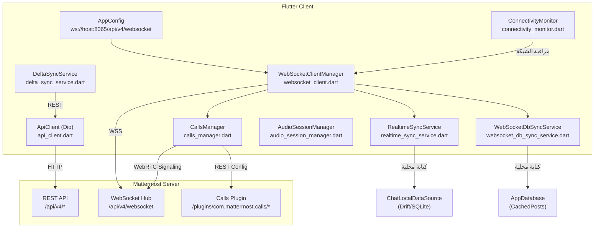
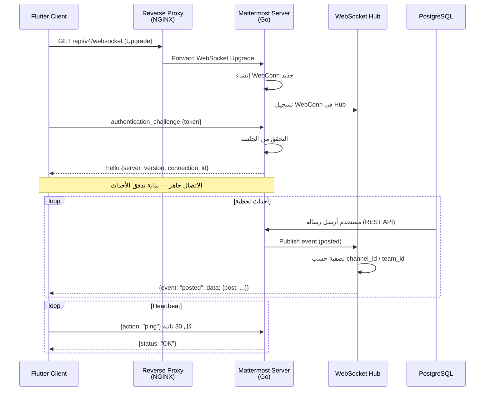
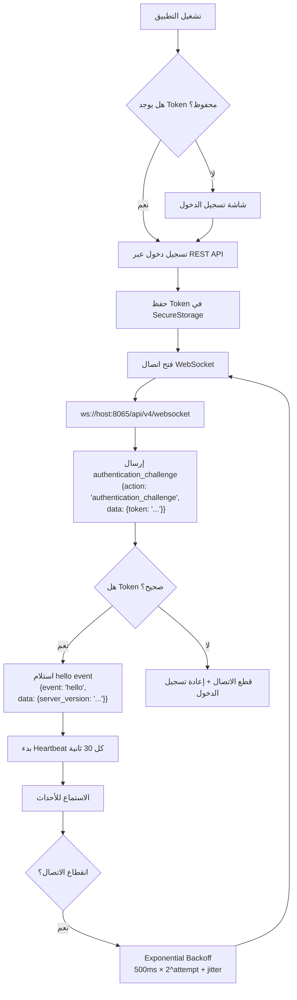
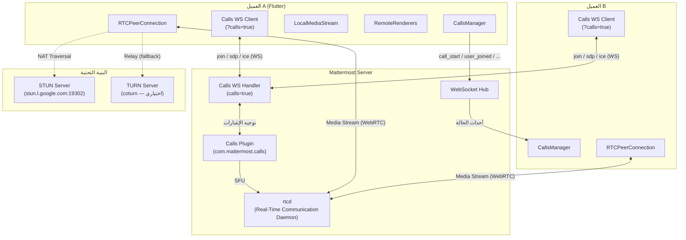
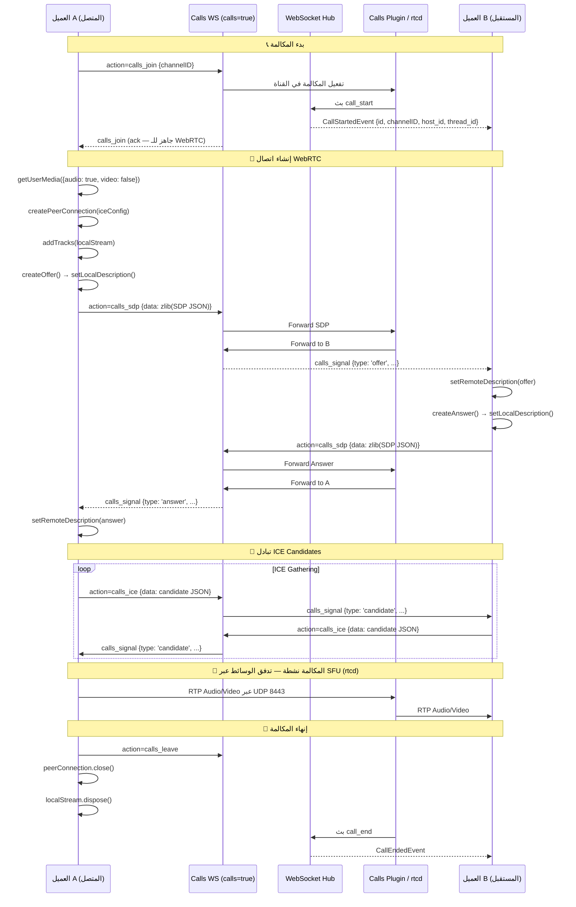
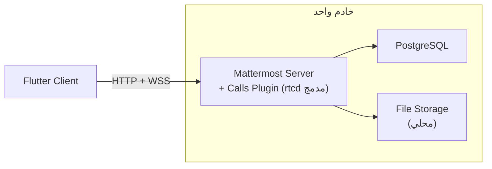
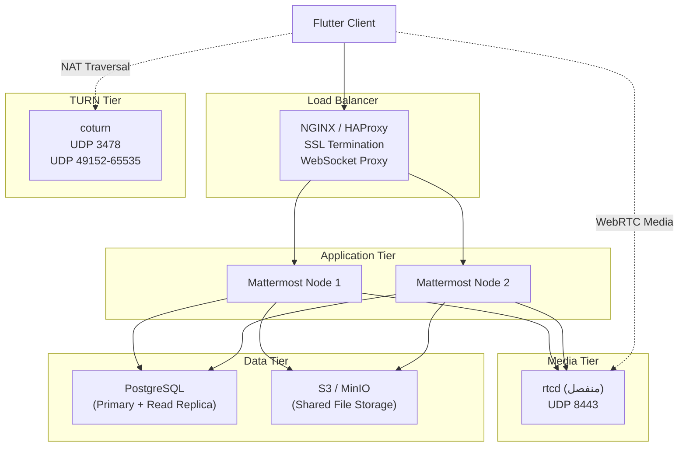

# 🔬 تحليل شامل: Mattermost Server — الرسائل اللحظية والمكالمات الصوتية/المرئية

## الفهرس
1. [البنية المعمارية الحالية لمشروعنا](#1-البنية-المعمارية-الحالية-لمشروعنا)
2. [كيف يعمل WebSocket في Mattermost Server](#2-كيف-يعمل-websocket-في-mattermost-server)
3. [المكالمات الصوتية والمرئية (Calls Plugin + WebRTC)](#3-المكالمات-الصوتية-والمرئية)
4. [البنية التحتية المطلوبة](#4-البنية-التحتية-المطلوبة)
5. [خطة الربط التفصيلية](#5-خطة-الربط-التفصيلية)
6. [الثغرات والنواقص في مشروعنا الحالي](#6-الثغرات-والنواقص)
7. [خارطة طريق التنفيذ](#7-خارطة-طريق-التنفيذ)
8. [المرحلة 0 — نتائج التحقق الميداني وتوثيق البروتوكول](#8-المرحلة-0--نتائج-التحقق-الميداني-وتوثيق-البروتوكول)

---

## 1. البنية المعمارية الحالية لمشروعنا

### 1.1 ملفات الشبكة والاتصال اللحظي



### 1.2 الملفات الرئيسية وأدوارها

| الملف | الدور | الحالة |
|-------|-------|--------|
| [websocket_client.dart](file:///home/osmsoftwareengineering/StudioProjects/flutter_mattermost/lib/core/network/websocket_client.dart) | إدارة اتصال WebSocket + تحويل الأحداث لـ Typed Events | ✅ مكتمل |
| [realtime_sync_service.dart](file:///home/osmsoftwareengineering/StudioProjects/flutter_mattermost/lib/features/chat/data/realtime/realtime_sync_service.dart) | كتابة أحداث WS في قاعدة البيانات المحلية | ✅ مكتمل |
| [websocket_db_sync_service.dart](file:///home/osmsoftwareengineering/StudioProjects/flutter_mattermost/lib/core/sync/websocket_db_sync_service.dart) | مزامنة المنشورات من WS إلى CachedPosts | ⚠️ جزئي |
| [delta_sync_service.dart](file:///home/osmsoftwareengineering/StudioProjects/flutter_mattermost/lib/core/sync/delta_sync_service.dart) | مزامنة تفاضلية عبر REST | ⚠️ placeholder |
| [calls_manager.dart](file:///home/osmsoftwareengineering/StudioProjects/flutter_mattermost/lib/core/calls/calls_manager.dart) | إدارة مكالمات WebRTC | ✅ هيكل أساسي |
| [audio_session_manager.dart](file:///home/osmsoftwareengineering/StudioProjects/flutter_mattermost/lib/core/calls/audio_session_manager.dart) | إدارة جلسة الصوت | ✅ مكتمل |
| [calls_rest_repository.dart](file:///home/osmsoftwareengineering/StudioProjects/flutter_mattermost/lib/features/chat/domain/repositories/calls_rest_repository.dart) | REST API للمكالمات | ⚠️ أساسي فقط |
| [app_config.dart](file:///home/osmsoftwareengineering/StudioProjects/flutter_mattermost/lib/app/config/app_config.dart) | إعدادات الخادم والاتصال | ✅ مكتمل |
| [connectivity_monitor.dart](file:///home/osmsoftwareengineering/StudioProjects/flutter_mattermost/lib/core/network/connectivity_monitor.dart) | مراقبة حالة الإنترنت | ✅ مكتمل |

---

## 2. كيف يعمل WebSocket في Mattermost Server

### 2.1 بنية WebSocket في الخادم (Go)



### 2.2 أنواع أحداث WebSocket الرئيسية

خادم Mattermost يبث عشرات الأحداث. ما يعالجه مشروعنا حالياً مُعلّم بـ ✅:

#### أحداث الرسائل (Posts)
| الحدث | الوصف | حالتنا |
|-------|-------|--------|
| `posted` | رسالة جديدة | ✅ `PostCreatedEvent` |
| `post_edited` | تعديل رسالة | ✅ `PostUpdatedEvent` |
| `post_deleted` | حذف رسالة | ✅ `PostDeletedEvent` |
| `post_unread` | تحديد رسالة كغير مقروءة | ❌ غير مدعوم |
| `post_acknowledgement_added` | تأكيد القراءة | ❌ غير مدعوم |
| `post_acknowledgement_removed` | إلغاء تأكيد القراءة | ❌ غير مدعوم |

#### أحداث التفاعلات (Reactions)
| الحدث | الوصف | حالتنا |
|-------|-------|--------|
| `reaction_added` | إضافة تفاعل (إيموجي) | ✅ `ReactionChangedEvent` |
| `reaction_removed` | إزالة تفاعل | ✅ `ReactionChangedEvent` |

#### أحداث القنوات (Channels)
| الحدث | الوصف | حالتنا |
|-------|-------|--------|
| `channel_updated` | تحديث قناة | ✅ `ChannelUpdatedEvent` |
| `channel_created` | إنشاء قناة جديدة | ✅ (يُعالج كـ update) |
| `channel_deleted` | حذف قناة | ✅ (يُعالج كـ update) |
| `channel_converted` | تحويل قناة (عامة↔خاصة) | ❌ غير مدعوم |
| `channel_viewed` | عرض قناة (مزامنة القراءة) | ❌ غير مدعوم |
| `channel_member_updated` | تحديث عضوية | ❌ غير مدعوم |
| `channel_scheme_updated` | تحديث مخطط صلاحيات | ❌ غير مدعوم |
| `direct_added` | إضافة رسالة مباشرة | ❌ غير مدعوم |
| `group_added` | إضافة مجموعة | ❌ غير مدعوم |

#### أحداث المستخدمين
| الحدث | الوصف | حالتنا |
|-------|-------|--------|
| `user_added` | انضمام مستخدم لقناة | ✅ `UserAddedEvent` |
| `user_removed` | مغادرة مستخدم من قناة | ✅ `UserRemovedEvent` |
| `typing` | مستخدم يكتب | ✅ `UserTypingEvent` |
| `presence` / `status_change` | تغيير حالة (online/away/dnd) | ✅ `UserPresenceEvent` |
| `user_updated` | تحديث بيانات المستخدم | ❌ غير مدعوم |
| `user_role_updated` | تحديث صلاحيات | ❌ غير مدعوم |
| `memberrole_updated` | تحديث دور العضو | ❌ غير مدعوم |

#### أحداث المحادثات (Threads)
| الحدث | الوصف | حالتنا |
|-------|-------|--------|
| `thread_follow_changed` | تغيير متابعة محادثة | ✅ `ThreadFollowChangedEvent` |
| `thread_read_changed` | تغيير حالة القراءة | ✅ `ThreadReadChangedEvent` |
| `thread_updated` | تحديث محادثة | ❌ غير مدعوم |

#### أحداث المسودات (Drafts)
| الحدث | الوصف | حالتنا |
|-------|-------|--------|
| `draft_created` | مسودة جديدة | ✅ `DraftUpsertedEvent` |
| `draft_updated` | تحديث مسودة | ✅ `DraftUpsertedEvent` |
| `draft_deleted` | حذف مسودة | ✅ `DraftDeletedEvent` |

#### أحداث المكالمات (Calls Plugin)

> [!IMPORTANT]
> **تصحيح ميداني (المرحلة 0)**: أسماء الأحداث تحقّقت من كود العميل الرسمي
> `mattermost-mobile` (constants/websocket.ts) — فاسم الحدث هو
> `custom_com.mattermost.calls_call_start` (وليس `call_started`)، والرابط في
> كودنا الحالي `custom_com.mattermost.calls_call_start` صحيح. أما إشارات
> WebRTC فلا تأتي كأحداث منفصلة على الـ Hub الرئيسي — تأتي عبر **اتصال
> WebSocket مخصص** بـ `?calls=true` تحت حدث واحد `custom_com.mattermost.calls_signal`
> (انظر القسم 3.4). الأحداث التالية تصل على الـ Hub الرئيسي:

| الحدث | الحمولة (data) | حالتنا |
|-------|----------------|--------|
| `custom_com.mattermost.calls_call_start` | `id, channelID, start_at, thread_id, post_id, owner_id, host_id` | ✅ `CallStartedEvent` |
| `custom_com.mattermost.calls_call_end` | `callID, channelID` | ❌ غير مدعوم |
| `custom_com.mattermost.calls_call_state` | `channel_id, call (JSON نصي من CallState)` | ❌ غير مدعوم |
| `custom_com.mattermost.calls_user_joined` | `user_id, session_id` | ❌ غير مدعوم |
| `custom_com.mattermost.calls_user_left` | `user_id, session_id` | ❌ غير مدعوم |
| `custom_com.mattermost.calls_user_muted` | `userID, session_id` | ❌ غير مدعوم |
| `custom_com.mattermost.calls_user_unmuted` | `userID, session_id` | ❌ غير مدعوم |
| `custom_com.mattermost.calls_user_voice_on` | `userID, session_id` | ❌ غير مدعوم |
| `custom_com.mattermost.calls_user_voice_off` | `userID, session_id` | ❌ غير مدعوم |
| `custom_com.mattermost.calls_user_screen_on` | `userID, session_id` | ❌ غير مدعوم |
| `custom_com.mattermost.calls_user_screen_off` | `userID, session_id` | ❌ غير مدعوم |
| `custom_com.mattermost.calls_user_raise_hand` | `userID, session_id, raised_hand (ms)` | ❌ غير مدعوم |
| `custom_com.mattermost.calls_user_unraise_hand` | `userID, session_id, raised_hand` | ❌ غير مدعوم |
| `custom_com.mattermost.calls_user_reacted` | `user_id, session_id, emoji{name,unified,skin,literal}, timestamp` | ❌ غير مدعوم |
| `custom_com.mattermost.calls_call_host_changed` | `hostID` | ❌ غير مدعوم |
| `custom_com.mattermost.calls_call_job_state` | `jobState{type,init_at,start_at,end_at}, callID` | ❌ غير مدعوم |
| `custom_com.mattermost.calls_caption` | `channel_id, user_id, session_id, text` | ❌ غير مدعوم |
| `custom_com.mattermost.calls_host_mute` | `user_id` (إجبار كتم من المضيف) | ❌ غير مدعوم |
| `custom_com.mattermost.calls_host_lower_hand` | `user_id` | ❌ غير مدعوم |
| `custom_com.mattermost.calls_host_removed` | `user_id` (طرد من المكالمة) | ❌ غير مدعوم |
| `custom_com.mattermost.calls_channel_enable_voice` / `channel_disable_voice` | `channel_id` | ❌ غير مدعوم |

> ملاحظة: أحداث `user_muted`/`voice_*`/`screen_*`/`raise_hand` تصل لجميع أعضاء
> القناة (أحداث قناة) — تُستخدم للمراقبة/البانرات. عند بدء v2 (LiveKit) تختفي
> هذه الأحداث وتُدار من داخل غرفة LiveKit (مؤجل للمرحلة 4).

### 2.3 هيكل رسالة WebSocket من الخادم

```json
{
  "event": "posted",
  "data": {
    "channel_display_name": "General",
    "channel_name": "general",
    "channel_type": "O",
    "mentions": "[\"user_id_1\"]",
    "post": "{\"id\":\"abc123\",\"create_at\":1723456789000,\"message\":\"Hello!\",\"channel_id\":\"ch_id\",...}",
    "sender_name": "@username",
    "set_online": true,
    "team_id": "team_id"
  },
  "broadcast": {
    "channel_id": "ch_id",
    "team_id": "team_id",
    "user_id": "",
    "omit_users": null
  },
  "seq": 42
}
```

### 2.4 آلية المصادقة والاتصال



---

## 3. المكالمات الصوتية والمرئية

### 3.1 بنية Mattermost Calls

> [!IMPORTANT]
> **تصحيح ميداني (المرحلة 0)**: الإشارات (join/sdp/ice/...) لا تمر عبر الـ Hub
> الرئيسي — تحتاج **اتصال WebSocket ثانٍ مستقل** بنفس المسار لكن مع
> `?calls=true` (راجع القسم 3.4). أحداث الحالة (`call_start`/`user_joined`/
> `user_muted`/...) تصل على الـ Hub الرئيسي كأحداث قناة.



### 3.2 تدفق المكالمة خطوة بخطوة



### 3.3 REST API لإضافة المكالمات

> [!IMPORTANT]
> **تصحيح ميداني (المرحلة 0)**: المسارات تحققت من عميل الموبايل الرسمي
> (`ClientCalls` / `rest.ts`) — الرابط الحالي `/plugins/com.mattermost.calls/config`
> صحيح، والباقي أدناه صيغته الفعلية. `CallChannelState` = `{enabled, channel_id, call}`.

```
GET  /plugins/com.mattermost.calls/config        → CallsConfig (ICEServers, ICEServersConfigs, NeedsTURNCredentials, EnableAV1, EnableSimulcast, EnableRinging, MaxCallParticipants, ...)
GET  /plugins/com.mattermost.calls/turn-credentials → RTCIceServer[] (تحقق باهني عند NeedsTURNCredentials=true)
GET  /plugins/com.mattermost.calls/calls          → جميع المكالمات النشطة CallChannelState[]
GET  /plugins/com.mattermost.calls/channels/{channelId}                → حالة المكالمة في القناة
POST /plugins/com.mattermost.calls/channels/{channelId}/calls          → بدء مكالمة (body: {title?, thread_id?, root_id?})
GET  /plugins/com.mattermost.calls/channels/{channelId}/calls/{callId} → حالة مكالمة
POST /plugins/com.mattermost.calls/channels/{channelId}/calls/{callId}/end → إنهاء المكالمة (المضيف)
GET  /plugins/com.mattermost.calls/channels/{channelId}/calls/{callId}/participants → قائمة المشاركين
POST /plugins/com.mattermost.calls/channels/{channelId}/calls/{callId}/mute       → كتم مشارك (مضيف)
POST /plugins/com.mattermost.calls/channels/{channelId}/calls/{callId}/lower_hand → إنزال يد (مضيف)
POST /plugins/com.mattermost.calls/channels/{channelId}/calls/{callId}/remove     → طرد مشارك (مضيف)
POST /plugins/com.mattermost.calls/channels/{channelId}/calls/{callId}/recording/start|stop → تسجيل
```

### 3.4 بروتوكول WebSocket المخصص للمكالمات (`calls=true`) — موثق بالمرحلة 0

تحقق المرحلة 0 (من كود `mattermost-mobile` الرسمي) أثبت أن الإشارات تُرسل عبر
**اتصال مستقل** وليس الـ Hub الرئيسي:

| الخصائص | القيمة |
|---------|--------|
| **المسار** | نفس مسار الـ WebSocket الرئيسي + `?calls=true&connection_id=<connId>&sequence_number=<seq>` |
| **المصادقة** | `authorization: Bearer <token>` في الـ header (أو `authentication_challenge`) |
| **الترحيب** | `hello` → يمنح `connection_id` (يُستخدم كـ **session_id** لاحقاً) |
| **الاستلام** | `custom_com.mattermost.calls_join` (ack)، `custom_com.mattermost.calls_error`، `custom_com.mattermost.calls_signal` (الإشارات) |
| **الإرسال** | `{action: "custom_com.mattermost.calls_<signal>", seq, data}` |
| **الترميز الثنائي** | رسائل `sdp` تُرسل msgpack + SDP مضغوط zlib (الحجم قد يتجاوز حد النص 8KB) |

**إشارات الإرسال المعتمدة (client → server):**

| الإشارة | الحمولة (data) | الغرض |
|---------|----------------|-------|
| `join` | `{channelID, title?, threadID?, av1Support, dcSignaling}` | الانضمام/بدء مكالمة |
| `reconnect` | `{channelID, originalConnID, prevConnID}` | إعادة اتصال (بدل join) |
| `leave` | — | مغادرة المكالمة |
| `mute` / `unmute` | — | كتم/إلغاء كتم الميكروفون |
| `raise_hand` / `unraise_hand` | — | رفع/إنزال اليد |
| `react` | `{data: JSON.stringify(emoji)}` | تفاعل إيموجي |
| `sdp` | `{data: <SDP مضغوط zlib>}` | Offer/Answer |
| `ice` | `{data: JSON.stringify(candidate)}` | ICE candidate |
| `call_end` | — | إنهاء المكالمة (المضيف) |
| `host_change` | `{session_id}` | نقل المضيف |
| `recording_start` / `recording_stop` | — | التسجيل |
| `metric` | `{metric_name, data}` | إحصاءات الشبكة |

> [!WARNING]
> أسماء الإشارات في الكود الحالي **خاطئة**: `join_call` ← يجب `join`،
> `leave_call` ← يجب `leave`، `webrtc_offer`/`webrtc_answer` ← يجب `sdp`،
> `ice_candidate` ← يجب `ice` — وسيجري تصحيحها في المرحلة 1 (اتصال المكالمات)
> والمرحلة 3 (CallsManager).

---

## 4. البنية التحتية المطلوبة

### 4.1 المتطلبات حسب حجم النشر

#### 🟢 نشر صغير (1-50 مستخدم)



| المكون | المتطلب |
|--------|---------|
| **الخادم** | CPU: 2 cores، RAM: 4GB، SSD: 50GB |
| **قاعدة البيانات** | PostgreSQL 12+ (يمكن على نفس الخادم) |
| **المنافذ** | `8065` (HTTP+WS)، `8443/UDP` (Media/WebRTC) |
| **STUN** | الافتراضي: `stun.l.google.com:19302` |
| **TURN** | غير مطلوب (ما لم يكن هناك NAT معقد) |
| **SSL/TLS** | Let's Encrypt (مجاني) |
| **نظام التشغيل** | Ubuntu 22.04+ / CentOS 8+ |

#### 🟡 نشر متوسط (50-500 مستخدم)



| المكون | المتطلب |
|--------|---------|
| **Load Balancer** | NGINX/HAProxy — CPU: 2 cores، RAM: 2GB |
| **Mattermost Nodes (×2)** | CPU: 4 cores، RAM: 8GB لكل عقدة |
| **PostgreSQL** | CPU: 4 cores، RAM: 16GB، SSD: 200GB |
| **rtcd (منفصل)** | CPU: 4 cores، RAM: 8GB |
| **coturn** | CPU: 2 cores، RAM: 4GB |
| **S3/MinIO** | تخزين مشترك للملفات |
| **الشبكة** | جميع العقد في نفس مركز البيانات |
| **الترخيص** | ⚠️ Enterprise Edition للـ HA Clustering |

#### 🔴 نشر كبير (500+ مستخدم)

| المكون | المتطلب |
|--------|---------|
| **Load Balancer** | NGINX × 2 (Active/Passive) |
| **Mattermost Nodes** | 4+ عقد، CPU: 8 cores، RAM: 16GB |
| **PostgreSQL** | Cluster (Primary + 2 Replicas)، 32GB RAM |
| **rtcd** | 2+ instances مع load balancing |
| **coturn** | 2+ instances |
| **Elasticsearch** | للبحث المتقدم (3 nodes cluster) |
| **Redis/Memcached** | للتخزين المؤقت (اختياري) |

### 4.2 إعدادات الشبكة والمنافذ

```
┌─────────────────────────────────────────────────────────┐
│                    Firewall Rules                        │
├─────────────┬──────────┬────────────────────────────────┤
│ المنفذ      │ البروتوكول│ الوصف                          │
├─────────────┼──────────┼────────────────────────────────┤
│ 443         │ TCP      │ HTTPS (REST API + WSS)         │
│ 8065        │ TCP      │ Mattermost (بدون proxy)        │
│ 8443        │ UDP      │ rtcd Media Traffic              │
│ 3478        │ UDP/TCP  │ STUN/TURN                       │
│ 5349        │ TCP      │ TURN over TLS                   │
│ 49152-65535 │ UDP      │ coturn Relay Range               │
│ 5432        │ TCP      │ PostgreSQL (داخلي فقط)          │
│ 8075        │ TCP      │ Mattermost Cluster (داخلي)     │
├─────────────┴──────────┴────────────────────────────────┤
│ ⚠️ المنافذ 5432 و 8075 يجب ألا تكون مفتوحة للعموم      │
└─────────────────────────────────────────────────────────┘
```

### 4.3 إعداد NGINX كـ Reverse Proxy

```nginx
# /etc/nginx/conf.d/mattermost.conf

upstream mattermost_backend {
    server 127.0.0.1:8065;
    keepalive 32;
}

server {
    listen 443 ssl http2;
    server_name mm.yourdomain.com;

    ssl_certificate     /etc/letsencrypt/live/mm.yourdomain.com/fullchain.pem;
    ssl_certificate_key /etc/letsencrypt/live/mm.yourdomain.com/privkey.pem;

    # WebSocket Support — حاسم جداً
    location ~ /api/v4/websocket {
        proxy_pass http://mattermost_backend;
        proxy_http_version 1.1;
        proxy_set_header Upgrade $http_upgrade;
        proxy_set_header Connection "upgrade";
        proxy_set_header Host $host;
        proxy_set_header X-Real-IP $remote_addr;
        proxy_set_header X-Forwarded-For $proxy_add_x_forwarded_for;
        proxy_set_header X-Forwarded-Proto $scheme;

        # مهم: timeout طويل للـ WebSocket
        proxy_read_timeout 600s;
        proxy_send_timeout 600s;
    }

    # REST API + Static Files
    location / {
        proxy_pass http://mattermost_backend;
        proxy_http_version 1.1;
        proxy_set_header Host $host;
        proxy_set_header X-Real-IP $remote_addr;
        proxy_set_header X-Forwarded-For $proxy_add_x_forwarded_for;
        proxy_set_header X-Forwarded-Proto $scheme;

        client_max_body_size 50M;
    }
}
```

---

## 5. خطة الربط التفصيلية

### 5.1 الخطوة 1: تحديث إعدادات الاتصال

[app_config.dart](file:///home/osmsoftwareengineering/StudioProjects/flutter_mattermost/lib/app/config/app_config.dart) يحتاج تعديلات لدعم:

```dart
abstract class AppConfig {
  // ① دعم HTTPS/WSS للإنتاج
  static const bool useSSL = true;  // ← جديد
  static const String host = 'mm.yourdomain.com';

  static String get defaultBaseUrl =>
    '${useSSL ? "https" : "http"}://$host/api/v4';

  static String get defaultWebSocketUrl =>
    '${useSSL ? "wss" : "ws"}://$host/api/v4/websocket';

  // ② إعدادات المكالمات
  static const String defaultStunServer = 'stun:stun.l.google.com:19302';
  static const String? turnServer = null;  // 'turn:turn.yourdomain.com:3478'
  static const String? turnUsername = null;
  static const String? turnPassword = null;

  // ③ إعدادات rtcd
  static const int rtcdPort = 8443;
}
```

### 5.2 الخطوة 2: تحسين WebSocket Client

المشاكل الحالية في [websocket_client.dart](file:///home/osmsoftwareengineering/StudioProjects/flutter_mattermost/lib/core/network/websocket_client.dart):

> [!WARNING]
> 1. **لا يتم معالجة حدث `hello`** — الخادم يرسل `hello` بعد المصادقة الناجحة لكن الكود يتجاهله
> 2. **`seq` في authenticate ثابت = 1** — يجب أن يكون تسلسلي
> 3. **لا يوجد تتبع لـ `connection_id`** — مطلوب للمزامنة التفاضلية
> 4. **Reconnect لا يُفعّل Delta Sync** — عند إعادة الاتصال يجب جلب الأحداث المفقودة
> 5. **لا يوجد دعم لأحداث المكالمات المتقدمة** — فقط `call_start`، وإشارات
>    WebRTC (`sdp`/`ice`) لا تصل أصلاً على الـ Hub الرئيسي بل على اتصال
>    `?calls=true` المخصص (راجع القسم 3.4)
>
> **تصحيح ميداني (المرحلة 0)**: النقاط 1–4 أُصلحت فعلاً في الكود الحالي
> (HelloEvent + تسلسل seq + تتبع connection_id + WebSocketReconnectedEvent/Delta
> Sync). البند 5 هو عمل المرحلة 1 و2.

التحسينات المطلوبة:

```dart
// ① إضافة معالجة hello event
case 'hello':
  final serverVersion = data['server_version'] as String? ?? '';
  final connectionId = data['connection_id'] as String? ?? '';
  _connectionId = connectionId;
  _typedEventStreamController.add(
    HelloEvent(serverVersion: serverVersion, connectionId: connectionId, seq: seq),
  );
  break;

// ② إضافة أحداث المكالمات الناقصة
case 'custom_com.mattermost.calls_call_end':
  _typedEventStreamController.add(CallEndedEvent(...));
  break;
case 'custom_com.mattermost.calls_user_joined':
  _typedEventStreamController.add(CallUserJoinedEvent(...));
  break;
case 'custom_com.mattermost.calls_user_left':
  _typedEventStreamController.add(CallUserLeftEvent(...));
  break;
case 'custom_com.mattermost.calls_user_muted':
case 'custom_com.mattermost.calls_user_unmuted':
  _typedEventStreamController.add(CallUserMuteEvent(...));
  break;
case 'custom_com.mattermost.calls_user_voice_on':
case 'custom_com.mattermost.calls_user_voice_off':
  _typedEventStreamController.add(CallUserVoiceEvent(...));
  break;
case 'custom_com.mattermost.calls_user_screen_on':
case 'custom_com.mattermost.calls_user_screen_off':
  _typedEventStreamController.add(CallScreenShareEvent(...));
  break;
case 'custom_com.mattermost.calls_user_raise_hand':
case 'custom_com.mattermost.calls_user_unraise_hand':
  _typedEventStreamController.add(CallRaiseHandEvent(...));
  break;
case 'custom_com.mattermost.calls_host_changed':
  _typedEventStreamController.add(CallHostChangedEvent(...));
  break;

// ③ إضافة reconnect مع delta sync
void _handleDisconnectAndReconnect() {
  _lastDisconnectSeq = _lastReceivedSeq;  // حفظ آخر seq
  _onDisconnected();
  _scheduleReconnect();
}

// بعد إعادة الاتصال بنجاح:
if (_lastDisconnectSeq > 0) {
  // جلب الأحداث المفقودة عبر REST
  _onReconnectCallback?.call(_lastDisconnectSeq);
}
```

### 5.3 الخطوة 3: تحسين CallsManager

المشاكل الحالية في [calls_manager.dart](file:///home/osmsoftwareengineering/StudioProjects/flutter_mattermost/lib/core/calls/calls_manager.dart):

> [!IMPORTANT]
> 1. **لا يتم تحديث `participants` من أحداث WS** — فقط من `onTrack`
> 2. **لا يوجد إشعار عند انضمام/مغادرة مشارك**
> 3. **لا يوجد دعم لـ SFU (Selective Forwarding Unit)** — النموذج الحالي P2P فقط
> 4. **ICE restart لا يُبلَّغ للمشاركين الآخرين**
> 5. **لا يوجد إدارة لحالة المكالمة (ringing/connected/ended)**
>
> **تصحيح ميداني (المرحلة 0)**: CallsManager يرسل إشارات `join_call`/`leave_call`/
> `webrtc_offer`/`webrtc_answer`/`ice_candidate` عبر `WebSocketClientManager`
> (الـ Hub الرئيسي) — هذا **لا يعمل** مع الخادم الحقيقي. المرحلة 1 تبني اتصال
> `calls=true` المخصص، والمرحلة 3 تعيد كتابة CallsManager عليه بالإشارات الصحيحة
> (`join`/`leave`/`sdp`/`ice`).

التحسينات المطلوبة:

```dart
// ① إضافة حالة المكالمة
enum CallState { idle, ringing, connecting, connected, reconnecting, ended }

// ② إضافة أحداث جديدة في _onWebSocketEvent
void _onWebSocketEvent(TypedWebSocketEvent event) {
  if (event is CallStartedEvent) {
    _callState = CallState.ringing;
    _incomingCallsController.add(event);
  } else if (event is CallEndedEvent) {
    _callState = CallState.ended;
    endCall();
  } else if (event is CallUserJoinedEvent) {
    _addParticipant(event.userId, event.sessionId);
  } else if (event is CallUserLeftEvent) {
    _removeParticipant(event.sessionId);
  } else if (event is CallUserMuteEvent) {
    _updateParticipantMute(event.sessionId, event.isMuted);
  } else if (event is CallUserVoiceEvent) {
    _updateParticipantVoice(event.sessionId, event.isActive);
  } else if (event is CallScreenShareEvent) {
    _updateParticipantScreenShare(event.sessionId, event.isSharing);
  } else if (event is CallRaiseHandEvent) {
    _updateParticipantHandRaise(event.sessionId, event.isRaised);
  } else if (event is WebRTCSignalingEvent) {
    _handleSignalingEvent(event);
  }
}

// ③ إضافة REST APIs ناقصة في CallsRestRepository
Future<ApiResult<void>> joinCall(String channelId);
Future<ApiResult<void>> leaveCall(String channelId);
Future<ApiResult<List<CallParticipant>>> getCallParticipants(String channelId);
Future<ApiResult<Map>> getAllActiveCalls();
```

### 5.4 الخطوة 4: تحسين Delta Sync

[delta_sync_service.dart](file:///home/osmsoftwareengineering/StudioProjects/flutter_mattermost/lib/core/sync/delta_sync_service.dart) حالياً **placeholder**. التنفيذ الكامل:

```dart
@lazySingleton
class DeltaSyncService {
  final ChatLocalDataSource _localDataSource;
  final PostRemoteDataSource _postRemoteDataSource;
  final AuthRepository _authRepository;
  final ApiClient _apiClient;

  int _lastSyncAt = 0;

  /// مزامنة تفاضلية: جلب فقط التغييرات منذ آخر مزامنة
  Future<void> deltaSync() async {
    if (_lastSyncAt == 0) {
      // أول مزامنة — جلب كل شيء
      await fullSync();
      return;
    }

    // استخدام endpoint الخاص بالمزامنة التفاضلية
    final result = await _apiClient.get<Map<String, dynamic>>(
      '/users/me/teams/unread',
      fromJson: (data) => data as Map<String, dynamic>,
    );

    // ... معالجة التغييرات وتحديث القاعدة المحلية
    _lastSyncAt = DateTime.now().millisecondsSinceEpoch;
  }

  /// يُستدعى عند إعادة اتصال WebSocket
  Future<void> onReconnect(int lastSeq) async {
    await deltaSync();
  }
}
```

### 5.5 الخطوة 5: ربط ConnectivityMonitor مع WebSocket

```dart
// في AuthBloc أو AppBloc:
_connectivityMonitor.connectionChangeStream.listen((hasConnection) {
  if (hasConnection && _webSocketManager.status == WebSocketStatus.disconnected) {
    _webSocketManager.connect();
    _deltaSyncService.deltaSync(); // مزامنة عند استعادة الاتصال
  }
});
```

---

## 6. الثغرات والنواقص

### 6.1 ثغرات حرجة 🔴

| # | المشكلة | التأثير | الحل |
|---|---------|---------|------|
| 1 | **لا يوجد SSL/TLS** — الاتصال حالياً `ws://` و `http://` | البيانات غير مشفرة — كلمات المرور والرسائل مكشوفة | تفعيل `wss://` و `https://` عبر NGINX |
| 2 | **عدم معالجة `hello` event** | لا يمكن معرفة هل المصادقة نجحت أم لا | إضافة `HelloEvent` والتحقق من `connection_id` |
| 3 | **Delta Sync معطل** | عند الانقطاع والعودة، لا يتم جلب الرسائل المفقودة | تنفيذ `deltaSync()` الكامل |
| 4 | **لا يوجد sequence tracking** | لا يمكن كشف الفجوات في الأحداث | تتبع `seq` وطلب الأحداث المفقودة |

### 6.2 ثغرات مهمة 🟡

| # | المشكلة | التأثير | الحل |
|---|---------|---------|------|
| 5 | **أحداث المكالمات ناقصة** | لا يعرف المستخدم من انضم/غادر/كتم | إضافة 14 حدث مكالمة مفقود |
| 6 | **لا يوجد إشعارات Push** | لا يصل إشعار عند إغلاق التطبيق | ربط Firebase FCM / APNs |
| 7 | **لا يوجد Retry Queue للرسائل** | الرسائل قد تضيع أثناء الانقطاع | إنشاء طابور إعادة محاولة |
| 8 | **P2P فقط بدون SFU** | المكالمات الجماعية (3+) لن تعمل بكفاءة | دعم SFU عبر rtcd |

### 6.3 ثغرات تحسينية 🟢

| # | المشكلة | الحل |
|---|---------|------|
| 9 | لا يوجد `channel_viewed` sync | إضافة مزامنة حالة القراءة |
| 10 | لا يوجد `user_updated` event | تحديث بيانات المستخدمين لحظياً |
| 11 | لا يوجد message acknowledgement | تأكيد وصول/قراءة الرسائل |
| 12 | لا يوجد تسجيل مكالمات | ربط REST API للتسجيل |

---

## 7. خارطة طريق التنفيذ

### المرحلة 1: الأساسيات الحرجة (أسبوع 1-2)

- [ ] تفعيل SSL/TLS (NGINX + Let's Encrypt)
- [ ] تحديث `AppConfig` لدعم `wss://` و `https://`
- [ ] إضافة معالجة `hello` event في WebSocket client
- [ ] تنفيذ تتبع `seq` وكشف الفجوات
- [ ] تنفيذ Delta Sync الكامل
- [ ] ربط `ConnectivityMonitor` مع إعادة الاتصال التلقائية

### المرحلة 2: إصلاح وتكامل المكالمات (أسبوع 3-4) — بعد تصحيحات المرحلة 0

- [x] **المرحلة 1 (مضمنة)**: اتصال WebSocket مخصص `?calls=true` (CallsWebSocketClient)
      — auth/hello/join/leave/sdp ثنائي msgpack+zlib/ice/دورات ping-pong/
      فلتر connID/إعادة اتصال تلقائي (نُفّذ واختبَر — 2026-08)
- [x] إضافة أحداث المكالمات الناقصة في الـ Hub الرئيسي (`CallStateEvent`
      لجميع `custom_com.mattermost.calls_*` + تصحيح `CallStartedEvent`
      لقراءة `id`/`channelID`) (نُفّذ — 2026-08)
- [x] إعادة بناء `CallsManager` على اتصال المكالمات بإشارات صحيحة
      (`join`/`leave`/`sdp`/`ice`) + إدارة حالة المكالمة
      (participants/isVideoOn/isHost/incomingCalls/callEnded/reactions/
      hostControl/connectionStatus + ICE restart عند إعادة الاتصال) (نُفّذ — 2026-08)
- [x] إضافة REST APIs المكالمات الناقصة بمساراتها الفعلية
      (`/config`, `/{channelId}?mobilev2=true`, `/turn-credentials`,
      `/calls/{channelId}/end`, `/calls/{channelId}/dismiss-notification`,
      `/calls/{callId}/host/{make|mute|screen-off|lower-hand|remove}`)
- [ ] نشر coturn TURN server + `genTURNCredentials`
- [ ] اختبار المكالمات عبر NAT/Firewall
- [ ] إضافة UI لإدارة المشاركين في المكالمة

### المرحلة 3: الاستقرار والأداء (أسبوع 5-6)

- [ ] إضافة Retry Queue للرسائل
- [ ] إضافة أحداث القنوات الناقصة
- [ ] تحسين إدارة الذاكرة في WebRTC renderers
- [ ] إضافة إشعارات Push (FCM/APNs)
- [ ] اختبار الأداء تحت ضغط عالٍ

### المرحلة 4: ميزات متقدمة (أسبوع 7-8)

- [ ] دعم SFU للمكالمات الجماعية
- [ ] مشاركة الشاشة المحسّنة
- [ ] تسجيل المكالمات
- [ ] الترجمة الحية (Live Captions)
- [ ] رفع اليد والتفاعلات أثناء المكالمة
- [ ] End-to-End Encryption (E2EE)

---

> [!TIP]
> **أولوية البداية**: ابدأ بالمرحلة 1 (SSL + Delta Sync + Hello Event) لأنها الأساس الذي تُبنى عليه كل الميزات الأخرى. بدون SSL لن يعمل التطبيق في بيئة إنتاج حقيقية، وبدون Delta Sync ستفقد رسائل عند كل انقطاع.

> [!IMPORTANT]
> **بخصوص المكالمات**: إضافة Calls (com.mattermost.calls) يجب أن تكون **مفعّلة** في System Console → Plugins → Calls. بدونها لن تعمل أي من ميزات WebRTC.

---

## 8. المرحلة 0 — نتائج التحقق الميداني وتوثيق البروتوكول (2026-08)

### 8.1 ما تحقق في هذه المرحلة

| البند | النتيجة |
|-------|---------|
| **مصدر المواصفات** | كود العميل الرسمي `mattermost-mobile` (connection.ts / websocket_client.ts / constants/websocket.ts) + `@mattermost/calls-common` المثبّت ضمن webapp مستودع `mattermost` المحلي |
| **النسخة** | البنية المعتمدة في مراجع `mattermost/docs` (v10+) هي **Integrated Calls (WebRTC + rtcd)** وليست LiveKit — العمل على بروتوكول v1 |
| **الخادم 192.168.137.1** | ⚠️ **غير قابل للوصول من بيئة التطوير هذه** (نحن على شبكة 192.168.1.x، والخادم على 192.168.137.x عبر ICS/Hotspot) — فحص حي معلّق (راجع 8.3) |
| **اتصال الإشارات** | يحتاج اتصال WS **مستقل** بـ `?calls=true` + `authorization: Bearer` (راجع القسم 3.4) |
| **الأخطاء المكتشفة في الكود** | إشارات `join_call`/`leave_call`/`webrtc_offer`/`webrtc_answer`/`ice_candidate` كلها **خاطئة** → الصحيحة `join`/`leave`/`sdp`/`ice`؛ و `WebRTCSignalingEvent` لا يُرسَل أبداً حالياً |

### 8.2 خلاصة التصحيحات المطبقة على هذا المستند

1. **أسماء الأحداث**: `call_start` (وليس `call_started`) — والكود الحالي صحيح فيها.
2. **أحداث الحالة** تصل على الـ Hub الرئيسي (جدول القسم 2.2)، و**الإشارات** على اتصال `calls=true` (القسم 3.4) — لا تخلط بينهما.
3. **الحمولات**: الحقول snake_case من الخادم لكن بعضها camelCase (`userID`, `channelID`, `session_id`, `hostID`, `callID`, `raised_hand`) — انتبه عند التحليل في Flutter.
4. **REST**: المسارات الفعلية في القسم 3.3 (مثل `turn-credentials` و `participants`).

### 8.3 أوامر الفحص الحي — تنفَّذ من جهاز على شبكة 192.168.137.x

```bash
# ① هل الخادم حي؟
curl -s http://192.168.137.1:8065/api/v4/system/ping

# ② إصدار الإضافة (تحتاج token — من الـ System Console أو من إعدادات المتصفح)
curl -s -H "Authorization: Bearer <TOKEN>" \
  http://192.168.137.1:8065/api/v4/plugins
# → ابحث عن com.mattermost.calls في النتيجة (حقل version)

# ③ إعدادات المكالمات (تأكيد icehostoverride/المنافذ)
curl -s -H "Authorization: Bearer <TOKEN>" \
  http://192.168.137.1:8065/plugins/com.mattermost.calls/config

# ④ المنافذ
nmap -sU -p 8443 192.168.137.1   # UDP وسائط rtcd
nmap -sT -p 8065 192.168.137.1   # HTTP/WS

# ⑤ التقاط أحداث WS الحقيقية: افتح المتصفح على القناة، ابدأ مكالمة،
#    وفي Network → WS راقب: الاتصال الرئيسي (call_start/user_joined/...)
#    والاتصال بـ ?calls=true (hello + calls_signal + calls_join).
#    سجّل الحمولات الفعلية وقارنها بجداول القسمين 2.2 و 3.4.
```

### 8.4 ملاحظات نهائية قبل التنفيذ

- **SDP مضغوط**: رسائل `sdp` تُرسل بترميز msgpack + ضغط zlib (قد يتجاوز النص 8KB) — المرحلة 1 تتضمن دعم الترميز الثنائي، أو إرسال JSON إن قبله الخادم.
- **session_id** = `connection_id` الصادر من hello على اتصال `calls=true` (لا حاجة لتوليد uuid).
- **إعادة الاتصال** تُرسل `reconnect` (وليس `join`) مع `originalConnID` و `prevConnID`.
- تأكّد من فتح `8443 UDP/TCP` في جدار الحماية قبل أي اختبار وسائط.
