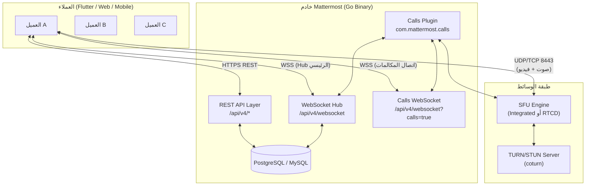
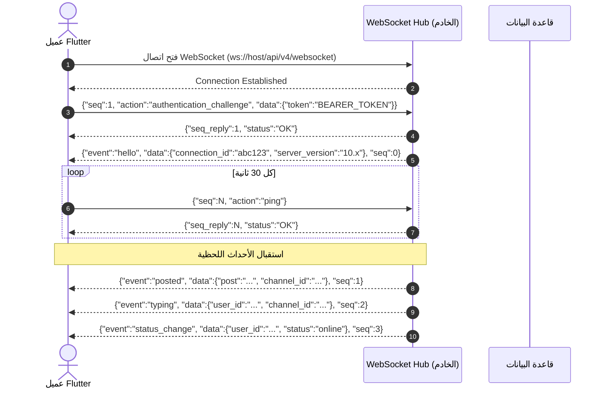
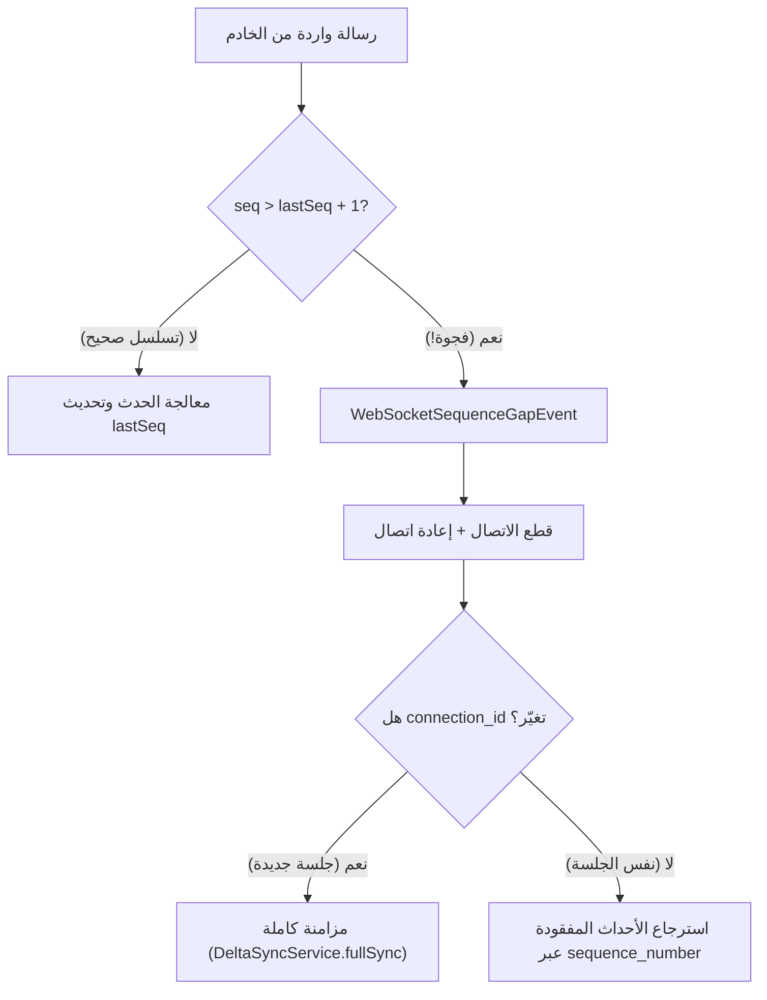
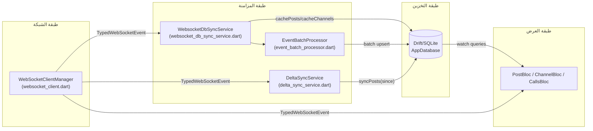
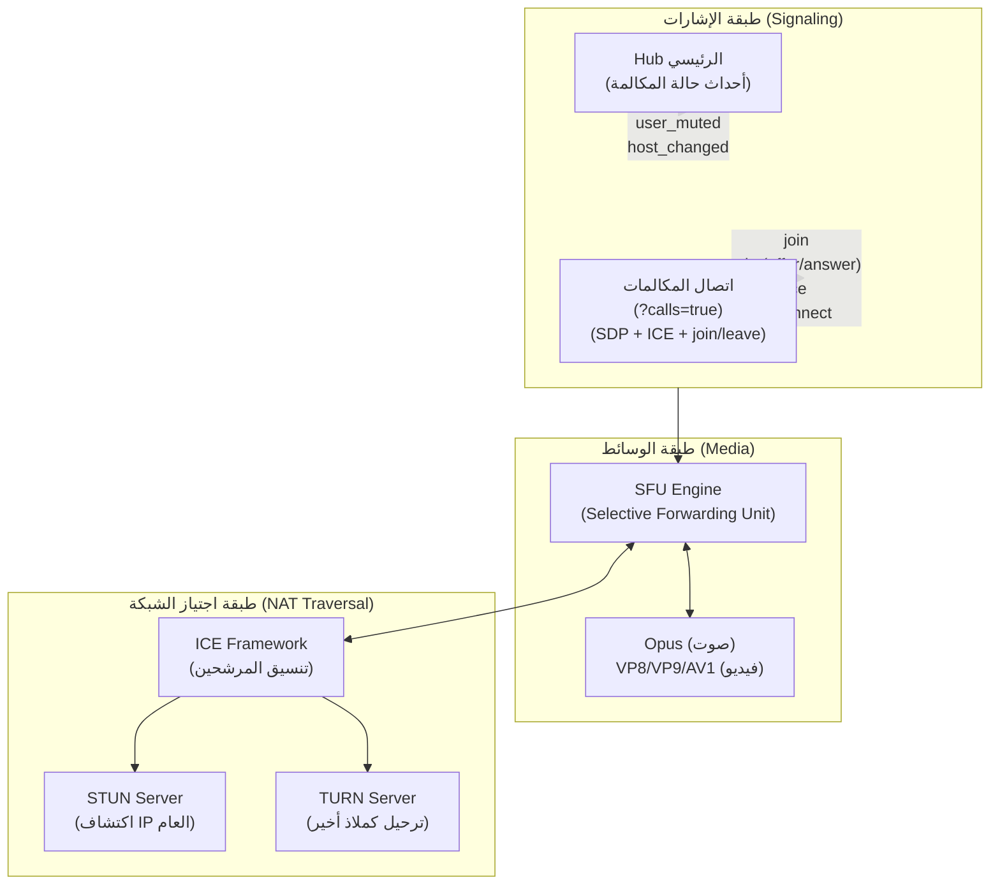
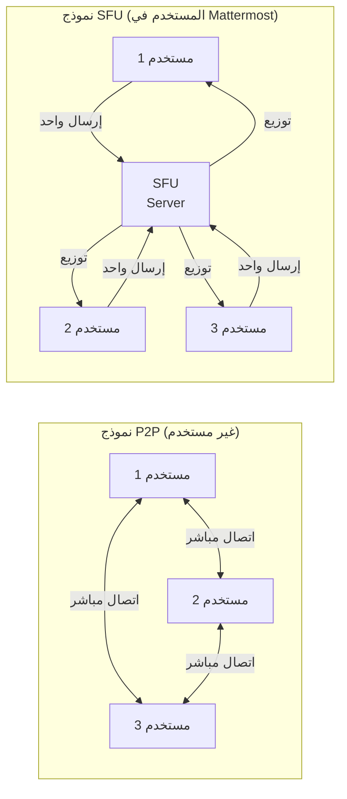
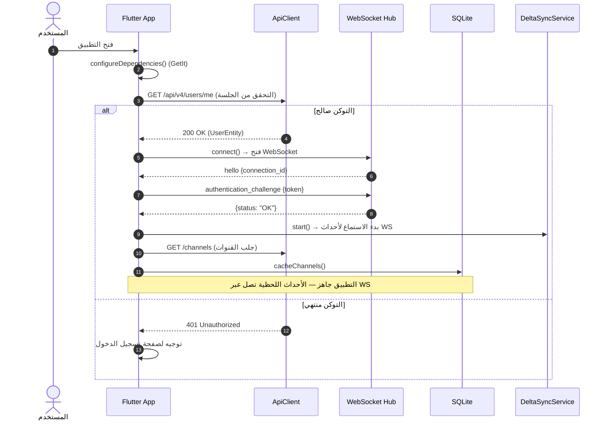
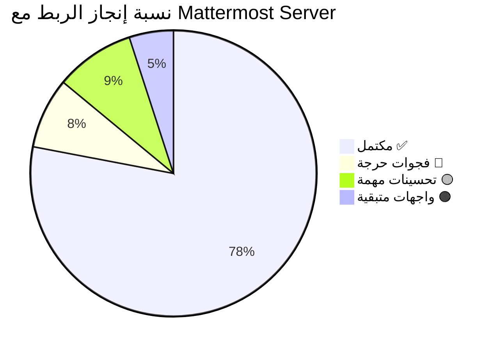

# تحليل شامل ومفصّل: Mattermost Server — الاتصال اللحظي (Real-Time) والمكالمات الصوتية/المرئية
## وكيفية الربط مع مشروعنا `flutter_mattermost`

---

## 📑 فهرس المحتويات

1. [الجزء الأول: معمارية WebSocket في Mattermost Server](#1-معمارية-websocket-في-mattermost-server)
2. [الجزء الثاني: نظام الرسائل اللحظية (Real-Time Messaging)](#2-نظام-الرسائل-اللحظية)
3. [الجزء الثالث: نظام المكالمات الصوتية والمرئية (Calls Plugin)](#3-نظام-المكالمات-الصوتية-والمرئية)
4. [الجزء الرابع: تحليل مشروعنا الحالي وما أنجزناه](#4-تحليل-مشروعنا-الحالي)
5. [الجزء الخامس: البنية التحتية المطلوبة بالتفصيل](#5-البنية-التحتية-المطلوبة)
6. [الجزء السادس: خطة الربط والتنفيذ التفصيلية](#6-خطة-الربط-والتنفيذ)
7. [الجزء السابع: الفجوات والمتطلبات المتبقية](#7-الفجوات-والمتطلبات-المتبقية)

---

## 1. معمارية WebSocket في Mattermost Server

### 1.1 النظرة العامة — كيف يعمل الخادم

Mattermost Server مكتوب بلغة **Go** كملف ثنائي واحد (single binary) يعمل كخادم RESTful JSON + WebSocket Hub. يستخدم نموذج **Hub/Client Pattern** حيث:



### 1.2 نموذج التزامن في Go

خادم Mattermost يستخدم **goroutines** الخفيفة في Go لإدارة آلاف الاتصالات المتزامنة:

| المكون | الآلية | الوظيفة |
|--------|--------|---------|
| **WebSocket Hub** | goroutine واحدة مركزية + قنوات Go | توزيع الأحداث على جميع العملاء المتصلين |
| **WebSocket Client** | goroutine مخصصة لكل اتصال | قراءة/كتابة الرسائل لكل عميل |
| **Event Broadcasting** | Go channels + mutex | إرسال الأحداث للمشتركين المعنيين فقط |
| **Ping/Pong** | Timer goroutine | مراقبة حيوية كل اتصال |

### 1.3 اتصالان WebSocket منفصلان

> [!IMPORTANT]
> Mattermost يستخدم **اتصالي WebSocket مختلفين تماماً** — وهذا أمر حاسم لفهم المعمارية:

| الاتصال | URL | الغرض | البيانات المتبادلة |
|---------|-----|--------|-------------------|
| **Hub الرئيسي** | `wss://host/api/v4/websocket` | الرسائل + حالة القنوات + إشعارات المكالمات | أحداث JSON نصية |
| **اتصال المكالمات** | `wss://host/api/v4/websocket?calls=true` | إشارات WebRTC + SDP + ICE | JSON نصي + إطارات msgpack ثنائية |

---

## 2. نظام الرسائل اللحظية

### 2.1 دورة حياة الاتصال بـ Hub الرئيسي



### 2.2 جدول الأحداث اللحظية الكامل (Hub الرئيسي)

| الحدث (Event) | الوصف | بيانات المفتاح | تأثيره في العميل |
|---------------|-------|--------------|----------------|
| `hello` | ترحيب الخادم بعد الاتصال | `connection_id`, `server_version` | حفظ معرّف الاتصال لاكتشاف إعادة الاتصال |
| `posted` | رسالة جديدة | `post` (JSON string), `channel_id` | إدراج الرسالة في القائمة + تحديث العدادات |
| `post_edited` | تعديل رسالة | `post` (JSON string) | تحديث محتوى الرسالة المعروضة |
| `post_deleted` | حذف رسالة | `post` (JSON string مع `id`) | حذف/إخفاء الرسالة |
| `post_unread` | تغيّر عدد غير المقروءة | `channel_id`, `msg_count`, `mention_count` | تحديث شارات القناة |
| `typing` | مستخدم يكتب | `user_id`, `channel_id` | عرض مؤشر الكتابة |
| `status_change` | تغيّر حالة المستخدم | `user_id`, `status` (online/away/dnd/offline) | تحديث مؤشر الحالة |
| `channel_updated` | تحديث قناة | `channel` (JSON string) | تحديث اسم/وصف القناة |
| `channel_created` | إنشاء قناة جديدة | `channel` (JSON string) | إضافة القناة للقائمة |
| `channel_deleted` | حذف قناة | `channel` (JSON string) | إزالة القناة |
| `channel_converted` | تحويل نوع القناة | `channel_id`, `channel_type` | تحديث أيقونة النوع |
| `channel_viewed` | مشاهدة قناة من جهاز آخر | `channel_id`, `last_viewed_at` | مزامنة علامة القراءة |
| `user_added` | إضافة عضو لقناة | `user_id`, `channel_id` | تحديث عدد الأعضاء |
| `user_removed` | إزالة عضو من قناة | `user_id`, `channel_id` | تحديث عدد الأعضاء |
| `user_updated` | تحديث بيانات مستخدم | `user` (JSON) | تحديث الاسم/الصورة |
| `reaction_added` | إضافة تفاعل | `reaction` (JSON string) | عرض التفاعل على الرسالة |
| `reaction_removed` | إزالة تفاعل | `reaction` (JSON string) | إزالة التفاعل |
| `thread_follow_changed` | تغيّر متابعة محادثة | `thread_id`, `state` | تحديث حالة المتابعة |
| `thread_read_changed` | قراءة محادثة | `thread_id`, `timestamp` | مزامنة علامة القراءة |
| `draft_created/updated/deleted` | مسودة من جهاز آخر | `draft` (JSON) | مزامنة المسودات |
| `custom_com.mattermost.calls_*` | أحداث المكالمات | متنوعة | تحديث حالة المكالمة |

### 2.3 آلية المزامنة والـ Sequence Tracking



> [!NOTE]
> **الخادم يحفظ الأحداث مؤقتاً** — عند إعادة الاتصال مع نفس `connection_id` و `sequence_number`، يُرسل الأحداث المفقودة تلقائياً. إذا تغيّر `connection_id`، يجب إجراء مزامنة كاملة.

### 2.4 كيف يعمل الربط في مشروعنا حالياً

في مشروعنا، الربط يتم عبر ثلاث طبقات متعاونة:



**الملفات الرئيسية المعنية:**

| الملف | الدور |
|-------|-------|
| [websocket_client.dart](file:///home/osmsoftwareengineering/StudioProjects/flutter_mattermost/lib/core/network/websocket_client.dart) | إدارة اتصال Hub الرئيسي + تحليل ~35 نوع حدث |
| [websocket_db_sync_service.dart](file:///home/osmsoftwareengineering/StudioProjects/flutter_mattermost/lib/core/sync/websocket_db_sync_service.dart) | كتابة أحداث الـ WS مباشرة في قاعدة البيانات المحلية |
| [delta_sync_service.dart](file:///home/osmsoftwareengineering/StudioProjects/flutter_mattermost/lib/core/sync/delta_sync_service.dart) | مزامنة تزايدية (watermark-based) عند إعادة الاتصال |
| [event_batch_processor.dart](file:///home/osmsoftwareengineering/StudioProjects/flutter_mattermost/lib/core/sync/event_batch_processor.dart) | تجميع الرسائل الواردة وإدخالها دفعة واحدة |

---

## 3. نظام المكالمات الصوتية والمرئية

### 3.1 معمارية المكالمات — ثلاث طبقات



### 3.2 بروتوكول اتصال المكالمات بالتفصيل

> [!IMPORTANT]
> **اتصال المكالمات منفصل تماماً عن Hub الرئيسي.** له URL خاص (`?calls=true`) ويحمل:
> - `connection_id`: للتعريف بالجلسة
> - `sequence_number`: لاسترجاع الأحداث المفقودة
> - بروتوكول msgpack ثنائي: لإرسال SDP المضغوط بـ zlib

#### البروتوكول المعتمد (v1.x):

```
┌─────────────────────────────────────────────────────────────────┐
│               اتصال المكالمات (calls=true)                       │
├─────────────────────────────────────────────────────────────────┤
│                                                                 │
│  URL: wss://host/api/v4/websocket?calls=true                    │
│       &connection_id=<connId>&sequence_number=<seq>              │
│                                                                 │
│  الرسائل الصادرة (Client → Server):                              │
│  ─────────────────────────────────────────                      │
│  • authentication_challenge  → مصادقة بالتوكن                    │
│  • calls_join               → الانضمام لمكالمة قناة              │
│  • calls_reconnect          → إعادة الانضمام بعد انقطاع          │
│  • calls_leave              → مغادرة المكالمة                    │
│  • calls_mute/unmute        → كتم/تفعيل الميكروفون              │
│  • calls_raise_hand         → رفع/إنزال اليد                    │
│  • calls_react              → تفاعل بإيموجي                     │
│  • calls_ice                → مرشح ICE (JSON نصي)               │
│  • calls_sdp                → عرض/إجابة SDP (msgpack ثنائي!)     │
│  • calls_call_state         → طلب حالة المكالمة                  │
│  • ping                     → نبض القلب                         │
│                                                                 │
│  الرسائل الواردة (Server → Client):                              │
│  ─────────────────────────────────────────                      │
│  • hello                    → معرّف الجلسة (connection_id)       │
│  • calls_join               → إقرار الانضمام                    │
│  • calls_signal             → إشارة WebRTC (offer/answer/ice)   │
│  • calls_error              → خطأ من الخادم                     │
│  • calls_call_state         → حالة المكالمة الكاملة             │
│  • pong                     → رد النبض (ضمن seq_reply)          │
│                                                                 │
│  ⚠️ إطار SDP الثنائي:                                           │
│  msgpack({seq, action: "calls_sdp",                             │
│           data: {data: zlib(json({type, sdp}))}})                │
│                                                                 │
└─────────────────────────────────────────────────────────────────┘
```

### 3.3 دورة حياة المكالمة الكاملة — من البداية حتى النهاية

```mermaid
sequenceDiagram
    autonumber
    actor Alice as المتصل (Alice)
    participant HUB as Hub الرئيسي (WS)
    participant CALLS as اتصال المكالمات (WS?calls=true)
    participant SFU as SFU Engine (RTCD)
    actor Bob as المستقبل (Bob)

    Note over Alice,Bob: المرحلة 1: فتح اتصال المكالمات والمصادقة
    Alice->>CALLS: فتح WS(?calls=true&connection_id=&sequence_number=0)
    CALLS-->>Alice: connection established
    Alice->>CALLS: authentication_challenge {token}
    CALLS-->>Alice: {seq_reply, status: "OK"}
    CALLS-->>Alice: hello {connection_id: "sess_abc"}

    Note over Alice,Bob: المرحلة 2: الانضمام للمكالمة
    Alice->>CALLS: calls_join {channelID, title}
    CALLS-->>Alice: calls_join {connID: "sess_abc"} (إقرار)
    HUB-->>Bob: call_started {callId, channelId, ownerId}

    Note over Alice,Bob: المرحلة 3: إعداد WebRTC
    Alice->>Alice: getUserMedia(audio: true, video: false)
    Alice->>Alice: createPeerConnection(iceServers)
    Alice->>Alice: addTrack(localAudioTrack)
    Alice->>Alice: createOffer()
    Alice->>CALLS: calls_sdp (msgpack+zlib) {type:"offer", sdp:"v=0..."}
    CALLS->>SFU: تمرير SDP Offer

    SFU-->>CALLS: SDP Answer
    CALLS-->>Alice: calls_signal {type:"answer", sdp:"v=0..."}
    Alice->>Alice: setRemoteDescription(answer)

    Note over Alice,Bob: المرحلة 4: تبادل ICE Candidates
    Alice->>CALLS: calls_ice {candidate, sdpMid, sdpMLineIndex}
    SFU-->>CALLS: ICE candidate
    CALLS-->>Alice: calls_signal {type:"candidate", ...}

    Note over Alice,Bob: المرحلة 5: Bob ينضم
    Bob->>HUB: [يرى call_started → يضغط "الانضمام"]
    Bob->>CALLS: [يفتح اتصال مكالمات + join]
    HUB-->>Alice: user_joined {userId: Bob, sessionId}

    Note over Alice,Bob: المرحلة 6: تدفق الوسائط
    Alice<-->SFU: UDP/TCP 8443 (صوت SRTP مشفر)
    Bob<-->SFU: UDP/TCP 8443 (صوت SRTP مشفر)
    SFU->>SFU: توجيه انتقائي (SFU Forwarding)

    Note over Alice,Bob: المرحلة 7: أحداث أثناء المكالمة
    Alice->>CALLS: calls_mute
    HUB-->>Bob: user_muted {sessionId, muted: true}
    Bob->>CALLS: calls_raise_hand
    HUB-->>Alice: user_raise_hand {sessionId, raised: true}

    Note over Alice,Bob: المرحلة 8: المغادرة
    Alice->>CALLS: calls_leave
    HUB-->>Bob: user_left {userId: Alice}
    Alice->>CALLS: إغلاق اتصال المكالمات
```

### 3.4 نموذج SFU مقابل P2P



> [!TIP]
> **لماذا SFU وليس P2P؟**
> - P2P: كل مشارك يُرسل لكل مشارك آخر ← O(n²) اتصال ← لا يتوسع
> - SFU: كل مشارك يُرسل مرة واحدة للخادم ← O(n) اتصال ← يتوسع لعشرات المشاركين

---

## 4. تحليل مشروعنا الحالي

### 4.1 ما أنجزناه ✅

````carousel
### طبقة WebSocket الرئيسية (Hub)
**ملف:** [websocket_client.dart](file:///home/osmsoftwareengineering/StudioProjects/flutter_mattermost/lib/core/network/websocket_client.dart)
- ✅ اتصال WebSocket مع المصادقة (`authentication_challenge`)
- ✅ Heartbeat (Ping كل 30 ثانية)
- ✅ إعادة الاتصال التلقائية (Exponential Backoff + Jitter)
- ✅ تتبع التسلسل (Sequence Tracking) واكتشاف الفجوات
- ✅ تحليل ~35 نوع حدث مطبّع (Typed Events)
- ✅ دعم أحداث المكالمات (`custom_com.mattermost.calls_*`)
- ✅ اكتشاف إعادة الاتصال عبر تغيّر `connection_id`

**972 سطر كود** — تغطية ممتازة ومطابقة للعميل الرسمي
<!-- slide -->
### طبقة اتصال المكالمات (Calls WebSocket)
**ملف:** [calls_websocket_client.dart](file:///home/osmsoftwareengineering/StudioProjects/flutter_mattermost/lib/core/calls/calls_websocket_client.dart)
- ✅ اتصال منفصل مع `?calls=true`
- ✅ إدارة `connection_id` و `sequence_number`
- ✅ حفظ `originalConnID` (هوية الجلسة الثابتة)
- ✅ إعادة اتصال تلقائية مع `reconnect` message
- ✅ إرسال join/leave/mute/unmute/raise_hand/react/ice
- ✅ **إرسال SDP الثنائي** (msgpack + zlib) — مطابق للبروتوكول!
- ✅ فلترة الرسائل حسب `connID` (تجاهل جلسات أخرى)

**533 سطر كود** — بروتوكول كامل ومطابق
<!-- slide -->
### مدير المكالمات (Calls Manager)
**ملف:** [calls_manager.dart](file:///home/osmsoftwareengineering/StudioProjects/flutter_mattermost/lib/core/calls/calls_manager.dart)
- ✅ آلة حالات كاملة: `idle → ringing → joining → connected → reconnecting → ended`
- ✅ إنشاء `RTCPeerConnection` مع Unified Plan
- ✅ `getUserMedia` للصوت والفيديو
- ✅ إرسال/استقبال SDP Offer/Answer
- ✅ تبادل ICE Candidates
- ✅ ICE Restart عند فقدان الاتصال
- ✅ إدارة المشاركين (`Map<String, CallParticipantState>`)
- ✅ تتبع session_id من track_id (نمط SFU)
- ✅ دعم Simulcast (h/m/l) للفيديو
- ✅ تفاعلات الإيموجي + Host Controls (REST)
- ✅ رنين المكالمات الواردة مع مهلة 30 ثانية
- ✅ تسجيل المكالمات (start/stop عبر REST)
- ✅ جلب ICE config ديناميكياً + TURN credentials

**999 سطر كود** — تغطية شاملة ومتقدمة
<!-- slide -->
### المكونات المساعدة
| الملف | الوظيفة | الحالة |
|-------|---------|--------|
| [sfu_stream_manager.dart](file:///home/osmsoftwareengineering/StudioProjects/flutter_mattermost/lib/core/calls/sfu_stream_manager.dart) | كشف المتحدث النشط عبر إحصائيات RTC | ✅ مبني (يحتاج ربط track→session) |
| [audio_session_manager.dart](file:///home/osmsoftwareengineering/StudioProjects/flutter_mattermost/lib/core/calls/audio_session_manager.dart) | إدارة مخارج الصوت + proximity sensor + wakelock | ✅ مبني وفعال |
| [call_ringer.dart](file:///home/osmsoftwareengineering/StudioProjects/flutter_mattermost/lib/core/calls/call_ringer.dart) | نغمة رنين + اهتزاز + fallback للنظام | ✅ مبني وفعال |
| [calls_rest_repository.dart](file:///home/osmsoftwareengineering/StudioProjects/flutter_mattermost/lib/features/chat/domain/repositories/calls_rest_repository.dart) | REST API كاملة: config/state/TURN/host-controls/recording | ✅ مبني وشامل |
| [websocket_db_sync_service.dart](file:///home/osmsoftwareengineering/StudioProjects/flutter_mattermost/lib/core/sync/websocket_db_sync_service.dart) | كتابة أحداث WS في SQLite فوراً | ✅ مبني وفعال |
| [delta_sync_service.dart](file:///home/osmsoftwareengineering/StudioProjects/flutter_mattermost/lib/core/sync/delta_sync_service.dart) | مزامنة تزايدية عند إعادة الاتصال | ✅ مبني وفعال |
````

### 4.2 مقارنة مع العميل الرسمي

| الميزة | العميل الرسمي (Mobile/Web) | مشروعنا | الحالة |
|--------|---------------------------|---------|--------|
| WebSocket Hub + Typed Events | ✅ | ✅ | 🟢 مكتمل |
| Sequence Tracking + Gap Detection | ✅ | ✅ | 🟢 مكتمل |
| Delta Sync (watermark-based) | ✅ | ✅ | 🟢 مكتمل |
| Calls WebSocket (separate connection) | ✅ | ✅ | 🟢 مكتمل |
| SDP Binary Protocol (msgpack+zlib) | ✅ | ✅ | 🟢 مكتمل |
| WebRTC PeerConnection + ICE | ✅ | ✅ | 🟢 مكتمل |
| Multi-participant state tracking | ✅ | ✅ | 🟢 مكتمل |
| ICE Restart + Reconnection | ✅ | ✅ | 🟢 مكتمل |
| Dynamic ICE Config from REST | ✅ | ✅ | 🟢 مكتمل |
| Host Controls (mute/remove/end) | ✅ | ✅ | 🟢 مكتمل |
| Recording start/stop | ✅ | ✅ | 🟢 مكتمل |
| CallKit / ConnectionService | ✅ | ❌ | 🔴 مفقود |
| Push Notifications for calls | ✅ | ❌ | 🔴 مفقود |
| Data Channel Signaling (DC) | ✅ (optional) | ❌ | 🟡 اختياري |
| Simulcast encoding | ✅ | ✅ | 🟢 مكتمل |

---

## 5. البنية التحتية المطلوبة

### 5.1 أنماط النشر

````carousel
### النمط 1: مدمج (Development/Small Team ≤50 مستخدم)
```
┌──────────────────────────────────────────┐
│           خادم واحد (Linux)               │
│                                          │
│  ┌────────────────────────────────┐      │
│  │ Mattermost Server              │      │
│  │ • REST API (:443 أو :8065)     │      │
│  │ • WebSocket Hub                │      │
│  │ • Calls Plugin (SFU مدمج)      │      │
│  │ • Media Processing             │      │
│  └────────────────────────────────┘      │
│                                          │
│  ┌────────────────────┐                  │
│  │ PostgreSQL (:5432)  │                  │
│  └────────────────────┘                  │
│                                          │
│  المنافذ المطلوبة:                        │
│  • TCP 443/8065 (HTTPS + WS)             │
│  • UDP 8443 (Media)                      │
│  • TCP 8443 (Media fallback)             │
└──────────────────────────────────────────┘
```
**المواصفات المطلوبة:**
- CPU: 4 cores
- RAM: 8 GB
- Storage: 50 GB SSD
- Network: 100 Mbps
<!-- slide -->
### النمط 2: RTCD مخصص (Production >50 مستخدم) — الموصى به
```
┌─────────────────────┐    ┌─────────────────────┐
│ خادم Mattermost     │    │ خادم RTCD           │
│                     │    │                     │
│ • REST API (:443)   │    │ • SFU Engine        │
│ • WebSocket Hub     │◄──►│ • Media Processing  │
│ • Calls Plugin      │8045│ • UDP/TCP :8443     │
│ • Signaling only    │    │                     │
│                     │    │ CPU: 4-8 cores      │
│ CPU: 4 cores        │    │ RAM: 4-8 GB         │
│ RAM: 8 GB           │    │ Network: 1 Gbps     │
│                     │    │                     │
│ ┌─────────────┐     │    └─────────────────────┘
│ │ PostgreSQL  │     │
│ └─────────────┘     │
└─────────────────────┘
```
<!-- slide -->
### النمط 3: إنتاجي كامل (Enterprise)
```
                    ┌─────────────┐
                    │ Load Balancer│
                    │ (Nginx/HAProxy)│
                    └──────┬──────┘
                           │
              ┌────────────┼────────────┐
              │            │            │
    ┌─────────▼──┐  ┌──────▼─────┐  ┌──▼──────────┐
    │ MM Server 1│  │ MM Server 2│  │ MM Server 3 │
    │ (API+WS)   │  │ (API+WS)   │  │ (API+WS)    │
    └─────┬──────┘  └──────┬─────┘  └──────┬──────┘
          │                │               │
          └────────────────┼───────────────┘
                           │ (Redis Pub/Sub)
              ┌────────────┼────────────┐
              │            │            │
    ┌─────────▼──┐  ┌──────▼─────┐  ┌──▼──────────┐
    │ RTCD Node 1│  │ RTCD Node 2│  │ RTCD Node 3 │
    │ (Media SFU)│  │ (Media SFU)│  │ (Media SFU) │
    └────────────┘  └────────────┘  └─────────────┘
          │                │               │
    ┌─────▼────┐    ┌──────▼─────┐  ┌──────▼──────┐
    │ coturn 1 │    │ coturn 2   │  │ PostgreSQL  │
    │ (TURN)   │    │ (TURN)     │  │ (Primary+   │
    └──────────┘    └────────────┘  │  Replica)   │
                                    └─────────────┘
```
**المواصفات لكل عقدة RTCD:**
- CPU: 8 cores (مخصصة للوسائط)
- RAM: 8 GB
- Network: 1-10 Gbps
- Storage: 20 GB SSD
````

### 5.2 مصفوفة المنافذ الكاملة

| الخدمة | المنفذ | البروتوكول | الاتجاه | المصدر | الهدف | ملاحظات |
|--------|--------|-----------|---------|--------|-------|---------|
| **Mattermost API + WS** | 443 (أو 8065 للتطوير) | TCP | Inbound | العملاء | MM Server | HTTPS + WSS — **إجباري** |
| **Media Traffic (أساسي)** | 8443 | **UDP** | Inbound | العملاء | RTCD/MM | نقل الصوت/الفيديو — **حرج** |
| **Media Traffic (احتياطي)** | 8443 | TCP | Inbound | العملاء | RTCD/MM | عند حظر UDP |
| **RTCD Internal API** | 8045 | TCP | Internal | MM Server | RTCD | إدارة الجلسات (النمط المخصص فقط) |
| **Calls Offloader** | 4545 | TCP | Internal | MM Server | Offloader | تسجيل + ترجمة (اختياري) |
| **STUN Discovery** | 3478 | UDP | Outbound | RTCD/MM | STUN Server | اكتشاف IP العام |
| **TURN Service** | 3478 | UDP/TCP | Inbound | العملاء | coturn | ترحيل NAT |
| **TURN TLS** | 5349 | TCP | Inbound | العملاء | coturn | ترحيل مشفر |
| **TURN Relay Range** | 49152-65535 | UDP | Inbound | العملاء | coturn | منافذ الترحيل الفعلية |
| **PostgreSQL** | 5432 | TCP | Internal | MM Server | DB | قاعدة البيانات |

### 5.3 تجهيز الخوادم — أوامر التثبيت

#### خادم Mattermost + Calls Plugin:
```bash
# 1. تنزيل وتثبيت Mattermost Server
wget https://releases.mattermost.com/10.x.x/mattermost-10.x.x-linux-amd64.tar.gz
tar -xzf mattermost-*.tar.gz
sudo mv mattermost /opt/

# 2. تكوين قاعدة البيانات
sudo -u postgres psql
CREATE DATABASE mattermost;
CREATE USER mmuser WITH PASSWORD 'secure_password';
GRANT ALL PRIVILEGES ON DATABASE mattermost TO mmuser;

# 3. تفعيل Calls Plugin (موجود مسبقاً في server-local/plugins/)
# يُفعّل من System Console → Plugins → Calls

# 4. إعدادات config.json المهمة
{
    "PluginSettings": {
        "Plugins": {
            "com.mattermost.calls": {
                "DefaultEnabled": true,
                "UDPServerAddress": "0.0.0.0",
                "UDPServerPort": 8443,
                "TCPServerAddress": "0.0.0.0",
                "TCPServerPort": 8443,
                "ICEHostOverride": "YOUR_PUBLIC_IP_OR_LAN_IP",
                "AllowEnableCalls": true,
                "MaxCallParticipants": 50,
                "EnableRinging": true,
                "EnableVideo": true,
                "AllowScreenSharing": true,
                "EnableSimulcast": false,
                "EnableAV1": false
            }
        }
    }
}
```

#### خادم coturn (TURN):
```bash
# تثبيت coturn
sudo apt install coturn -y

# تكوين /etc/turnserver.conf
listening-port=3478
tls-listening-port=5349
realm=turn.yourdomain.com
use-auth-secret
static-auth-secret=YOUR_TURN_SECRET
min-port=49152
max-port=65535
fingerprint
lt-cred-mech
no-multicast-peers

# تشغيل
sudo systemctl enable coturn
sudo systemctl start coturn
```

### 5.4 إعدادات مشروعنا Flutter للربط

**ملف التكوين الحالي:** [app_config.dart](file:///home/osmsoftwareengineering/StudioProjects/flutter_mattermost/lib/app/config/app_config.dart)

```dart
abstract class AppConfig {
  // ── بروتوكول الاتصال ────────────────────────────────
  static const bool useSSL = false; // ← true للإنتاج

  static const String host = '192.168.137.1'; // ← عنوان الخادم

  // URLs مُولَّدة تلقائياً
  static String get defaultBaseUrl =>
      '${useSSL ? "https" : "http"}://$host${useSSL ? "" : ":$defaultPort"}/api/v4';

  static String get defaultWebSocketUrl =>
      '${useSSL ? "wss" : "ws"}://$host${useSSL ? "" : ":$defaultPort"}/api/v4/websocket';
}
```

**ملف تكوين المكالمات:** [config.json](file:///home/osmsoftwareengineering/StudioProjects/flutter_mattermost/lib/config.json)
```json
{
    "ICEHostOverride": "192.168.137.1",
    "UDPServerPort": 8443,
    "TCPServerPort": 8443,
    "EnableRinging": true,
    "ICEServersConfigs": [
        {"urls": ["stun:stun.global.calls.mattermost.com:3478"]}
    ],
    "AllowEnableCalls": true,
    "DefaultEnabled": true
}
```

> [!WARNING]
> **هذا التكوين المحلي (`config.json`) هو نسخة احتياطية فقط!** التطبيق يجلب التكوين ديناميكياً من الخادم عبر `GET /plugins/com.mattermost.calls/config` — وهذا هو السلوك الصحيح المطابق للعميل الرسمي.

---

## 6. خطة الربط والتنفيذ

### 6.1 كيف يتصل مشروعنا بـ Mattermost Server — المخطط الكامل

```mermaid
flowchart TB
    subgraph FlutterApp["تطبيق Flutter (مشروعنا)"]
        direction TB

        subgraph Presentation["طبقة العرض"]
            AUTH_BLOC["AuthBloc"]
            POST_BLOC["PostBloc"]
            CHANNEL_BLOC["ChannelBloc"]
            CALLS_BLOC["CallsBloc"]
            USER_BLOC["UserStatusBloc"]
        end

        subgraph Domain["طبقة الأعمال"]
            AUTH_REPO["AuthRepository"]
            CHAT_REPO["ChatRepository"]
            CALLS_REST["CallsRestRepository"]
        end

        subgraph Core["طبقة النواة"]
            API["ApiClient (Dio)"]
            WS_HUB["WebSocketClientManager\n(Hub الرئيسي)"]
            CALLS_WS["CallsWebSocketClient\n(اتصال المكالمات)"]
            CALLS_MGR["CallsManager\n(WebRTC + حالة المكالمة)"]
            DB_SYNC["WebsocketDbSyncService"]
            DELTA_SYNC["DeltaSyncService"]
        end

        subgraph Storage["طبقة التخزين"]
            SQLITE[(Drift/SQLite)]
            SECURE["SecureStorage\n(Token/Cookies)"]
        end
    end

    subgraph Server["خادم Mattermost"]
        MM_API["REST API\n:443/8065"]
        MM_WS["WebSocket Hub"]
        MM_CALLS_WS["Calls WebSocket"]
        MM_SFU["SFU Engine\n(Integrated/RTCD)"]
        PG[(PostgreSQL)]
    end

    %% REST connections
    API <-->|"HTTPS"| MM_API
    AUTH_REPO --> API
    CHAT_REPO --> API
    CALLS_REST --> API

    %% WebSocket connections
    WS_HUB <-->|"WSS (الرسائل + الحالة)"| MM_WS
    CALLS_WS <-->|"WSS (إشارات المكالمات)"| MM_CALLS_WS

    %% Internal wiring
    WS_HUB -->|"TypedEvents"| DB_SYNC
    WS_HUB -->|"TypedEvents"| DELTA_SYNC
    WS_HUB -->|"TypedEvents"| POST_BLOC
    WS_HUB -->|"TypedEvents"| CHANNEL_BLOC
    WS_HUB -->|"TypedEvents"| USER_BLOC
    WS_HUB -->|"CallEvents"| CALLS_MGR

    CALLS_WS -->|"CallsWSEvents"| CALLS_MGR
    CALLS_MGR -->|"participants/state"| CALLS_BLOC
    CALLS_MGR <-->|"WebRTC media"| MM_SFU

    DB_SYNC --> SQLITE
    DELTA_SYNC --> SQLITE
    SECURE --> API
    SECURE --> WS_HUB
    SECURE --> CALLS_WS
```



### 6.2 تسلسل التشغيل عند فتح التطبيق



---

## 7. الفجوات والمتطلبات المتبقية

### 7.1 الفجوات الحرجة 🔴

| # | الفجوة | التأثير | الحل المقترح |
|---|--------|---------|-------------|
| 1 | **CallKit / ConnectionService** | المكالمات لا تظهر على شاشة القفل أو عند إغلاق التطبيق | إضافة `flutter_callkit_incoming` لـ iOS (CallKit) و Android (ConnectionService) |
| 2 | **Push Notifications للمكالمات** | لا يمكن استقبال مكالمات والتطبيق مغلق | تكامل FCM/APNs مع Mattermost Push Proxy + VoIP Push (iOS) |
| 3 | **SFUStreamManager.getSessionIdFromStats** | كشف المتحدث النشط لا يعمل فعلياً (يعيد `null`) | ربط `track.id` بـ `session_id` عبر نمط `audio_<sessionId>_<random>` |

### 7.2 تحسينات مهمة 🟡

| # | التحسين | التفاصيل |
|---|---------|----------|
| 1 | **Data Channel Signaling** | بديل أسرع لإرسال ICE/SDP عبر WebRTC Data Channel بدل WebSocket (تقليل الـ latency) — يُفعّل عبر `EnableDCSignaling: true` |
| 2 | **AV1 Codec Support** | ترميز فيديو أكفأ (أقل bandwidth) — يُفعّل عبر `EnableAV1: true` |
| 3 | **Network Transition Handling** | عند انتقال المستخدم من WiFi إلى 4G/5G، يجب ICE Restart + إعادة تفاوض سلسة |
| 4 | **Background Audio Session** | الحفاظ على الصوت عند قفل الشاشة أو التبديل بين التطبيقات |
| 5 | **Calls Offloader Integration** | دعم عرض التسجيلات والترجمة النصية داخل ثريد المحادثة |

### 7.3 واجهات المستخدم المتبقية 🟠

| الواجهة | الوصف | الأولوية |
|---------|-------|----------|
| Active Call Banner | شريط علوي يظهر في كل الشاشات أثناء المكالمة | عالية |
| Floating Call Widget | نافذة عائمة صغيرة قابلة للسحب | عالية |
| Participant Grid View | شبكة عرض المشاركين مع تمييز المتحدث | عالية |
| Call Settings Modal | قائمة إعدادات الصوت/الفيديو أثناء المكالمة | متوسطة |
| Host Controls Panel | لوحة تحكم المضيف (كتم الكل/طرد/إنهاء) | متوسطة |
| In-Call Reactions Overlay | حائط تفاعلات الإيموجي المتحركة | منخفضة |
| Live Captions View | عرض الترجمة الحية أسفل الشاشة | منخفضة |

---

## 📊 ملخص الحالة النهائية



> [!TIP]
> **الخلاصة:** مشروعنا يمتلك **بنية تحتية ممتازة ومتقدمة** في طبقتي الشبكة والمكالمات — الاتصال بالخادم يعمل بشكل كامل للرسائل اللحظية والمكالمات. الخطوات التالية الأهم هي:
> 1. **CallKit + Push Notifications** (لاستقبال المكالمات والتطبيق مغلق)
> 2. **إصلاح SFUStreamManager** (لكشف المتحدث النشط)
> 3. **واجهات المكالمات الكاملة** (Banner + Grid + Controls)
