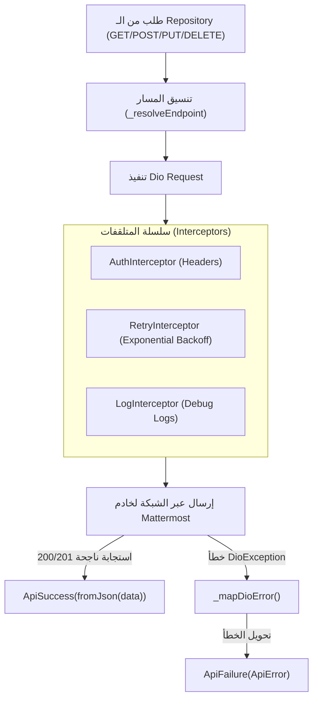
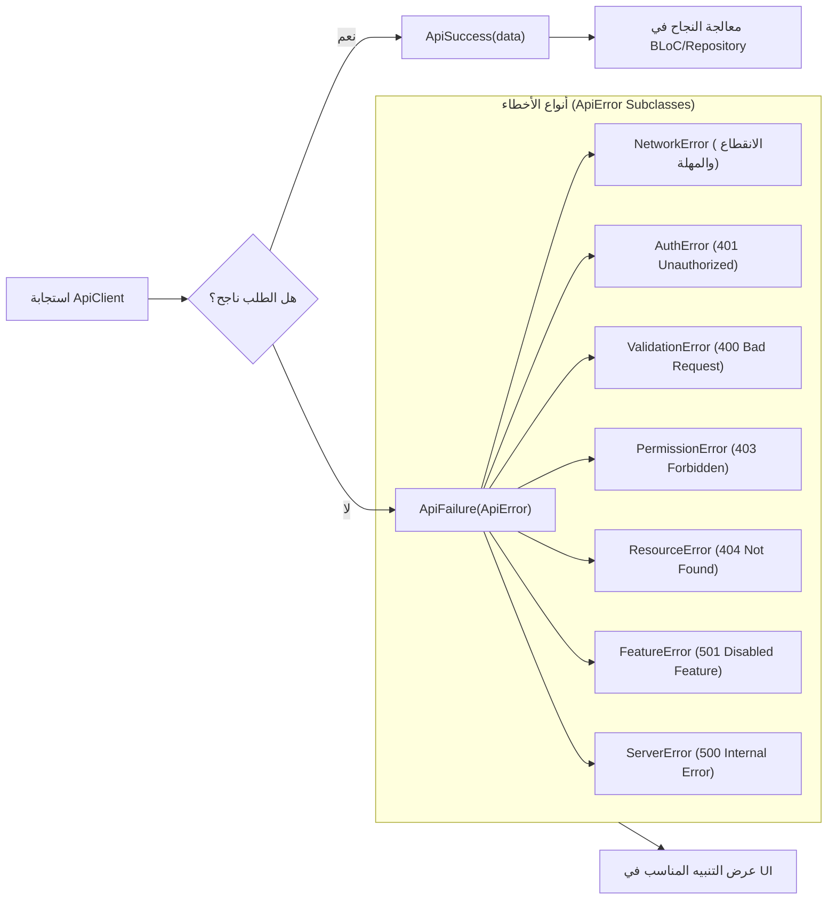
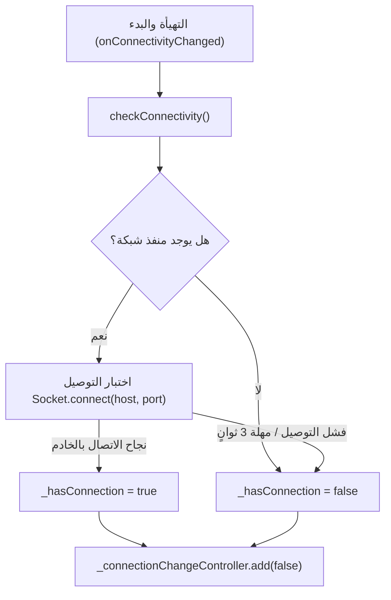
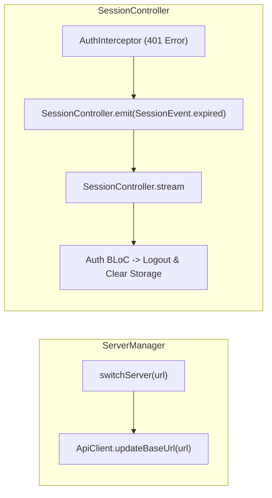
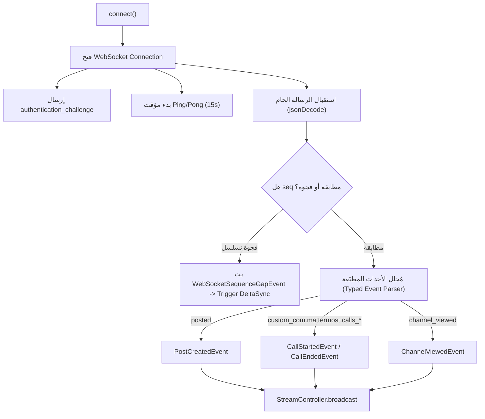
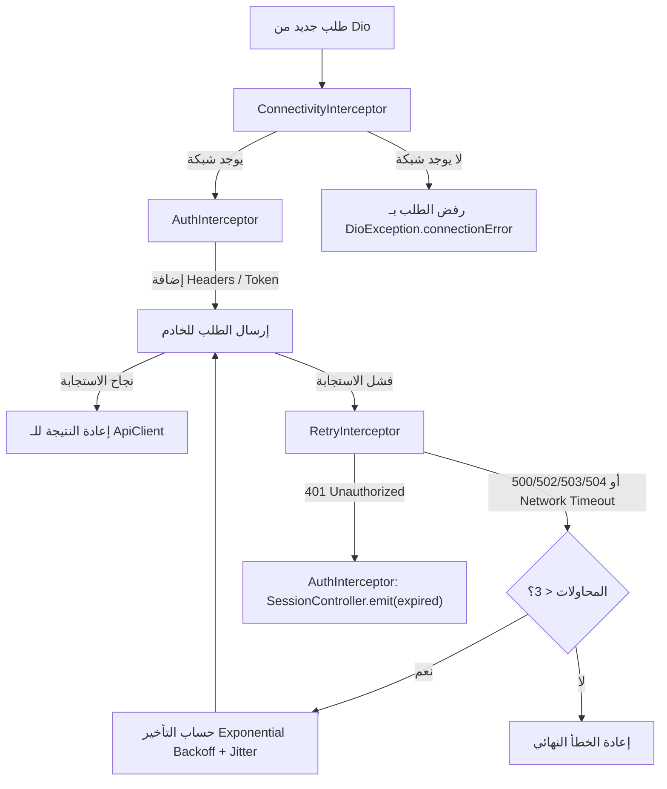
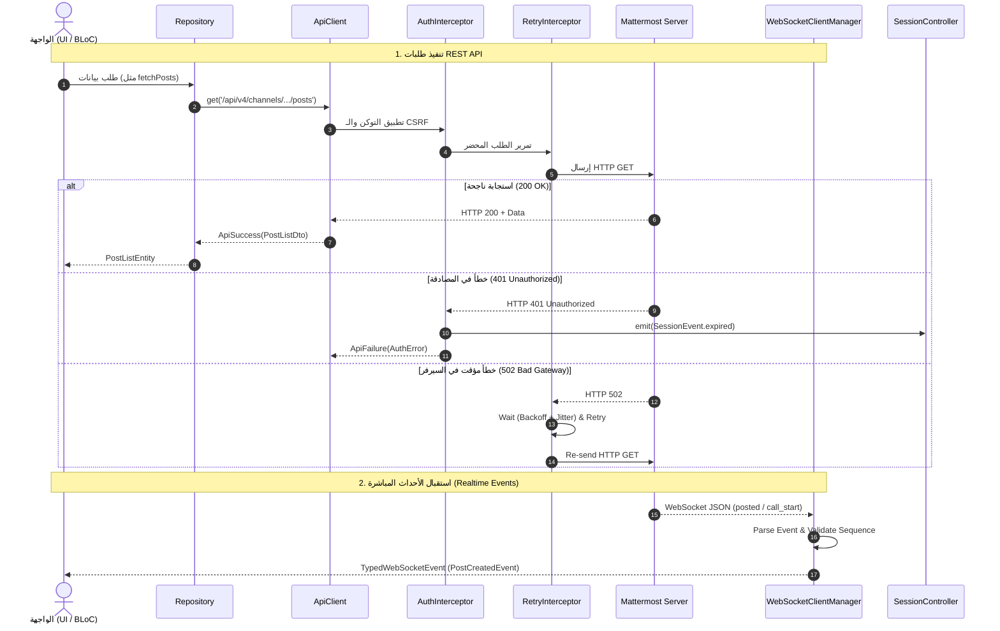

# توثيق وتحليل كلاسات شبكة الاتصال (`lib/core/network`) ومخططات تدفق البيانات (DataFlow)

## 1. الملخص التنفيذي والنظرة العامة

يمثل المجلد `lib/core/network` في مشروع `flutter_mattermost` الطبقة المسؤولة عن جميع الاتصالات الشبكية مع خادم Mattermost.

تضمن هذه الطبقة:
* إدارة طلبات **REST API** عبر حزمة Dio المحسّنة بالمُتلقفات (Interceptors).
* إدارة الاتصال المستمر ثنائي الاتجاه **WebSocket Hub** وتتبع تسلسل الأحداث المباشرة (Realtime Events).
* كشف واختبار الاتصال الشبكي بالخادم عبر الـ LAN والمنافذ النشطة.
* معالجة أخطاء المصادقة، وإعادة المحاولة التلقائية عند انقطاع الاتصال (Exponential Backoff & Jitter).

---

## 2. جدول الكلاسات والمكونات الأساسية في المجلد

| الملف (File) | اسم الكلاس / العنصر | النمط والتعيين | الوظيفة الرئيسية (Role & Purpose) |
|---|---|---|---|
| [api_client.dart](file:///home/osmsoftwareengineering/StudioProjects/flutter_mattermost/lib/core/network/api_client.dart) | `ApiClient` | `@lazySingleton` | **عميل HTTP الرئيسي**: يغلّف Dio لتنفيذ عمليات `GET`, `POST`, `PUT`, `PATCH`, `DELETE`, `HEAD` ومعالجة الأخطاء وتحويلها لـ `ApiResult`. |
| [api_result.dart](file:///home/osmsoftwareengineering/StudioProjects/flutter_mattermost/lib/core/network/api_result.dart) | `ApiResult` (`ApiSuccess` / `ApiFailure`) | Sealed Class | **نمط النتيجة آمنة الأنواع**: لتمثيل نجاح العملية أو فشلها بشكل صريح بدون استثناءات غير معالجة. |
| [api_error.dart](file:///home/osmsoftwareengineering/StudioProjects/flutter_mattermost/lib/core/network/api_error.dart) | `ApiError` والتفريعات | Sealed Class | **تسلسل أخطاء الـ API**: تمثيل تصنيفي للأخطاء (`NetworkError`, `AuthError`, `ValidationError`, `PermissionError`, `ServerError`, إلخ). |
| [connectivity_monitor.dart](file:///home/osmsoftwareengineering/StudioProjects/flutter_mattermost/lib/core/network/connectivity_monitor.dart) | `ConnectivityMonitor` | `@lazySingleton` | **مراقب الاتصال الشبكي**: يفحص الاتصال بالشبكة واختبار التوصيل المباشر بخادم Mattermost (Socket Connect) لدعم شبكات الـ LAN المحمية. |
| [server_manager.dart](file:///home/osmsoftwareengineering/StudioProjects/flutter_mattermost/lib/core/network/server_manager.dart) | `ServerManager` | `@singleton` | **مدير عنوان الخادم**: حفظ وتحديث عنوان الخادم النشط وتحديث الـ BaseURL في `ApiClient` ديناميكياً. |
| [session_controller.dart](file:///home/osmsoftwareengineering/StudioProjects/flutter_mattermost/lib/core/network/session_controller.dart) | `SessionController` | `@singleton` | **متحكم الجلسة**: بث أحداث حالة الجلسة (`SessionEvent.expired`, `restored`, `loggedOut`) لتنبيه التطبيق عند انتهاء صلاحية التوكن. |
| [websocket_client.dart](file:///home/osmsoftwareengineering/StudioProjects/flutter_mattermost/lib/core/network/websocket_client.dart) | `WebSocketClientManager` | `@lazySingleton` | **مدير الـ WebSocket الرئيسي (Hub)**: يدير اتصال الـ WebSocket المباشر (`/api/v4/websocket`)، وبث الأحداث المطبّعة (`TypedWebSocketEvent`). |
| [auth_interceptor.dart](file:///home/osmsoftwareengineering/StudioProjects/flutter_mattermost/lib/core/network/interceptors/auth_interceptor.dart) | `AuthInterceptor` | Interceptor | **متلقّف المصادقة**: إرفاق `Authorization: Bearer`, `Cookie`, و `X-CSRF-Token` بالطلبات، وإطلاق حدث انقضاء الجلسة عند استلام HTTP 401. |
| [connectivity_interceptor.dart](file:///home/osmsoftwareengineering/StudioProjects/flutter_mattermost/lib/core/network/interceptors/connectivity_interceptor.dart) | `ConnectivityInterceptor` | Interceptor | **متلقّف الاتصال الشبكي**: رفض الطلبات مبكراً قبل إرسالها عند عدم وجود اتصال شبكي لتوفير موارد المكونات. |
| [retry_interceptor.dart](file:///home/osmsoftwareengineering/StudioProjects/flutter_mattermost/lib/core/network/interceptors/retry_interceptor.dart) | `RetryInterceptor` | Interceptor | **متلقّف إعادة المحاولة**: إعادة محاولة الطلبات الفاشلة بسبب أخطاء الشبكة المؤقتة أو أخطاء الخادم (500, 502, 503, 504) بتأخير تصاعدي. |

---

## 3. الشرح التفصيلي ومخطط التدفق (DataFlow) لكل كلاس

---

### 3.1 كلاس `ApiClient`

#### الوظيفة وآلية العمل:
* يغلف كائن `Dio` لتهيئة الأعدادات القياسية للـ HTTP (مثل `baseUrl`, `connectTimeout`, `headers`).
* يوجه طلبات الـ Plugins المستقلة تلقائياً عبر دالة `_resolveEndpoint` مثل مسارات `/plugins/com.*` و `/plugins/playbooks/*`.
* يحول استجابات واستثناءات Dio إلى نمط آمن للأنواع `ApiResult<T>` عبر دالة `_mapDioError`.

#### مخطط تدفق البيانات (DataFlow):

---

### 3.2 كلاسات `ApiResult` و `ApiError`

#### الوظيفة وآلية العمل:
* `ApiResult<T>`: فئة مغلقة (Sealed) تمثل إما `ApiSuccess<T>` محتوية على البيانات المكتملة، أو `ApiFailure<T>` محتوية على الكائن `ApiError`.
* `ApiError`: تسلسل صريح لكافة حالات الفشل التشغيلي (مثل `NetworkError`, `AuthError`, `ValidationError`, `PermissionError`, `ResourceError`, `FeatureError`, `ServerError`, `UnknownError`).

#### مخطط تدفق البيانات (DataFlow):

---

### 3.3 كلاس `ConnectivityMonitor`

#### الوظيفة وآلية العمل:
* يراقب حالة الشبكة المحلية للجهاز باستخدام مكتبة `connectivity_plus`.
* ينفذ فحص توصيل مباشر عبر `Socket.connect` بالـ IP والمنفذ المخصص لخادم Mattermost لضمان عمل التطبيق في شبكات الـ LAN المغلقة التي لا تمتلك وصولاً للإنترنت الخارجي.
* يضخ التغييرات عبر التدفق `connectionChangeStream`.

#### مخطط تدفق البيانات (DataFlow):

---

### 3.4 كلاس `ServerManager` و `SessionController`

#### الوظيفة وآلية العمل:
* `ServerManager`: مسؤول عن التبديل بين سيرفرات Mattermost المختلفة وتحديث رابط الـ `baseUrl` في الـ `ApiClient` صراحةً.
* `SessionController`: يمثل الوسيط الإشاري لإدارة دورة حياة الجلسة، وبث أحداث مثل انتهاء صلاحية التوكن `SessionEvent.expired` لإعادة توجيه المستخدم لصفحة الدخول.

#### مخطط تدفق البيانات (DataFlow):

---

### 3.5 كلاس `WebSocketClientManager` (الـ Hub الرئيسي)

#### الوظيفة وآلية العمل:
* يتصل بالمسار الرئيسي `/api/v4/websocket` مع دعم التشفير وحفظ الـ `connection_id` و `sequence_number`.
* يرسل تحديات المصادقة `authentication_challenge` فور فتح الاتصال.
* يراقب النبضات الدوري (Ping/Pong Heartbeat) للتأكد من حيوية القناة.
* يحلل الأحداث القادمة ويحظر تكرار الأحداث عبر الـ Sequence Tracking ويحولها إلى كائنات مطبوعة (`PostCreatedEvent`, `CallStartedEvent`, `ChannelUpdatedEvent`, إلخ).

#### مخطط تدفق البيانات (DataFlow):

---

### 3.6 متلقفات الشبكة (Interceptors: Auth, Connectivity, Retry)

#### الوظيفة وآلية العمل:
* `AuthInterceptor`: يقرأ الـ Token و Cookies من `SecureStorageService` ويحظر إرفاقها لطلبات التسجيل المفتوحة مثل `/api/v4/users/login`.
* `ConnectivityInterceptor`: يرفض الطلب فوراً إذا كان الجهاز في وضع 오فلين بدون شبكة.
* `RetryInterceptor`: يعيد إرسال الطلبات التي تفشل بأخطاء شبكة مؤقتة أو أخطاء الخادم `500, 502, 503, 504` حتى 3 محاولات بتأخير عشوائي تصاعدي (Jitter).

#### مخطط تدفق البيانات (DataFlow):

---

## 4. المخطط الشامل لمعمارية وتدفق بيانات الشبكة (Unified Network DataFlow)

