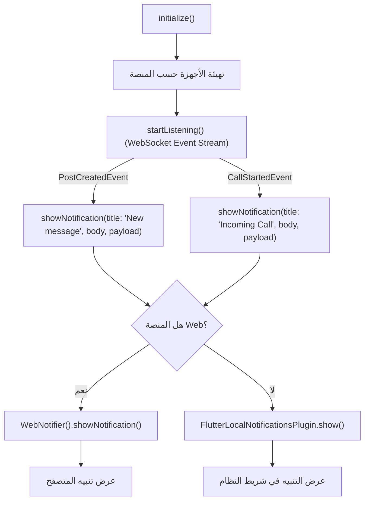
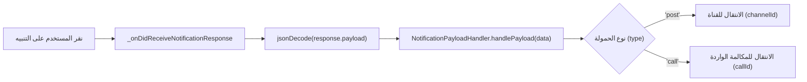
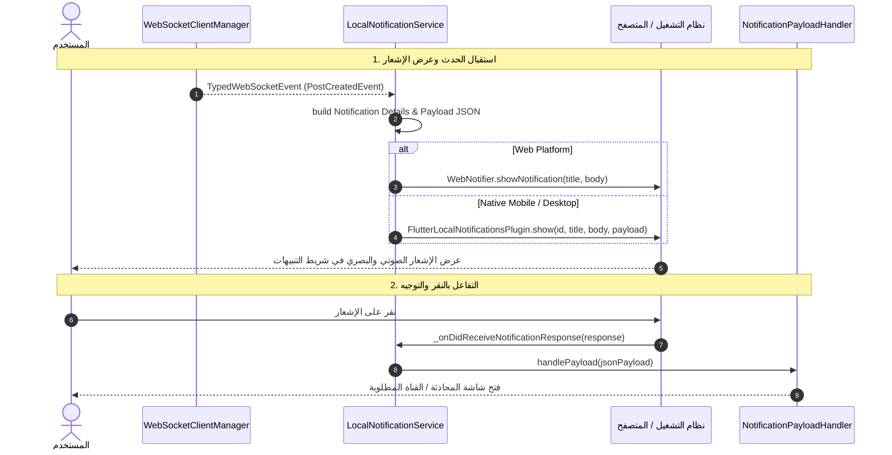

# توثيق وتحليل كلاسات التنبيهات والإشعارات (`lib/core/notifications`) ومخططات تدفق البيانات (DataFlow)

## 1. الملخص التنفيذي والنظرة العامة

يمثل المجلد `lib/core/notifications` في مشروع `flutter_mattermost` الطبقة المسؤولة عن تقديم الإشعارات والتنبيهات المحلية والويب للمستخدم.

تضمن هذه الطبقة:
* معالجة أحداث الـ WebSocket الحية (`PostCreatedEvent`, `CallStartedEvent`) وتحويلها لإشعارات مرئية على شاشة الجهاز.
* الدعم الكامل لجميع المنصات المستهدفة: Android (الأذونات و Channels), iOS/macOS (UNUserNotificationCenter), Linux (Desktop Urgency), والويب (Browser Web Notifications JS Interop).
* التقاط تفاعلات نقر المستخدم على التنبيهات وتوجيهه للقناة أو المكالمة عبر `NotificationPayloadHandler`.

---

## 2. جدول الكلاسات والمكونات الأساسية في المجلد

| الملف (File) | اسم الكلاس / العنصر | النمط والتعيين | الوظيفة الرئيسية (Role & Purpose) |
|---|---|---|---|
| [local_notification_service.dart](file:///home/osmsoftwareengineering/StudioProjects/flutter_mattermost/lib/core/notifications/local_notification_service.dart) | `LocalNotificationService` | `@lazySingleton` | **خدمة الإشعارات المحلية الرئيسية**: إدارة التهدئة والتراخيص وعرض التنبيهات المحلية على Android/iOS/macOS/Linux وتوجيه الويب. |
| [notification_payload_handler.dart](file:///home/osmsoftwareengineering/StudioProjects/flutter_mattermost/lib/core/notifications/notification_payload_handler.dart) | `NotificationPayloadHandler` | `@lazySingleton` | **معالج بيانات النقر على الإشعار**: استخراج البيانات (Payload) وتوجيه المستخدم للقناة أو المكالمة المناسبة عند النقر. |
| [web_notifier.dart](file:///home/osmsoftwareengineering/StudioProjects/flutter_mattermost/lib/core/notifications/web_notifier.dart) / [web_notifier_web.dart](file:///home/osmsoftwareengineering/StudioProjects/flutter_mattermost/lib/core/notifications/web_notifier_web.dart) | `WebNotifier` | conditional import | **مُنبه متصفح الويب**: استخدام JS Interop لعرض إشعارات المتصفح القياسية عند تشغيل التطبيق على الويب. |

---

## 3. الشرح التفصيلي ومخطط التدفق (DataFlow) لكل كلاس

---

### 3.1 كلاس `LocalNotificationService`

#### الوظيفة وآلية العمل:
* يغلف `FlutterLocalNotificationsPlugin` لتهيئة الأعدادات القياسية للمنصات (أيقونة Android `@mipmap/ic_launcher` وأذونات iOS/macOS).
* يراقب تدفق أحداث الـ WebSocket المباشرة (`_handleWsEvent`).
* يستجيب لـ `PostCreatedEvent` بإنشاء تنبيه رسالة جديدة، ولـ `CallStartedEvent` بإنشاء تنبيه مكالمة واردة بـ Payload معرف القناة والمكالمة.
* يوجه طلبات الويب تلقائياً إلى `WebNotifier`.

#### مخطط تدفق البيانات (DataFlow):



---

### 3.2 كلاس `NotificationPayloadHandler`

#### الوظيفة وآلية العمل:
* يستقبل رد النقر من النظام `_onDidReceiveNotificationResponse`.
* يفصل حمولة الـ JSON المرفقة بالإشعار (`payload`).
* يوجه المستخدم مباشرة إلى القناة المسؤولة عن الرسالة أو يفتح شاشة رنين المكالمة المحددة.

#### مخطط تدفق البيانات (DataFlow):



---

### 3.3 كلاس `WebNotifier`

#### الوظيفة وآلية العمل:
* كلاس مشروط التضمين (Conditional Import): على الأجهزة الذكية والمكتبية يحتوي على دوال فارغة وحامية، بينما على الويب يترجم إلى `web_notifier_web.dart`.
* يتفاعل مع الـ Browser Notification API لطلب ترخيص `Notification.requestPermission()` وإطلاق `Notification(title, body)`.

#### مخطط تدفق البيانات (DataFlow):

```mermaid
flowchart TD
    CALL_WEB["استدعاء WebNotifier"] --> COND_IMP{"نوع المنصة"}
    COND_IMP -->|Native| STUB["No-Op Stub Function"]
    COND_IMP -->|Web (JS)| WEB_IMPL["WebNotifierWeb (dart:js_interop)"]

    WEB_IMPL --> REQ_PERM["طلب ترخيص Notification.requestPermission()"]
    WEB_IMPL --> SHOW["Notification(title, {body: message})"]
```

---

## 4. المخطط الشامل لمعمارية وتدفق بيانات الإشعارات (Unified Notifications DataFlow)


