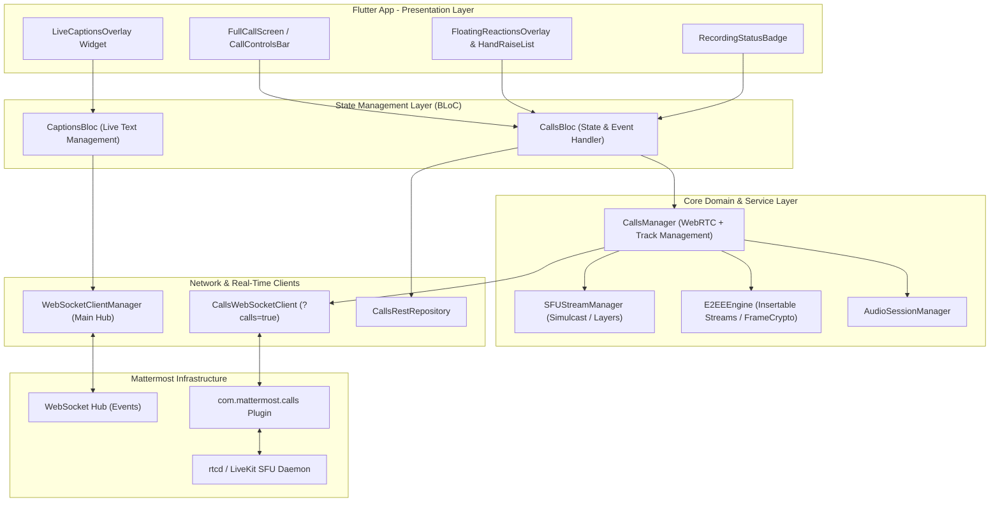
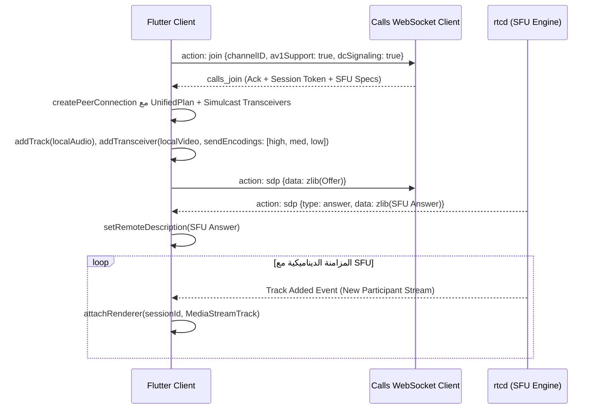

# 🚀 خطة تنفيذ المرحلة الرابعة: الميزات المتقدمة (Advanced Real-Time & Calls Features)

تغطي هذه الخطة المرحلة الرابعة والأخيرة من خارطة طريق تطوير الاتصال اللحظي والمكالمات الصوتية والمرئية في مشروع **Flutter Mattermost**. تهدف هذه المرحلة إلى نقل النظام من مكالمات ثنائية/بسيطة ونظام رسائل أساسي إلى **منصة اتصالات متقدمة متكاملة** تضاهي الحلول السحابية الكبرى (مثل Zoom وMicrosoft Teams)، مع تقديم أداء عالٍ، وسعة استيعابية كبيرة عبر SFU، وأمان فائق بالتشفير من طرف لطرف.

---

## 📐 البنية المعمارية العامة للمرحلة الرابعة

---

## 📋 نظرة عامة على المكونات الرئيسية للمرحلة الرابعة

1. **دعم SFU للمكالمات الجماعية (Multi-Party Conference via SFU)**
2. **رفع اليد والتفاعلات اللحظية (Hand Raising & In-Call Reactions)**
3. **مشاركة الشاشة المحسّنة وإدارة البث (Enhanced Screen Share & Multi-Stream)**
4. **إدارة تسجيل المكالمات (Call Recording Controls & State)**
5. **الترجمة الحية والتعليقات التوضيحية (Live Captions & Subtitles)**
6. **التشفير من طرف لطرف (End-to-End Encryption - E2EE)**

---

## 🛠️ تفاصيل المكونات والتنفيذ الفني

---

### 1. دعم SFU للمكالمات الجماعية (Multi-Party Conference via SFU)

#### 🎯 الهدف:
الانتقال من الاتصال المباشر (P2P Mesh) الذي يستهلك الموارد عند زيادة عدد المشاركين، إلى نموذج **Selective Forwarding Unit (SFU)** المدعوم بواسطة خادم `rtcd` / LiveKit في Mattermost. يتكيف هذا النموذج مع قدرات الشبكة ويستقبل عدة مسارات فيديو وصوت بجودات مختلفة دون تحميل المعالج على الهاتف.

#### 🏗️ التغييرات والملفات المطلوبة:
- **[MODIFY] [calls_manager.dart](file:///home/osmsoftwareengineering/StudioProjects/flutter_mattermost/lib/core/calls/calls_manager.dart)**
  - دعم إدارة المسارات المتعددة (Multi-track PeerConnection) لربط مسار واحد لإرسال العميل ومسارات متعددة لاستقبال باقي المشاركين من SFU.
  - إعداد Simulcast على مسار الفيديو المحلي (إرسال High, Medium, Low layers) لتوفير البث الملائم للشبكة.
  - إضافة آليات التكيف الديناميكي للجودة (Adaptive Bitrate / Dynamic Resolution Switching) بناءً على أحداث RTCP/Network stats.

- **[NEW] [sfu_stream_manager.dart](file:///home/osmsoftwareengineering/StudioProjects/flutter_mattermost/lib/core/calls/sfu_stream_manager.dart)**
  - تتبع وحساب الجودة وتحديد المشارك النشط (Active Speaker Detection) لطلب رفع جودة الفيديو الخاص به وخفض جودة المصغرات (Thumbnails).

#### 🔄 تدفق الإشارات والتفاعل:

---

### 2. رفع اليد والتفاعلات اللحظية (Hand Raising & In-Call Reactions)

#### 🎯 الهدف:
تمكين المشاركين من رفع اليد عند طلب التحدث، وتفاعلهم باستخدام إيموجيات لحظية تطوف فوق الشاشة وتُزامن لجميع المشاركين، مع إتاحة خيارات للمضيف (Host) لإدارة الأيدي المرفوعة.

#### 🏗️ التغييرات والملفات المطلوبة:
- **[MODIFY] [calls_websocket_client.dart](file:///home/osmsoftwareengineering/StudioProjects/flutter_mattermost/lib/core/calls/calls_websocket_client.dart)**
  - إرسال إشارات WebSocket:
    - `raise_hand`: `{action: "custom_com.mattermost.calls_raise_hand"}`
    - `unraise_hand`: `{action: "custom_com.mattermost.calls_unraise_hand"}`
    - `react`: `{action: "custom_com.mattermost.calls_react", data: "{\"emoji\": {\"name\": \"thumbsup\", \"unified\": \"1F44D\"}}"}`
  - الاستماع لأحداث WS المعالجة في Hub الرئيسي:
    - `custom_com.mattermost.calls_user_raise_hand`
    - `custom_com.mattermost.calls_user_unraise_hand`
    - `custom_com.mattermost.calls_user_reacted`

- **[MODIFY] [calls_rest_repository.dart](file:///home/osmsoftwareengineering/StudioProjects/flutter_mattermost/lib/features/chat/domain/repositories/calls_rest_repository.dart)**
  - إضافة endpoint للمضيف: `POST /plugins/com.mattermost.calls/channels/{channelId}/calls/{callId}/lower_hand` لتنزيل يد مشارك محدد.

- **[NEW] [floating_reactions_overlay.dart](file:///home/osmsoftwareengineering/StudioProjects/flutter_mattermost/lib/features/chat/presentation/widgets/floating_reactions_overlay.dart)**
  - ودجت تعرض أنيميشن الإيموجي المتصاعدة (Floating Emojis Physics/Animation).

- **[MODIFY] [calls_bloc.dart](file:///home/osmsoftwareengineering/StudioProjects/flutter_mattermost/lib/features/chat/presentation/bloc/calls_bloc.dart)** & **[calls_state.dart](file:///home/osmsoftwareengineering/StudioProjects/flutter_mattermost/lib/features/chat/presentation/bloc/calls_state.dart)**
  - إضافة الأحداث والحالات الخاصة بـ `RaiseHandPressed`, `UnraiseHandPressed`, `EmojiReactionSent`, `ParticipantHandStatusChanged`, `ParticipantReactionReceived`.
  - تحديث الترتيب التلقائي للمشاركين في القائمة للبدء بالمشاركين الذين رفعوا أيديهم حسب أسبقية التسجيل الزمني `raised_hand_timestamp`.

---

### 3. مشاركة الشاشة المحسّنة (Enhanced Screen Sharing & Media Controls)

#### 🎯 Objetivo والهدف:
تمكين المشارك من مشاركة شاشة هاتفه (Screen Capture) بجودة عالية مع بث صوت النظام (System Audio)، وإتاحة واجهة مستخدم تفاعلية للمستقبلين لدعم التكبير والتثبيت (Pin & Zoom).

#### 🏗️ التغييرات والملفات المطلوبة:
- **[MODIFY] [calls_manager.dart](file:///home/osmsoftwareengineering/StudioProjects/flutter_mattermost/lib/core/calls/calls_manager.dart)**
  - ربط مكتبة `flutter_webrtc` بالتقاط الشاشة `navigator.mediaDevices.getDisplayMedia()`.
  - إدارة تبديل مسار الفيديو الأصلي (الكاميرا) إلى مسار مشاركة الشاشة دون قطع اتصال WebRTC.
  - إرسال إشارات `custom_com.mattermost.calls_user_screen_on` و `custom_com.mattermost.calls_user_screen_off`.

- **[NEW] [screen_share_view.dart](file:///home/osmsoftwareengineering/StudioProjects/flutter_mattermost/lib/features/chat/presentation/widgets/screen_share_view.dart)**
  - ودجت تفاعلية مخصصة لعرض الشاشة المشاركة تدعم:
    - الإيماءات: Pinch-to-Zoom (تكبير وتصغير بأصبعين) مع `InteractiveViewer`.
    - زر التثبيت والتكبير لملء الشاشة (Full Screen Mode).
    - مؤشر اسم المشارك الذي يشارك شاشته حالياً.

- **إعدادات المنصات (Platform Setup)**:
  - **Android**: إضافة `ForegroundService` لدعم `MEDIA_PROJECTION` في ملف `AndroidManifest.xml`.
  - **iOS**: إعداد `Broadcast Upload Extension` لدعم ReplayKit لمشاركة الشاشة أثناء التواجد خارج التطبيق.

---

### 4. إدارة تسجيل المكالمات (Call Recording Management)

#### 🎯 الهدف:
تمكين المضيف/المدير من بدء وإيقاف تسجيل المكالمة، وإظهار مؤشرات وتنبيهات صوتية وبصرية واضحة لجميع المشاركين عند تفعيل التسجيل.

#### 🏗️ التغييرات والملفات المطلوبة:
- **[MODIFY] [calls_rest_repository.dart](file:///home/osmsoftwareengineering/StudioProjects/flutter_mattermost/lib/features/chat/domain/repositories/calls_rest_repository.dart)**
  - إضافة مسارات REST API للتسجيل:
    - `POST /plugins/com.mattermost.calls/channels/{channelId}/calls/{callId}/recording/start`
    - `POST /plugins/com.mattermost.calls/channels/{channelId}/calls/{callId}/recording/stop`

- **[MODIFY] [calls_websocket_client.dart](file:///home/osmsoftwareengineering/StudioProjects/flutter_mattermost/lib/core/calls/calls_websocket_client.dart)**
  - إرسال إشارات WS البديلة: `recording_start` / `recording_stop`.
  - الاستماع لحدث WS العام: `custom_com.mattermost.calls_call_job_state` لمعرفة حالة التسجيل (`recording`, `processing`, `finished`).

- **[NEW] [recording_status_badge.dart](file:///home/osmsoftwareengineering/StudioProjects/flutter_mattermost/lib/features/chat/presentation/widgets/recording_status_badge.dart)**
  - ودجت تعرض شارة حمراء نابضة (Pulsing Red Dot) مع كلمة "REC" وإمكانية النقر لإنهاء التسجيل إن كان المستخدم هو المضيف.

- **[MODIFY] [audio_session_manager.dart](file:///home/osmsoftwareengineering/StudioProjects/flutter_mattermost/lib/core/calls/audio_session_manager.dart)**
  - تشغيل نغمة تنبيه صوتية قصيرة ("This call is being recorded") للمشاركين عند بدء أو وقف التسجيل.

---

### 5. الترجمة الحية والتعليقات التوضيحية (Live Captions & Closed Captions)

#### 🎯 الهدف:
استقبال وعرض النصوص المغلقة والترجمة الحية لمحادثات المكالمة بناءً على ما يقدمه إضافة Mattermost Calls / Whisper Transcription Engine.

#### 🏗️ التغييرات والملفات المطلوبة:
- **[MODIFY] [websocket_client.dart](file:///home/osmsoftwareengineering/StudioProjects/flutter_mattermost/lib/core/network/websocket_client.dart)**
  - معالجة الحدث اللحظي: `custom_com.mattermost.calls_caption`
  - استخراج البيانات: `{channel_id, user_id, session_id, text}` وتأطيرها في `CallCaptionEvent`.

- **[NEW] [captions_bloc.dart](file:///home/osmsoftwareengineering/StudioProjects/flutter_mattermost/lib/features/chat/presentation/bloc/captions_bloc.dart)**
  - إدارة التدفق اللحظي للترجمة، وتصفية النصوص المكررة، وإدارة التلاشي الزمني للنص بعد مرور 3-5 ثوانٍ من التوقف عن الحديث.

- **[NEW] [live_captions_overlay.dart](file:///home/osmsoftwareengineering/StudioProjects/flutter_mattermost/lib/features/chat/presentation/widgets/live_captions_overlay.dart)**
  - ودجت شفافة تُعرض فوق شاشة المكالمة تعرض اسم الناطق والترجمة مع تنسيق ممتاز للقراءة باللغتين العربية والإنجليزية.

---

### 6. التشفير من طرف لطرف (End-to-End Encryption - E2EE)

#### 🎯 الهدف:
تأمين محتوى الصوت والفيديو في المكالمات بجانب الرسائل الحساسة بحيث لا يمكن لأي وسيط (حتى خادم NGINX أو خادم Mattermost نفسه) الوصول لحمولة الوسائط.

#### 🏗️ التغييرات والملفات المطلوبة:
- **[NEW] [e2ee_engine.dart](file:///home/osmsoftwareengineering/StudioProjects/flutter_mattermost/lib/core/security/e2ee_engine.dart)**
  - استخدام بروتوكول SFrame أو WebRTC Insertable Streams (FrameCrypto APIs).
  - تشفير كل فريم صوتي/فيديو (EncodedFrame) قبل إرساله إلى RtpSender، وتفكيك التشفير عند RtpReceiver.

- **[NEW] [key_exchange_service.dart](file:///home/osmsoftwareengineering/StudioProjects/flutter_mattermost/lib/core/security/key_exchange_service.dart)**
  - تبادل المفاتيح المشتركة للجلسة (Epoch Master Keys) عبر قنوات آمنة أو عبر الإشارات المشفرة (Diffie-Hellman / Olm protocol).

---

## 🧪 خطة التحقق والاختبار (Verification & Testing Plan)

### 1. الاختبارات البرمجية والآلية (Automated Tests)
- **Unit Tests**:
  - اختبار `CallsWebSocketClient` مع محاكاة أحداث `custom_com.mattermost.calls_user_raise_hand` و `custom_com.mattermost.calls_caption`.
  - اختبار `CaptionsBloc` والتأكد من التلاشي الزمني التلقائي للنصوص.
  - اختبار `SFUStreamManager` وتحديد Active Speaker.
- **Integration Tests**:
  - محاكاة اتصال 5+ مشاركين في `CallsManager` والتحقق من الاستجابة وعدم حدوث تسريب في الذاكرة (Memory Leak) لـ WebRTC Renderers.

### 2. التحقق الميداني والتطبيقي (Manual Verification)
- **اختبار المكالمة الجماعية بـ SFU**: الانضمام بعدة أجهزة (أو المحاكيات) والتحقق من سلاسة البث وانخفاض استهلاك المعالج.
- **اختبار مشاركة الشاشة**: مشاركة شاشة هاتف محاكي والتحقق من ظهور الإيماءات (Pinch-to-zoom) والتكبير على جهاز آخر.
- **اختبار رفع اليد والرياكشن**: رفع اليد من جهاز وتأكيد إعادة ترتيب القائمة في الأجهزة الأخرى وظهور الإيموجي التفاعلي بشكل متحرك.
- **اختبار التسجيل والترجمة**: بدء التسجيل والتحقق من الشارة الحمراء والتحقق من استلام حدث Caption وإظهاره بشكل متناسق فوق الشاشة.

---

## 📅 خارطة الجدول الزمني لتنفيذ المرحلة الرابعة (2 أسابيع)

| الأسبوع | المهام الرئيسية | الملفات المعنية |
|---|---|---|
| **الأسبوع 1** | - دعم SFU وإدارة المسارات المتعددة   - رفع اليد والتفاعلات اللحظية (Hand Raise & Reactions)   - تحسين مشاركة الشاشة والتقاطها | `calls_manager.dart` `sfu_stream_manager.dart` `floating_reactions_overlay.dart` `screen_share_view.dart` |
| **الأسبوع 2** | - إضافة التحكم بتسجيل المكالمات والشارة   - تنفيذ الترجمة الحية (Live Captions)   - إدخال التشفير E2EE واختبار الأداء العام | `calls_rest_repository.dart` `recording_status_badge.dart` `captions_bloc.dart` `live_captions_overlay.dart` `e2ee_engine.dart` |
