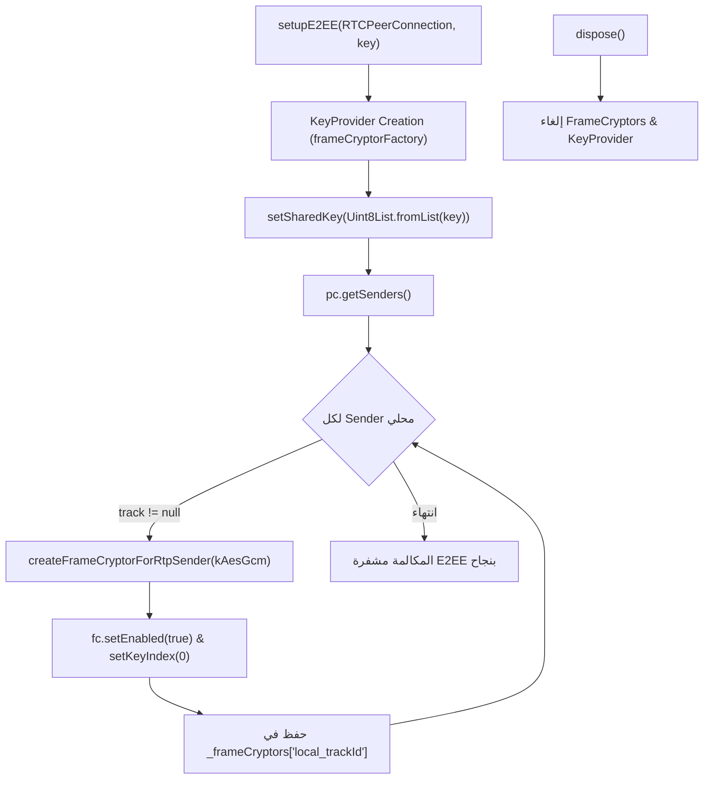
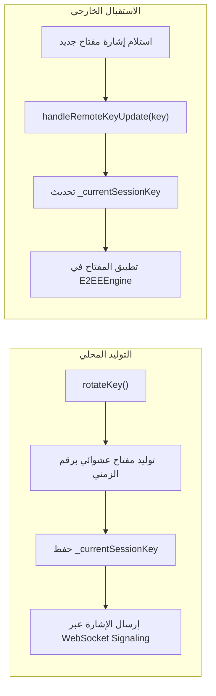
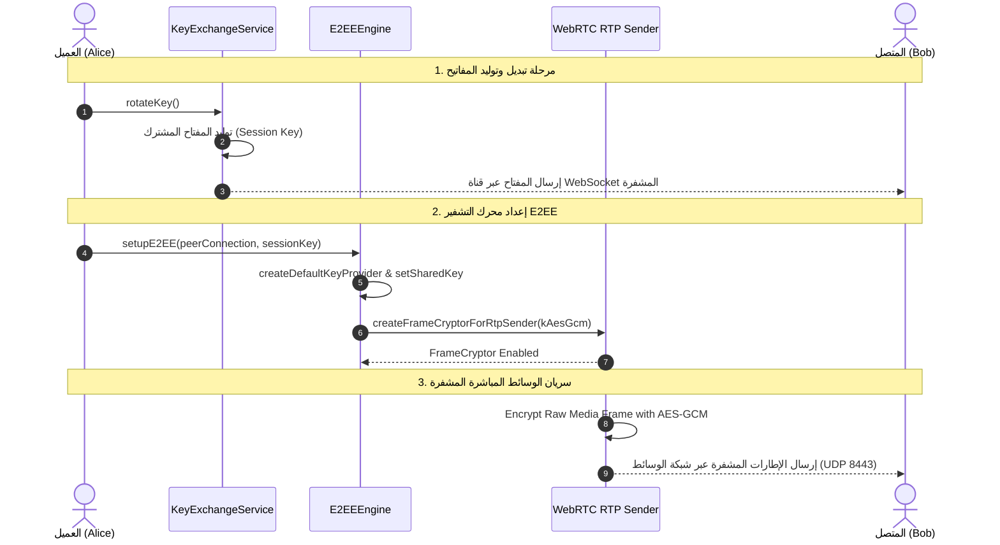

# توثيق وتحليل كلاسات الحماية والتشفير (`lib/core/security`) ومخططات تدفق البيانات (DataFlow)

## 1. الملخص التنفيذي والنظرة العامة

يمثل المجلد `lib/core/security` في مشروع `flutter_mattermost` طبقة الأمان والتشفير بين الطرفين (End-to-End Encryption - E2EE) الخاصة بالوسائط والمكالمات والتراسل.

تضمن هذه الطبقة:
* تشفير دفقات الوسائط المباشرة (Audio/Video Frames) على مستوى WebRTC RTP Senders باستخدام خوارزمية **AES-GCM**.
* إشراك محرك `frameCryptorFactory` لمنع خوادم الوسائط الوسيطة (SFU) من التجسس على محتوى الصوت والفيديو.
* تبديل وتدوير مفاتيح التشفير (`Key Rotation`) عبر خدمة تبادل المفاتيح المستقلة.

---

## 2. جدول الكلاسات والمكونات الأساسية في المجلد

| الملف (File) | اسم الكلاس / العنصر | النمط والتعيين | الوظيفة الرئيسية (Role & Purpose) |
|---|---|---|---|
| [e2ee_engine.dart](file:///home/osmsoftwareengineering/StudioProjects/flutter_mattermost/lib/core/security/e2ee_engine.dart) | `E2EEEngine` | `@lazySingleton` | **محرك التشفير بين الطرفين (E2EE)**: إدارة التشفير المباشر للإطارات الصوتية والمرئية لـ WebRTC باستخدام `FrameCryptor` وخوارزمية AES-GCM. |
| [key_exchange_service.dart](file:///home/osmsoftwareengineering/StudioProjects/flutter_mattermost/lib/core/security/key_exchange_service.dart) | `KeyExchangeService` | `@lazySingleton` | **خدمة تبادل وتدوير المفاتيح**: توليد مفاتيح الجلسة، وتوزيعها، واستقبال التحديثات من الطرف الآخر عبر إشارات WebSocket. |

---

## 3. الشرح التفصيلي ومخطط التدفق (DataFlow) لكل كلاس

---

### 3.1 كلاس `E2EEEngine`

#### الوظيفة وآلية العمل:
* يتعامل مع مكتبة `flutter_webrtc` لإنشاء `KeyProvider` مشترك يحتوي على مفتاح التشفير و `ratchetSalt`.
* يمر على جميع المسارات المباشرة (RTP Senders) في الـ `RTCPeerConnection` لربطها بـ `FrameCryptor`.
* يفعّل التشفير فورياً (`Algorithm.kAesGcm`) بحجم 256 بت لكل إطار صوت أو فيديو يغادر جهاز المستخدم قبل إرساله للشبكة.

#### مخطط تدفق البيانات (DataFlow):

---

### 3.2 كلاس `KeyExchangeService`

#### الوظيفة وآلية العمل:
* يحتفظ بمفتاح الجلسة الحالي `_currentSessionKey`.
* يقدم آلية تدوير المفاتيح `rotateKey()` لإنشاء مفاتيح عشوائية جديدة ذات مهلة زمنية.
* يستقبل التحديثات `handleRemoteKeyUpdate(key)` عند استلام مفاتيح متبادلة جديدة من المشاركين الآخرين عبر WebSocket Signaling.

#### مخطط تدفق البيانات (DataFlow):

---

## 4. المخطط الشامل لمعمارية وتدفق بيانات الأمان (Unified Security DataFlow)

