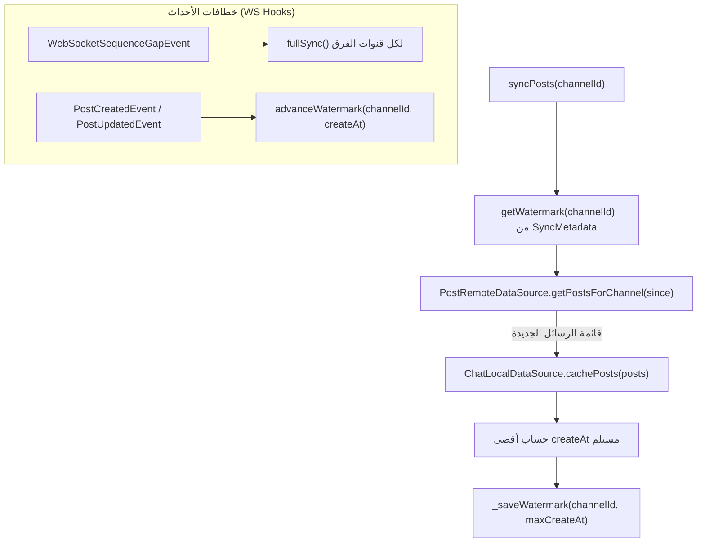
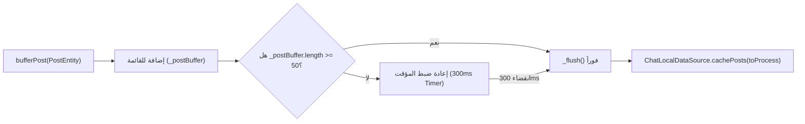
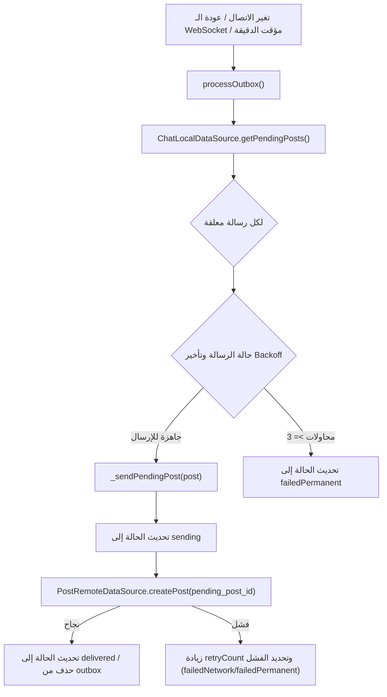
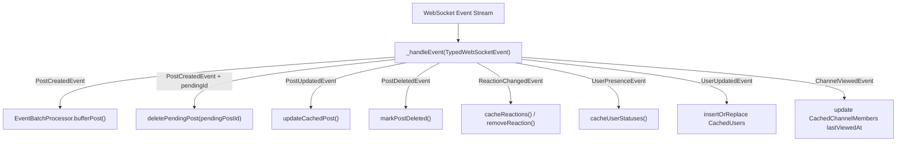
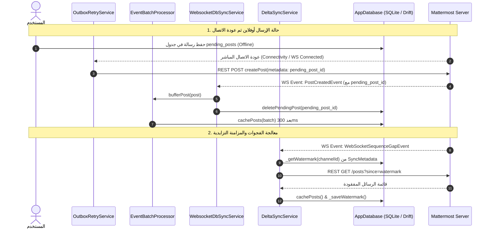

# توثيق وتحليل كلاسات التزامن والمزامنة (`lib/core/sync`) ومخططات تدفق البيانات (DataFlow)

## 1. الملخص التنفيذي والنظرة العامة

يمثل المجلد `lib/core/sync` في مشروع `flutter_mattermost` المحرك الأساسي المسوق للبيانات وتأمين عمل التطبيق بدون إنترنت (Offline-First Architecture).

تضمن هذه الطبقة:
* المزامنة التزايدية (**Delta Sync**) باستغلال الـ Watermarks والطلب الشفاف عبر `since` دون إعادة تحميل كل القنوات.
* المعالجة التجميعية للأحداث (**Batching**) لتخفيف الضغط على قاعدة بيانات SQLite المحلية (`Drift`).
* صندوق الرسائل المعلقة الصادرة (**Outbox Pattern**) وإعادة المحاولة التلقائية وفق خوارزمية Backoff عند عودة الاتصال الشبكي.
* التزامن المستمر بين أحداث الـ WebSocket وقواعد البيانات المحلية (**Websocket DB Sync**).

---

## 2. جدول الكلاسات والمكونات الأساسية في المجلد

| الملف (File) | اسم الكلاس / العنصر | النمط والتعيين | الوظيفة الرئيسية (Role & Purpose) |
|---|---|---|---|
| [delta_sync_service.dart](file:///home/osmsoftwareengineering/StudioProjects/flutter_mattermost/lib/core/sync/delta_sync_service.dart) | `DeltaSyncService` | `@lazySingleton` | **خدمة المزامنة التزايدية**: تجلب التغييرات من الخادم باستخدام علامة المزامنة (`since watermark`) للقنوات وتنفيذ `fullSync` عند حدوث فجوة في تسلسل الاحداث. |
| [event_batch_processor.dart](file:///home/osmsoftwareengineering/StudioProjects/flutter_mattermost/lib/core/sync/event_batch_processor.dart) | `EventBatchProcessor` | `@lazySingleton` | **معالج التجميع للأحداث**: تخزين الرسائل الواردة مؤقتاً في Buffer وتفريغها دفعة واحدة في قاعدة البيانات بعد الوصول لـ 50 عنصر أو مرور 300ms. |
| [outbox_retry_service.dart](file:///home/osmsoftwareengineering/StudioProjects/flutter_mattermost/lib/core/sync/outbox_retry_service.dart) | `OutboxRetryService` | `@lazySingleton` | **خدمة إعادة محاولة الصندوق الصادر**: إعادة إرسال الرسائل المنشأة بدون شبكة تلقائياً فور عودة الاتصال أو الـ WebSocket مع حساب تأخير محاولات الفشل. |
| [websocket_db_sync_service.dart](file:///home/osmsoftwareengineering/StudioProjects/flutter_mattermost/lib/core/sync/websocket_db_sync_service.dart) | `WebsocketDbSyncService` | `@lazySingleton` | **مُزامن الـ WebSocket مع قاعدة البيانات**: الاستماع لأحداث الـ Hub وتحديث الجداول المحلية (الرسائل، التفاعلات، حالات التواجد، القنوات، والمستخدمين). |

---

## 3. الشرح التفصيلي ومخطط التدفق (DataFlow) لكل كلاس

---

### 3.1 كلاس `DeltaSyncService`

#### الوظيفة وآلية العمل:
* يستعلم عن آخر ختم زمني للمزامنة (`watermark lastSyncAt`) المُنظَّم برابط الخادم والقناة في جدول `SyncMetadata`.
* يطلب الرسائل الجديدة فقط عبر `getPostsForChannel(since: watermark)`.
* عند التقاط حدث إعادة اتصال مع غياب الأحداث (`WebSocketSequenceGapEvent` أو `WebSocketReconnectedEvent.fullResync`) ينفذ مزامنة شمولية `fullSync()`.

#### مخطط تدفق البيانات (DataFlow):

---

### 3.2 كلاس `EventBatchProcessor`

#### الوظيفة وآلية العمل:
* يقلل عمليات الكتابة المتكررة في قاعدة بيانات SQLite عبر تجميع الرسائل في قائمة `_postBuffer`.
* يفرغ القائمة تلقائياً فور وصولها للحد الأقصى (`_maxBatchSize = 50`) أو عند انقضاء المؤقت الزمن المخصص (`300ms`).

#### مخطط تدفق البيانات (DataFlow):

---

### 3.3 كلاس `OutboxRetryService`

#### الوظيفة وآلية العمل:
* يدير الرسائل المعلقة (`PendingPostEntity`) المحفوظة محلياً أثناء انقطاع الاتصال.
* يراقب تغيرات الاتصال (`ConnectivityMonitor`) وحالة الـ WebSocket (`WebSocketClientManager`).
* يرسل الرسائل المحفوظة بالتتابع مع فحص تأخير المحاولات (2s -> 5s -> 15s) وتحويل الحالات إلى (`sending`, `delivered`, `failedNetwork`, `failedPermanent`).

#### مخطط تدفق البيانات (DataFlow):

---

### 3.4 كلاس `WebsocketDbSyncService`

#### الوظيفة وآلية العمل:
* الاستماع الشامل لجميع الأحداث المطبّعة الصادرة من `WebSocketClientManager`.
* توجيه الأحداث فوراً للمكونات المحلية المعنية:
  - `PostCreatedEvent` -> إرسال للـ `EventBatchProcessor` وحذف من الـ Outbox.
  - `PostUpdatedEvent` / `PostDeletedEvent` -> تحديث أو وسم بالحذف في قاعدة البيانات.
  - `ReactionChangedEvent` -> كاش التفاعلات أو إزالتها.
  - `UserPresenceEvent` -> تحديث حالة التواجد (online, offline, away).
  - `ChannelUpdatedEvent` / `ChannelConvertedEvent` / `ChannelViewedEvent` -> تحديث القنوات وعلامات القراءة.

#### مخطط تدفق البيانات (DataFlow):

---

## 4. المخطط الشامل لمعمارية وتدفق بيانات التزامن (Unified Sync DataFlow)

