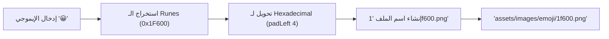
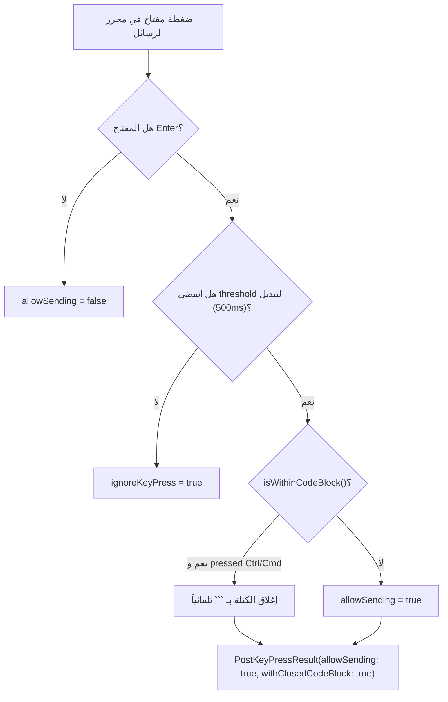
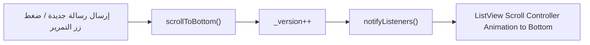
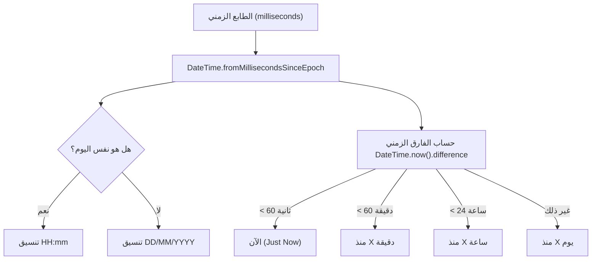
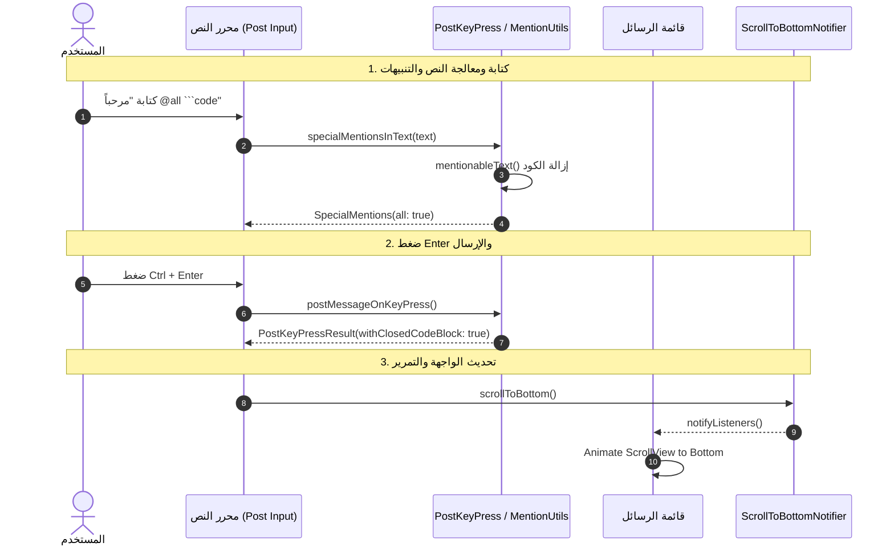

# توثيق وتحليل كلاسات الأدوات المساعدة (`lib/core/utils`) ومخططات تدفق البيانات (DataFlow)

## 1. الملخص التنفيذي والنظرة العامة

يمثل المجلد `lib/core/utils` في مشروع `flutter_mattermost` مجموعة من الأدوات والدوال والوظائف المساعدة المستخدمة عبر طبقات التطبيق المختلفة.

تضمن هذه الطبقة:
* تحليل ومعالجة المنشنات التلقائية (`@all`, `@channel`, `@here`) وتصفية النصوص من كتل الكود والإيموجي.
* معالجة اختصارات المفاتيح والإدخال (`Enter`, `Ctrl+Enter`, `Cmd+Enter`) وإغلاق كتل الكود التلقائية (`Code Blocks`).
* تحويل رموز الإيموجي لصور ورسومات سريعة الأداء.
* التوقيت والتنسيق النسبي والمناطق الزمنية متوافقة مع سلوك تطبيق الويب الرئيسي في Mattermost Webapp.
* التمرير التلقائي لقوائم المحادثات (`ScrollToBottomNotifier`).

---

## 2. جدول الكلاسات والمكونات الأساسية في المجلد

| الملف (File) | اسم الكلاس / العنصر | النمط والتعيين | الوظيفة الرئيسية (Role & Purpose) |
|---|---|---|---|
| [emoji_utils.dart](file:///home/osmsoftwareengineering/StudioProjects/flutter_mattermost/lib/core/utils/emoji_utils.dart) | `EmojiUtils` | Static Utility | **مساعد الإيموجي**: تحويل رموز الـ Unicode للإيموجي إلى أسماء ملفات الأصول البرمجية بصيغة hex وحفظ مسار الصور. |
| [mention_utils.dart](file:///home/osmsoftwareengineering/StudioProjects/flutter_mattermost/lib/core/utils/mention_utils.dart) | `SpecialMentions` / `mentionableText` | Utility Helper | **كاشف المنشنات والروابط**: تحليل النص للكشف عن `@all`, `@channel`, `@here` خارج كتل الكود والترتيب الطبيعي للأسماء. |
| [post_key_press.dart](file:///home/osmsoftwareengineering/StudioProjects/flutter_mattermost/lib/core/utils/post_key_press.dart) | `PostKeyPressResult` / `postMessageOnKeyPress` | Utility Helper | **معالج الإدخال وضغط المفاتيح**: التحكم بسلوك مفتاح Enter، وإغلاق كتل الكود التلقائي (` ``` `)، ومنع الإرسال عند تبديل القنوات. |
| [scroll_to_bottom_notifier.dart](file:///home/osmsoftwareengineering/StudioProjects/flutter_mattermost/lib/core/utils/scroll_to_bottom_notifier.dart) | `ScrollToBottomNotifier` | `ChangeNotifier` | **إشعار التمرير للأسفل**: تنبيه قائمة الرسائل للتمرير التلقائي عند إرسال رسالة جديدة أو ضغط زر الانتقال للأحدث. |
| [time_format.dart](file:///home/osmsoftwareengineering/StudioProjects/flutter_mattermost/lib/core/utils/time_format.dart) | `formatPostTime` / `formatRelativeTime` | Utility Helper | **مُنسق الوقت**: تنسيق أوقات الرسائل اليومية والتاريخ والتوقيت النسبي ("منذ دقيقتين", "الآن"). |
| [timezone_offset.dart](file:///home/osmsoftwareengineering/StudioProjects/flutter_mattermost/lib/core/utils/timezone_offset.dart) | `TimeZoneOffset` | Utility Helper | **مُحسب الفارق الزمني**: حساب إزاحة التوقيت المحلي للجهاز بالثواني لاستخدامها في البحث والـ payloads. |

---

## 3. الشرح التفصيلي ومخطط التدفق (DataFlow) لكل كلاس

---

### 3.1 كلاس `EmojiUtils`

#### الوظيفة وآلية العمل:
* يأخذ رمز الـ Unicode للإيموجي (مثل `😀` أو `👨‍⚕️`).
* يفكك الـ Runes ويحولها إلى Hexadecimal مطابقة لأسماء الصور في أصول Mattermost (مثل `1f600.png`).
* ينشئ المسار الكامل للصورة `assets/images/emoji/...`.

#### مخطط تدفق البيانات (DataFlow):



---

### 3.2 كلاس `SpecialMentions` و `mention_utils.dart`

#### الوظيفة وآلية العمل:
* ينظف النص عبر `mentionableText()` بإزالة كتل الكود (` ``` `) والـ Inline Code (` ` `) والروابط والإيموجي.
* يفحص وجود المنشنات الخاصة (`@all`, `@channel`, `@here`) عبر تعابير قياسية (RegEx) مطابقة للـ Webapp.
* يوفر الدالة `naturalCompare` للترتيب الرقمي الذكي للمستخدمين.

#### مخطط تدفق البيانات (DataFlow):

```mermaid
flowchart TD
    TXT["النصر المدخل"] --> CLEAN["mentionableText()"]
    CLEAN --> STRIP_CODE["إزالة كتل الكود والـ Spans"]
    STRIP_CODE --> STRIP_LINKS["إزالة الروابط والإيموجي"]

    STRIP_LINKS --> REGEX_CHK["مطابقة RegEx المنشنات"]
    REGEX_CHK -->|@all| M_ALL["all = true"]
    REGEX_CHK -->|@channel| M_CHAN["channel = true"]
    REGEX_CHK -->|@here| M_HERE["here = true"]

    M_ALL --> RES["SpecialMentions(all, channel, here)"]
    M_CHAN --> RES
    M_HERE --> RES
```

---

### 3.3 كلاس `PostKeyPressResult` و `postMessageOnKeyPress`

#### الوظيفة وآلية العمل:
* يفحص موضع المؤشر (`caretPosition`) عبر `isWithinCodeBlock` لمعرفة هل المستخدم داخل كتلة كود أم لا.
* يراقب المهلة الزمنية لتبديل القنوات (`500ms`) لمنع الإرسال بالخطأ.
* ينفذ الإغلاق التلقائي لكتل الكود بـ ` ``` ` عند الإرسال عبر `Ctrl/Cmd + Enter`.

#### مخطط تدفق البيانات (DataFlow):



---

### 3.4 كلاس `ScrollToBottomNotifier`

#### الوظيفة وآلية العمل:
* يرث من `ChangeNotifier` ويحافظ على الترقيم الهيكلي `_version`.
* ينادي `notifyListeners()` عند استدعاء `scrollToBottom()` لتقوم قائمة المحادثات بالتمرير السلس نحو الأسفل.

#### مخطط تدفق البيانات (DataFlow):



---

### 3.5 كلاس `TimeFormat` و `TimeZoneOffset`

#### الوظيفة وآلية العمل:
* `formatPostTime`: تحويل الطابع الزمني بالمللي ثانية لـ `HH:mm` إذا كانت الرسالة في نفس اليوم، أو `DD/MM/YYYY` للأيام السابقة.
* `formatRelativeTime`: حساب الفارق النسبي ("الآن", "منذ 5 دقائق", "منذ ساعتين", "منذ 3 أيام").
* `TimeZoneOffset`: استخراج إزاحة التوقيت المحلي بالثواني لتقديم طلبات البحث بالـ UTC الصحيحة.

#### مخطط تدفق البيانات (DataFlow):



---

## 4. المخطط الشامل لمعمارية وتدفق بيانات الأدوات (Unified Utils DataFlow)


