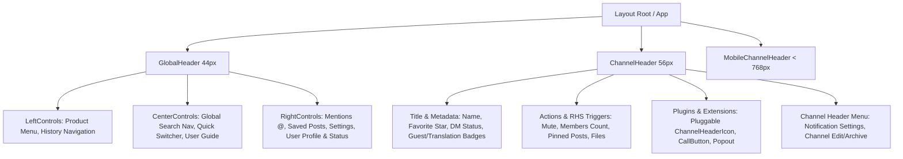

# تحليل شامل لمكونات Channel Global Header في Mattermost Webapp ودراسة التوافق والفرق مع Flutter

## 1. الهيكلية العامة والبنية المعمارية (Architectural Overview)

في Mattermost Webapp (`/home/osmsoftwareengineering/mattermost/webapp/`), لا يوجد مكون فردي مغلق واحد يسمى "Channel Global Header", بل ينقسم الشريط العلوي للمراسلات والقنوات إلى **ثلاثة مكونات رئيسية تعمل بالتكامل مع بعضها البعض**:

### أ) [GlobalHeader](file:///home/osmsoftwareengineering/mattermost/webapp/channels/src/components/global_header/global_header.tsx) (الشريط الإداري العام)
- **الارتفاع:** `44px` ثابت.
- **الموقع:** يظهر في أعلى الشاشة فوق التطبيق بالكامل وبشكل استمراري عبر منتجات Mattermost (Channels, Playbooks, Boards).
- **التوافق التجاوبي:** يتم إخفاؤه تماماً في الشاشات الصغيرة عند عرض أقل من `768px` عبر CSS Media Query (`display: none`).

### ب) [ChannelHeader](file:///home/osmsoftwareengineering/mattermost/webapp/channels/src/components/channel_header/channel_header.tsx) (رأس القناة النشطة)
- **الارتفاع:** `56px` تقريباً.
- **الموقع:** يقع داخل منطقة الـ Center Channel الخاصة بالقناة النشطة مباشرة تحت الـ GlobalHeader.
- **الوظيفة:** إدارة تفاصيل القناة النشطة وحالتها وتوفير مشغلات الشريط الجانبي الأيمن (RHS).

### ج) [MobileChannelHeader](file:///home/osmsoftwareengineering/mattermost/webapp/channels/src/components/mobile_channel_header/mobile_channel_header.tsx)
- **الوظيفة:** شريط بديل مدمج يتفعل عند استخدام شاشات الهواتف أو النوافذ الضيقة لتجميع عناصر الهيدر العام ورأس القناة في واجهة واحدة مناسبة للمس.

---

## 2. التحليل التفصيلي للمكونات الداخلية (Component Breakdown)

### أولاً: مكونات GlobalHeader
| المكون | المسار والملف | الوظائف والتفاصيل التقنية |
| :--- | :--- | :--- |
| **Left Controls** | [left_controls.tsx](file:///home/osmsoftwareengineering/mattermost/webapp/channels/src/components/global_header/left_controls/left_controls.tsx) | - **Product Menu:** التنقل بين تطبيقات المنظومة (Channels, Boards, Playbooks). - **History Buttons:** [history_buttons.tsx](file:///home/osmsoftwareengineering/mattermost/webapp/channels/src/components/global_header/left_controls/history_buttons/history_buttons.tsx) أزرار الرجوع والتقدم بين القنوات مستندة إلى `react-router` والتكامل مع `DesktopApp.getBrowserHistoryStatus()` لتطبيقات الـ Desktop. |
| **Center Controls** | [center_controls.tsx](file:///home/osmsoftwareengineering/mattermost/webapp/channels/src/components/global_header/center_controls/center_controls.tsx) | - **Global Search Nav:** شريط البحث العام التفاعلي المفعل باختصارات اللوحة (`Cmd+K` / `Ctrl+K`) مع اقتراحات مرشحات البحث التلقائية (`from:`, `in:`, `on:`). - **User Guide Dropdown:** قائمة المساعدة والوثائق والروابط الخارجية ورابط مجتمع Mattermost. |
| **Right Controls** | [right_controls.tsx](file:///home/osmsoftwareengineering/mattermost/webapp/channels/src/components/global_header/right_controls/right_controls.tsx) | - **Mentions Button:** فتح الإشارات المباشرة في الـ RHS. - **Saved Posts Button:** فتح الرسائل المحفوظة/المعلمة. - **Settings Button:** فتح مودال إعدادات المستخدم الشاملة. - **User Profile Popover:** منتقي حالة التواجد (Online, Away, DND, Offline) مع تفعيل الحالة المخصصة (Custom Status emoji + Text) وزر ترقية الخطة المأجورة وقائمة الإدارة (System Console). |

### ثانياً: مكونات ChannelHeader
| المكون | الوصف والتفاصيل |
| :--- | :--- |
| **Channel Title & Favorite** | - عرض اسم القناة، رمزيها (`#`, `🔒`, `👤`). - زر نجمة التفضيل [channel_header_title_favorite.tsx](file:///home/osmsoftwareengineering/mattermost/webapp/channels/src/components/channel_header/channel_header_title_favorite.tsx) المرتبط بحالة Redux و `ToggleFavoriteEvent`. |
| **Direct Message / Last Active** | - في المحادثات المباشرة (DM): يعرض "آخر ظهور/نشاط" للمستخدم `lastActivityTimestamp` مع الـ Custom Status الخاص به. |
| **Header Text & Popover** | - عرض وصف القناة (Purpose / Header Text) بدعم تنسيق **Markdown كامل**. - عند الضغط أو التمرير يظهر Popover تفاعلي مفصل [channel_header_text_popover.tsx](file:///home/osmsoftwareengineering/mattermost/webapp/channels/src/components/channel_header/channel_header_text_popover.tsx) لعرض كامل الوصف والأدوات. |
| **Special Badges & Indicators** | - **Has Guests Tag:** شارة تنبيه عندما تحتوي القناة على أعضاء ضيوف خارجيين. - **Auto-Translation Tag:** شارة الترجمة الآلية عند تفعيل الترجمة للقناة. - **Shared Channel Remotes:** جلب وعرض أسماء خوادم Mattermost المشاركة في القناة المشتركة via `fetchChannelRemotes`. |
| **Header Action Icons** | - **Mute Button:** إمكانية مكتومة/إلغاء الكتم السريع. - **Member Count & RHS:** زر عدد الأعضاء مع الـ Badge الأحمر الخاص بطلبات الانضمام المعلقة (`ChannelJoinRequestCountSync`). - **Pinned Posts:** زر عرض الرسائل المثبتة مع عداد حقيقي `pinnedPostsCount`. - **Channel Files:** زر استعراض ملفات القناة في الـ RHS. |
| **Pluggability & Extensions** | - يحتوي على نقاط حقن الإضافات Dynamic Pluggable:   * `<Pluggable pluggableName='ChannelHeaderIcon' />`   * `<ChannelHeaderPlug />` - **CallButton:** تكامل زري المكالمات عبر إضافة Mattermost Calls / WebRTC. |
| **Popout & Info Windows** | - **PopoutButton:** زر فصل القناة في نافذة متصفح/تطبيق مستقلة منفصلة عبر `popoutChannel`. - **ChannelInfoButton:** زر فتح بطاقة تفاصيل القناة الشاملة في الشريط الجانبي الأيمن. |

---

## 3. تحليل الفجوات وعدم التوافق مع تطبيق Flutter (Gaps & Incompatibilities Analysis)

عند مقارنة كود Webapp بحالة تطبيق Flutter الحالية في [`channel_global_header.dart`](file:///home/osmsoftwareengineering/StudioProjects/flutter_mattermost/lib/features/channels/presentation/widgets/channel_header/channel_global_header.dart) و [`channel_header.dart`](file:///home/osmsoftwareengineering/StudioProjects/flutter_mattermost/lib/features/chat/presentation/widgets/channel_header.dart)، يتبين وجود ست فجوات كبرى:

### 1. زاوية نظام الإضافات الديناميكي (Plugin System & Dynamic Injection)
* **في Webapp:** يتم استخدام `Pluggable` المعتمد على React Context وشبكة التحديثات الديناميكية لـ JavaScript (`window.WebappUtils`). يمكن لأي إضافة (مثل Jira, GitHub, Zoom) حقن أزرار وأيقونات تفاعلية كودية داخل الهيدر وقت التشغيل (Runtime).
* **النقص في Flutter:** أطر العمل المترجمة مسبقاً (مثل Flutter Dart) لا تدعم تحميل وتثبيت كود UI مجمع ديناميكياً في وقت التشغيل. هذا يعني غياب أزرار الإضافات المخصصة في الهيدر بدون تصميم نظام Plugin Host مخصص.

### 2. زاوية سجل التنقل وأزرار الـ History (Browser/Desktop Navigation)
* **في Webapp:** يدعم الهيدر أزرار الرجوع والتقدم [history_buttons.tsx](file:///home/osmsoftwareengineering/mattermost/webapp/channels/src/components/global_header/left_controls/history_buttons/history_buttons.tsx) التفاعلية المرتبطة بـ React Router و Mattermost Desktop Electron API لتمكين المستخدم من التنقل بين القنوات السابقة والقادمة.
* **النقص في Flutter:** يفتقر `ChannelGlobalHeader` لحفظ سجل القنوات المزارة مؤخراً وزرين `Back / Forward` هيدريين.

### 3. زاوية النوافذ المستقلة المنفصلة (Popout Channel Windows)
* **في Webapp:** يدعم الهيدر المكون `PopoutButton` الذي يستدعي `popoutChannel` لفتح القناة بكامل تفاصيلها ورأسها في نافذة مستقلة للمتصفح/Desktop.
* **النقص في Flutter:** يتعذر فتح قنوات في نوافذ منفصلة متعددة في Flutter Web/Desktop بدون معالجة معقدة لـ Multi-window State Synchronization.

### 4. زاوية المزامنة والتحديثات الفورية (Real-time State & Live Badges)
* **في Webapp:** يربط الهيدر مباشرة بـ Redux و WebSocket لتحديث شارة طلبات الانضمام المعلقة (`ChannelJoinRequestCountSync`) وعدد المثبتات وحالة المتصلين فورياً.
* **النقص في Flutter:** تطبيق Flutter يستدعي API الأعضاء ويعتمد على Memory Cache (`_memberCountCache`) مما قد يتسبب بحدوث تأخير في عكس الزيادة والنقص الحقيقي الفوري في التفاعلات النشطة.

### 5. زاوية دعم النص الغني وقوائم الـ Markdown التفاعلية
* **في Webapp:** رأس القناة `channel_header_text.tsx` يعالج الـ Markdown بنسبة 100% ويسمح بفتح Popover تفاعلي رغيد يحتوي على روابط، رموز Emoji، وصور توضيحية.
* **النقص في Flutter:** تكتفي عناصر Flutter الحالية بنص مختصر بسطر واحد (`TextOverflow.ellipsis`) دون دعم Popover الـ Markdown التفصيلي.

### 6. زاوية السلوك التجاوبي (Responsive Strategy)
* **في Webapp:** يتم إخفاء `GlobalHeader` نهائياً بحجم شاشة `< 768px` عبر ميديا كويري CSS ويتحول كلياً لـ `MobileChannelHeader`.
* **النقص في Flutter:** الاعتماد على شريط واحد متكيف يتطلب معالجة دقيقة لعدم تكدس الأيقونات في الشاشات الصغيرة.

---

## 4. مصفوفة التوافق الشاملة (Compatibility Matrix)

| الميزة في Mattermost Webapp | الحالة في Webapp | الحالة في Flutter (`flutter_mattermost`) | مستوى النقص / الفجوة |
| :--- | :--- | :--- | :--- |
| **ارتفاع الشريط العام (Global Header)** | `44px` مخصص | `44px` مخصص (`DesignTokens.globalHeaderHeight`) | 🟢 متوافق شكلياً |
| **أزرار التنقل (History Back/Forward)** | ✅ مدعوم بالكامل مع اختصارات اللوحة | ❌ غير موجود | 🔴 فجوة عالية |
| **البحث العام (Global Search & Quick Switcher)** | ✅ مدعوم باختصار `Cmd+K` ومرشحات live | 🟡 شريط ينقل لـ RHS | 🟡 فجوة متوسطة |
| **قائمة منتجات Mattermost (Products Menu)** | ✅ تنقل كامل مدمج (Playbooks/Boards) | 🟡 زر شكل بدون قائمة منتجات كاملة | 🟡 فجوة متوسطة |
| **نظام الإضافات Dynamic Pluggable** | ✅ مدعوم في الهيدر ورأس القناة | ❌ غير ممكن (Dart Compiled) | 🔴 فجوة حادّة (إعادة تصميم) |
| **عداد الأفراد والشارات التفاعلية** | ✅ مباشر ومزامن فورياً عبر WS | 🟡 يستدعي API ويخزن في Cache | 🟡 فجوة متوسطة |
| **شارات القنوات المشتركة والضيوف** | ✅ شارات وسجلات خوادم بعيدة | ❌ غير معروض في الهيدر | 🟡 فجوة متوسطة |
| **محرر ونافذة Popover لوصف القناة** | ✅ دعم Markdown و Popover كامل | 🟡 نص سطر واحد مجرد | 🟡 فجوة متوسطة |
| **زر فصل القناة (Popout Window)** | ✅ مدعوم | ❌ غير مدعوم | 🔴 فجوة عالية |
| **زر المكالمات (Calls Plugin Integration)** | ✅ مدعوم كـ Plug | 🟡 مفعل جزئياً عبر BLoC | 🟢 متوافق جزئياً |

---

## 5. التوصيات الفنية للتطوير

1. **إضافة أزرار سجل التنقل في Flutter:** إنشاء `ChannelHistoryCubit` للتحفظ بسجل القنوات المزارة لتزويد الهيدر بأزرار `Back / Forward`.
2. **تحسين وصف القناة:** إضافة Popover لعرض Markdown كامل لوصف القناة عند الضغط على الهيدر.
3. **تحديث الـ Member Badge حياً:** استبدال طلب الـ API المخبأ بالاستماع لأحداث `WebSocket` الخاصة بعضوية القناة.
