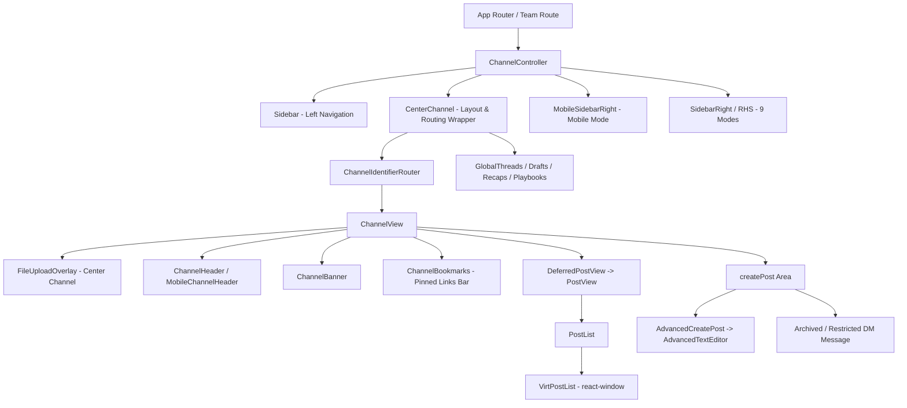

# تحليل شامل لصفحة Channel View في Mattermost Webapp ودراسة الفروقات والتوافق مع Flutter

تحليل مفصل ودقيق لهيكلية ومكونات صفحة عرض القناة **Channel View** في مشروع Mattermost Webapp في المسار:
`/home/osmsoftwareengineering/mattermost/webapp/`
ومقارنتها بتطبيق Flutter في مشروع `flutter_mattermost` لتحديد جميع نقاط النقص والعدم التوافق والفجوات المعمارية والوظيفية.

---

## 1. الهيكلية العامة والبنية المعمارية (Architectural Overview & Component Hierarchy)

في Mattermost Webapp، لا تمثل صفحة القناة مكوناً معزولاً، بل تتكون من منظومة متكاملة متداخلة تبدأ من الراوتر والتخطيط الخارجي (`ChannelController` و `CenterChannel`) حتى صفحة القناة الفعلية (`ChannelView`) وما تحتويه من أدوات العرض، الرأس، القائمة، المحرر، والشريط الجانبي الأيمن (RHS).

### البنية الملفية الرئيسية في Webapp:
* **[channel_controller.tsx](file:///home/osmsoftwareengineering/mattermost/webapp/channels/src/components/channel_layout/channel_controller.tsx):** الحاوية الكبرى الشاملة لصفحة القناة، حيث تدير استطلاع حالات المستخدمين (User Statuses Polling) ومزودات الأحداث العامة.
* **[center_channel.tsx](file:///home/osmsoftwareengineering/mattermost/webapp/channels/src/components/channel_layout/center_channel/center_channel.tsx):** تحكم مسارات التوجيه والتنقل الشاشاتي (Channels, Permalinks `/pl/`, Threads, Drafts, Recaps).
* **[channel_identifier_router.tsx](file:///home/osmsoftwareengineering/mattermost/webapp/channels/src/components/channel_layout/channel_identifier_router/channel_identifier_router.tsx):** يضمن حل معرف القناة أو اسمها أو مسار الرسائل المباشرة وتحديث الـ URL قبل استدعاء `ChannelView`.
* **[channel_view.tsx](file:///home/osmsoftwareengineering/mattermost/webapp/channels/src/components/channel_view/channel_view.tsx):** المكون المركزي الذي يجمع الهيدر، البانر، الإشارات المرجعية (Bookmarks)، قائمة الرسائل المرجأة (`DeferredPostView`)، ومنطقة إنشاء الرسالة.
* **[sidebar_right.tsx](file:///home/osmsoftwareengineering/mattermost/webapp/channels/src/components/sidebar_right/sidebar_right.tsx):** الشريط الجانبي الأيمن الداعم لـ 9 أوضاع مختلفة والمعالج للتوسع وإعادة الحجم.

---

## 2. التحليل التفصيلي لمكونات Channel View في Webapp

### أ) حاوية القناة والتوجيه (`ChannelController` & `CenterChannel`)
* **إدارة الحالات والاستطلاع (Status Polling):** يقوم `ChannelController` ببدء مؤقت دوري `setInterval` بحسب الثابت `Constants.STATUS_INTERVAL` لاستدعاء `addVisibleUsersInCurrentChannelAndSelfToStatusPoll()`، مما يضمن تحديث حالات المتصلين (Online/Offline) للمستخدمين الظاهرين فقط في الواجهة لتقليل استهلاك الشبكة.
* **مراعاة منصات التشغيل (OS Detection):** يضيف كلاسات CSS على `document.body` بناءً على النظام (`os--windows`, `os--mac`) لضبط الاختصارات وشكل الخطوط.
* **الرندر المؤجل (`deferComponentRender`):** تستخدم `ChannelView` أداة `deferComponentRender` لتأخير رندر `PostView` حتى يكتمل رندر الهيكل الخارجي، مما يمنع تجمد الواجهة عند التنقل بين القنوات الكبيرة.

### ب) صفحة القناة الرئيسية (`ChannelView` & `index.ts`)
* **المزامنة النشطة للـ WebSocket:** بمجرد تغير `channelId` في `componentDidUpdate`، يتم استدعاء `WebSocketClient.updateActiveChannel(channelId)` لإبلاغ السيرفر بنشاط المستخدم في هذه القناة فوراً.
* **التحقق من صلاحيات القنوات والقيود:**
  - **Archived Channel:** يمنع إنشاء الرسائل ويظهر رسالة إغلاق القناة واستبدال محرر النص بزر `Close Channel`.
  - **Deactivated User DM:** محادثة مع مستخدم معطل.
  - **Restricted DM (`canRestrictDirectMessage`):** محادثة مباشرة مع مستخدم لا يشاركك أي فريق.
  - **Missing Channel Roles:** إذا كانت أدواره غير مكتملة، يظهر `<InputLoading />`.
* **الإشارات المرجعية (`ChannelBookmarks`):** شريط علوي جديد أسفل الهيدر يتيح تثبيت روابط وأدوات مخصصة لكل قناة (`isChannelBookmarksEnabled`).

### ج) قائمة الرسائل والعرض الأفق افتراضي (`PostView`, `PostList`, `VirtPostList`)
* **التقسيم إلى مجموعات (Chunking):** لا يتم جلب كل الرسائل، بل يتم استخدام استراتيجية Chunks:
  - `loadPostsAround` للروابط المباشرة (Permalinks).
  - `loadUnreads` لجلب الرسائل غير المقروءة بدءاً من نقطة التوقف الأخيرة.
  - `loadPosts` لصفحات التمرير (30 رسالة للتمرير اليدوي، 200 رسالة للتنقل التلقائي السريع).
* **القائمة الافتراضية Virtualized (`VirtPostList`):** تُبنى اعتماداً على مكتبة رندر افتراضي تضمن رندر العناصر الظاهرة في الشاشة فقط، مع معالجة حفظ موضع التمرير (Scroll Position Retention) عند وصول رسائل جديدة.
* **فاصل الرسائل الجديدة والتواريخ:** إدراج تلقائي لـ `new_message_separator` و `date_separator` مع إمكانية التفاعل مع خيار تفضيلات المستخدم `UNREAD_SCROLL_POSITION_START_FROM_NEWEST`.

### د) محرر الرسائل المتقدم (`AdvancedCreatePost` -> `AdvancedTextEditor`)
ينطوي محرر Webapp على ميزات فائقة التعقيد:
1. **شريط التنسيق (Formatting Bar):** أدوات Markdown سريعة (خط عريض، مائل، اقتباس، كود، روابط، قوائم).
2. **الذكاء الاصطناعي والإعادة (`ai_actions_menu` / `rewrite_menu`):** قائمة مدمجة لإعادة صياغة الرسالة أو تلخيصها باستخدام الذكاء الاصطناعي.
3. **أولويات الرسائل (`priority_labels`):** تصنيف الرسالة كـ **Urgent** أو **Important** مع إمكانية تفعيل التنبيه عبر البريد الإكتروني والنغمة.
4. **جدولة الرسائل (`scheduled_post_indicator`):** إمكانية إرسال الرسالة في وقت لاحق محدد.
5. **الرسائل ذاتية التدمير (`use_burn_on_read`):** ميزة الحذف التلقائي فور القراءة.
6. **نظام الإكمال التلقائي الشامل (Autocomplete):**
   - الرموز التعبيرية `:emoji:`
   - الإشارات `@user` و `@group`
   - القنوات `~channel`
   - أوامر السلاش `/command`
7. **المرفقات والرفع:** دعم غلاف الإفلات Drag & Drop Overlay (`FileUploadOverlay`) ومعاينة الملفات الملتقطة paste من المحافظ.

### هـ) الشريط الجانبي الأيمن (`SidebarRight` / RHS)
يدعم Webapp 9 أوضاع تشغيلية كاملة داخل الشريط الجانبي الأيمن:
| وضع RHS | المكون المسؤول | الوصف والتفاصيل |
| :--- | :--- | :--- |
| **Reply Thread** | `RhsThread` | عرض سلسلة ردود الرسالة المحددة ومتابعتها. |
| **Post Card** | `RhsCard` | بطاقة معينة لرسالة مستقلة. |
| **Search / Mentions / Saved** | `Search` | عرض نتائج البحث العام، الإشارات الأخيرة `@` والرسائل المحفوظة. |
| **Pinned Posts** | `PinnedPosts` | قائمة الرسائل المثبتة في القناة الحالية. |
| **Channel Files** | `ChannelFilesPanel` | مستعرض الملفات والمستندات المشاركة في القناة. |
| **Channel Info** | `ChannelInfoRhs` | معلومات وتفاصيل القناة، العرض والوصف والروابط. |
| **Channel Members** | `ChannelMembersRhs` | قائمة أعضاء القناة مع أدوات إدارة الصلاحيات. |
| **Plugin RHS** | `RhsPlugin` | واجهة مخصصة محقونة ديناميكياً من إضافة (مثل Jira/GitHub). |
| **Post Edit History** | `PostEditHistory` | سجل تعديلات الرسالة ومقارنة النسخ السابقة. |

كما يدعم `SidebarRight` تغيير الحجم السحب بالماوس (`ResizableRhs`) واختصارات لوحة المفاتيح:
- `Cmd + .` : فتح/إغلاق الشريط الجانبي.
- `Cmd + Shift + .` : توسيع الشريط الجانبي على كامل الشاشة (Expand).
- `Cmd + Shift + I` : فتح معلومات القناة.

---

## 3. تحليل الفجوات وعدم التوافق من جميع الزوايا مقارنة بـ Flutter

عند فحص كود تطبيق Flutter الحالي في [`channel_screen.dart`](file:///home/osmsoftwareengineering/StudioProjects/flutter_mattermost/lib/features/chat/presentation/channel_screen.dart)، [`message_list.dart`](file:///home/osmsoftwareengineering/StudioProjects/flutter_mattermost/lib/features/chat/presentation/widgets/message_list.dart)، و [`message_editor.dart`](file:///home/osmsoftwareengineering/StudioProjects/flutter_mattermost/lib/features/chat/presentation/editor/message_editor.dart)، تظهر الفجوات التالية:

### 1. زاوية البنية الهيكلية والتنقل (Architecture & Layout Gap)
* **في Webapp:** يتم استخدام `ChannelController` الملتف برواتر `CenterChannel` المعالج لـ Permalinks وتأخير الرندر `deferComponentRender`.
* **في Flutter:** يعتمد `ChannelPage` على `Column` عمودي بسيط يربط بين `ChannelHeader`, `IncomingCallBanner`, `CallWidget`, `PostList`, و `MessageEditor`. يفتقر لنظام التوجيه المدمج للـ Permalinks والـ Drafts المخصصة داخل التخطيط المركزي.

### 2. زاوية عرض القائمة والأداء الافتراضي (Message Stream & Virtualization Gap)
* **في Webapp:** تستخدم `VirtPostList` تقنية Virtualized Scroll مع معالجة مجموعات الرسائل Chunks والتنقل إلى الرسائل غير المقروءة بدقة عبر `unreadChunkTimeStamp` وعرض فاصل الأيام وغير المقروء.
* **في Flutter:** يعتمد `MessageList` في Flutter على `ListView.builder` قياسي. ورغم كفاءة Flutter في الرندر، يفتقر إلى المزامنة التلقائية لرسائل الـ Chunks عند فتح رابط مباشر لقناة قديمة دون جلب الرسائل المحيطة بها من السيرفر عبر API `loadPostsAround`.

### 3. زاوية ميزات المحرر والذكاء الاصطناعي (Advanced Editor Features Gap)
* **في Webapp:** يضم `AdvancedTextEditor` الميزات التالية الغائبة تماماً في Flutter:
  - قائمة الذكاء الاصطناعي وإعادة الصياغة (`AI Rewrite`).
  - جدولة إرسال الرسائل (`Scheduled Posts`).
  - تحديد أولوية الرسالة (`Urgent / Important Priority`).
  - الرسائل ذاتية التدمير (`Burn-on-Read`).
  - الإشارات المرجعية للقناة (`ChannelBookmarks`).
* **في Flutter:** يحتوي `MessageEditor` على محرر ممتاز يدعم Markdown والإكمال التلقائي ورفع الملفات، ولكنه يفتقر لهذه الأدوات المتقدمة الخمس المذكورة أعلاه.

### 4. زاوية الشريط الجانبي الأيمن (RHS & Multi-View Gap)
* **في Webapp:** يوفر `SidebarRight` تسع (9) أوضاع عرض مختلفة، بما في ذلك **سجل تعديل الرسائل (Post Edit History)** و **واجهات الإضافات (Plugin RHS)**، مع إمكانية التوسع والتكبير بالماوس والتفاعل عبر اختصارات اللوحة (`Cmd+.`, `Cmd+Shift+.`).
* **في Flutter:** يوفر `RhsContainer` لوحات الردود والبحث والأعضاء والملفات والمثبتات، ولكنه يفتقر إلى:
  - لوحة سجل تعديلات الرسائل (Edit History View).
  - إمكانية سحب وتكبير شريط RHS تفاعلياً.
  - اختصارات اللوحة للتوسيع والإغلاق في نسخة Flutter Desktop/Web.

### 5. زاوية حالات القنوات الخاصة والقيود (Archived & Restricted DM Gap)
* **في Webapp:** معالجة متكاملة لأربع حالات استثنائية:
  1. القناة المؤرشفة (تمنع الكتابة وتوفر زر إغلاق التنقل `goToLastViewedChannel`).
  2. المستخدم المعطل (Deactivated User DM).
  3. الرسائل المباشرة الممنوعة لعدم وجود فريق مشترك (Restricted DM).
  4. نقص صلاحيات الأدوار (`missingChannelRole` إظهار `InputLoading`).
* **في Flutter:** يقتصر `ChannelPage` على فحص `isArchived` وعرض نص تحذيري ثابت بدون زر لإغلاق القناة أو الانتقال للتالية، كما يفتقر لمعالجة `Restricted DM` المباشرة بنفس العمق.

### 6. زاوية المزامنة واستطلاع الحالات (Real-time Status Polling Gap)
* **في Webapp:** يقوم `ChannelController` بتحديث القناة النشطة لدى خادم الـ WebSocket فورياً `updateActiveChannel` ويقوم بطلب حالات التواجد للمستخدمين الظاهرين فقط عبر استطلاع محدد الزمن `addVisibleUsersInCurrentChannelAndSelfToStatusPoll`.
* **في Flutter:** يعتمد على أحداث WebSocket الواردة دون إرسال تحديث صريح للقناة النشطة الحالية لتنظيف التنبيهات أو إجراء Polling محدد للمستخدمين الظاهرين فقط على الواجهة.

---

## 4. مصفوفة التوافق والمقارنة الشاملة (Compatibility Matrix)

| الوظيفة / المكون | الحالة في Mattermost Webapp | الحالة في تطبيق Flutter (`flutter_mattermost`) | مستوى الفجوة |
| :--- | :--- | :--- | :--- |
| **تخطيط الصفحة العام** | `ChannelController` -> `CenterChannel` | `ChannelPage` (`Column`) | 🟡 فجوة متوسطة |
| **الرندر المؤجل للقنوات** | ✅ `deferComponentRender(PostView)` | ❌ رندر مباشر متزامن | 🟡 فجوة أداء متوسطة |
| **شريط الإشارات المرجعية** | ✅ `ChannelBookmarks` (روابط مخصصة) | ❌ غير موجود | 🔴 فجوة عالية |
| **إشعارات القنوات المؤرشفة** | ✅ شريط مخصص + زر `Close Channel` | 🟡 شريط نصي فقط بدون زر إجراء | 🟡 فجوة بسيطة |
| **قيود الرسائل المباشرة DM** | ✅ فحص `RestrictedDM` و `DeactivatedUser` | ❌ غير معالج بالكامل | 🔴 فجوة عالية |
| **قوائم الرسائل والـ Chunks** | ✅ جلب `loadPostsAround` و `loadUnreads` | 🟡 جلب قائمة الرسائل العادية | 🟡 فجوة متوسطة |
| **شريط التنسيقات والـ Markdown** | ✅ شريط كامل متكامل | ✅ `FormattingBar` متوافق | 🟢 متوافق |
| **جدولة الرسائل (Scheduled)** | ✅ مدعوم ومدمج | ❌ غير موجود | 🔴 فجوة عالية |
| **أولويات الرسائل (Urgent)** | ✅ مدعوم بالكامل | ❌ غير موجود | 🔴 فجوة عالية |
| **رسائل التدمير الذاتي** | ✅ `use_burn_on_read` | ❌ غير موجود | 🔴 فجوة عالية |
| **إعادة الصياغة بالذكاء الاصطناعي** | ✅ `AI Rewrite Menu` | ❌ غير موجود | 🔴 فجوة عالية |
| **أوضاع الشريط الجانبي RHS** | ✅ 9 أوضاع + تكبير `ResizableRhs` | 🟡 6 أوضاع (بدون Edit History/Plugins) | 🟡 فجوة متوسطة |
| **سجل تعديل الرسائل** | ✅ `PostEditHistory` في RHS | ❌ غير مدعوم في RHS | 🔴 فجوة عالية |
| **تحديث القناة النشطة عبر WS** | ✅ `WebSocketClient.updateActiveChannel` | ❌ غير مدعوم صراحة | 🟡 فجوة متوسطة |
| **استطلاع حالات المستخدمين** | ✅ `addVisibleUsersInCurrentChannelAndSelfToStatusPoll` | ❌ يكتفي بحالات الـ WS العامة | 🟡 فجوة متوسطة |

---

## 5. التوصيات وخارطة الطريق لتحسين تطبيق Flutter (Actionable Roadmap)

للوصول بتطبيق `flutter_mattermost` إلى التوافق التام بنسبة 100% مع واجهة تجربة المستخدم في Mattermost Webapp، يُوصى باتباع الخطوات التالية:

1. **تحسين صفحة القناة (`channel_screen.dart`):**
   - إضافة زر إجراء "إغلاق القناة / Close Channel" في شريط القنوات المؤرشفة ليقوم بنقل المستخدم للقناة التفاعلية الأخيرة تلقائياً (`goToLastViewedChannel`).
   - إضافة فحص `Restricted DM` عند فتح محادثات خاصة مع مستخدمين لا يشاركون الفريق الحالي.

2. **تطوير ميزات محرر الرسائل (`message_editor.dart`):**
   - إضافة خيار **أولوية الرسالة (Message Priority)** لتأكيد الرسائل الهامة أو المستعجلة.
   - إضافة خيار **جدولة الرسائل (Scheduled Posts)** مع إمكانية استعراض الرسائل المجدولة من صفحة `/drafts`.

3. **توسيع قدرات الشريط الجانبي الأيمن (`RhsContainer`):**
   - إنشاء مكون `PostEditHistoryPanel` لعرض سجل التعديلات السابقة لأي رسالة معدلة.
   - دعم التوسع وسحب الحجم التفاعلي لـ RHS في شاشات Web/Desktop.

4. **إضافة شريط الإشارات المرجعية (`ChannelBookmarksWidget`):**
   - بناء ويدجت علوي أسفل `ChannelHeader` يعرض الروابط والتطبيقات المثبتة الخاصة بكل قناة.

5. **تعزيز المزامنة اللحظية (WebSocket & Active Channel):**
   - إرسال حدث تحديث القناة النشطة عبر WebSocket بمجرد اختيار قناة جديدة للحد من الإشعارات غير الضرورية وتوجيه القراءة فورياً.
